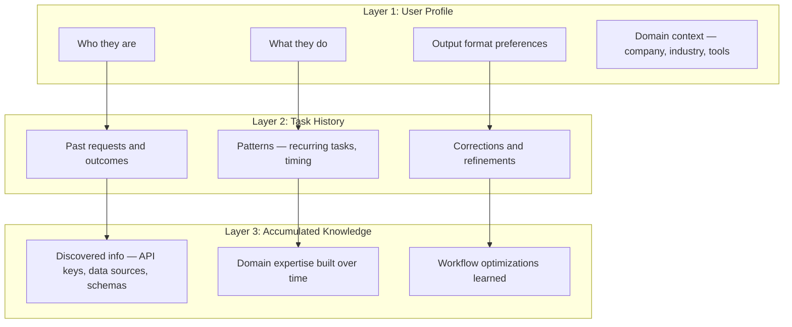

# Personalization: Why Memory is Core, Not Optional

## The Problem

Same request from 2 different users must produce 2 different outcomes, personalized to each user. Without memory and user context, the agent is just a stateless tool — no better than a generic API call.

## Example

> "Write me a weekly report"

- **User A (CFO):** Expects financial summaries, charts, KPIs, board-ready formatting
- **User B (Eng Lead):** Expects sprint velocity, blockers, deployment stats, team-level detail

The agent must know this **without being told every time**.

## Three Layers of Personalization

All three layers must:
- **Persist** across tasks
- **Be accessible** to the agent whenever it handles a task
- **Grow over time** — the agent gets better the longer it works with a user

## How OpenClaw Already Solves This

No custom personalization engine needed. OpenClaw's workspace IS the personalization layer:

| Personalization Need | OpenClaw Mechanism |
|---|---|
| User profile & preferences | `USER.md` (editable by user or agent) |
| Agent personality & instructions | `SOUL.md` + `AGENTS.md` |
| Long-term memory | `MEMORY.md` + vector search |
| Daily activity & context | `memory/YYYY-MM-DD.md` |
| Task history | Session transcripts (JSONL) |
| Accumulated knowledge | Workspace files the agent creates/maintains |

## How Users "Configure" Their Profile

No settings page. No dropdown menus. No config UI.

Users just talk to their agent:
> "I prefer charts over tables"
> "Always use formal tone"
> "My fiscal year starts in April"

The agent updates `USER.md` and `MEMORY.md` itself. Configuration through conversation.

## References

- [OpenClaw — Agent Workspace](https://docs.openclaw.ai/concepts/agent-workspace) — workspace layout and bootstrap files (SOUL.md, AGENTS.md, USER.md, etc.)
- [OpenClaw — Memory](https://docs.openclaw.ai/concepts/memory) — how memory works with workspace files and automatic memory flush
- [OpenClaw — Session Management](https://docs.openclaw.ai/concepts/session) — session keys, persistence, and DM scoping
- [OpenClaw — Context](https://docs.openclaw.ai/concepts/context) — what the model sees and how to inspect it
- [OpenClaw — Compaction](https://docs.openclaw.ai/concepts/compaction) — context window management and auto-compaction
