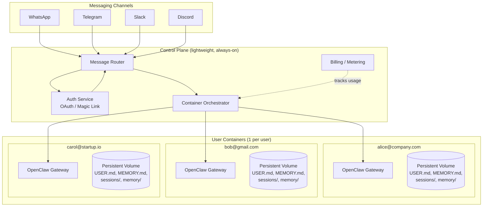
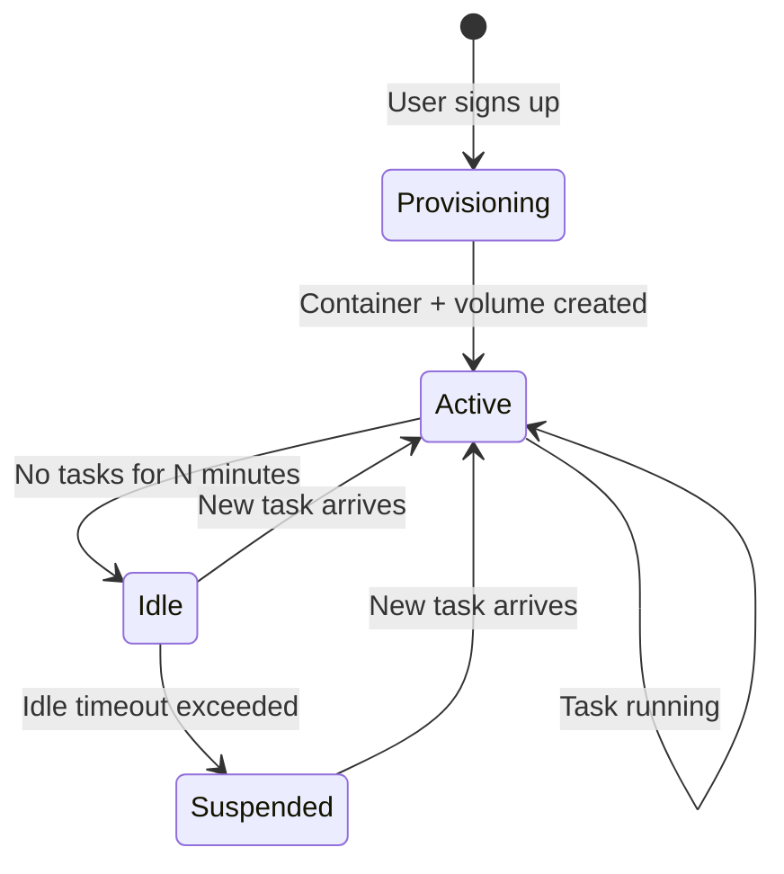
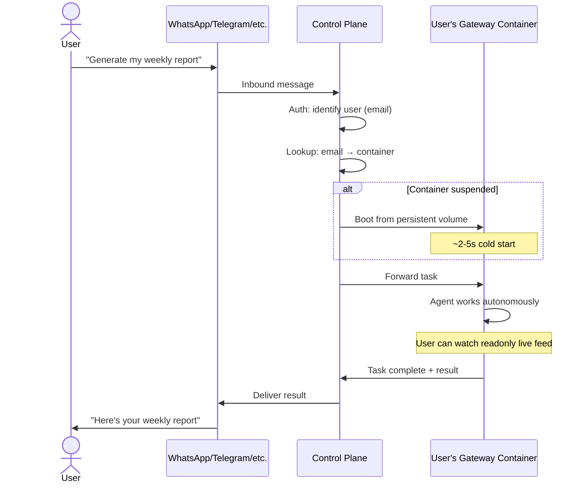
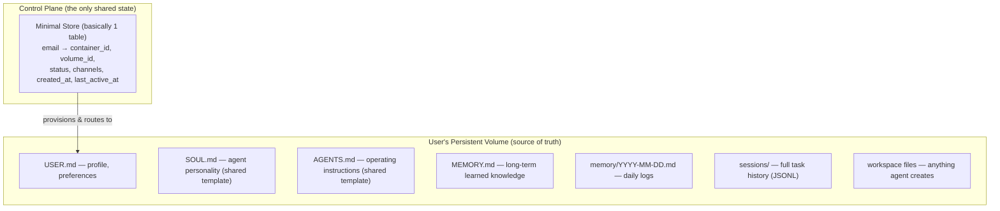

# Architecture: 1 User = 1 Gateway = 1 Container

## Core Principle

Every user gets their own dedicated OpenClaw gateway running in an isolated container with a persistent volume. Maximum isolation, maximum scalability.

## Identity Model

Dead simple:

```
1 email = 1 user = 1 gateway = 1 container = 1 persistent volume
```

No multi-email. No shared accounts. No teams (for now). Just one email per user.

## High-Level Architecture



## Container Lifecycle



## Task Flow



## Why 1:1 (Not Multi-Agent Packing)

We evaluated packing multiple user-agents onto shared gateways. OpenClaw's multi-agent feature does provide true isolation (separate workspaces, memory, sessions, auth, tool policies). However:

| | 1:1 Container | Multi-Agent Packed |
|---|---|---|
| **Isolation** | Complete (OS-level) | Shared Node.js process |
| **Failure blast radius** | 1 user | N users |
| **Resource fairness** | Guaranteed per container | Best-effort, shared event loop |
| **Security** | Container boundary | Trust the app code |
| **Scaling** | Add containers | Rebalance agents across gateways |
| **Complexity** | Simple — vanilla OpenClaw | Custom routing, affinity, rebalancing |
| **Cold start** | ~2-5s (acceptable for fire-and-forget) | Instant |

**Verdict:** 1:1 wins for maximum scalability and isolation. The cold start penalty is negligible for the fire-and-forget use case.

## Cost Optimization

Most containers will be idle most of the time (fire-and-forget = bursts, not constant load).

| Strategy | How |
|---|---|
| **Scale to zero** | Suspend containers after idle timeout (Fly.io Machines, Knative, AWS Fargate) |
| **Persistent volumes** | Workspace survives container restarts; memory never lost |
| **Cold start optimization** | Pre-warmed container images, workspace on fast SSD |
| **Tiered infra** | Active users → dedicated containers; inactive users → fully suspended |
| **Resource limits** | Free tier gets less CPU/RAM, premium gets more |

## What Lives Where



## No Traditional Backend

The gateway IS the database. No Postgres, no Redis, no migrations, no ORM.

**What we avoid:**
- No data model design — agent organizes its own data through markdown
- No migration hell — workspace files evolve naturally
- No sync problems — one source of truth (the workspace)
- No API layer for CRUD — agent reads/writes its own workspace
- No backup complexity — back up the volume, you've backed up everything

**What the backend actually does:**
1. Auth — verify identity (OAuth, magic link)
2. User → Container mapping — route traffic
3. Container lifecycle — boot, suspend, health check
4. Message relay — channels ↔ correct container
5. Billing/metering — track usage

**Risks to monitor:**
- Volume durability — need reliable backups, volume loss = user loses everything
- Cross-user analytics — can't SQL across workspaces; solve with lightweight telemetry at control plane
- GDPR/compliance — actually simpler: delete volume = delete everything
