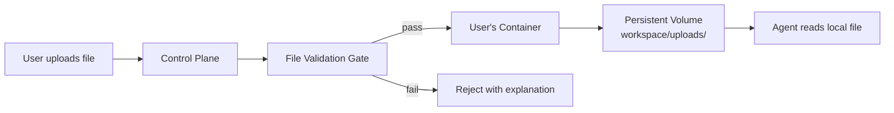
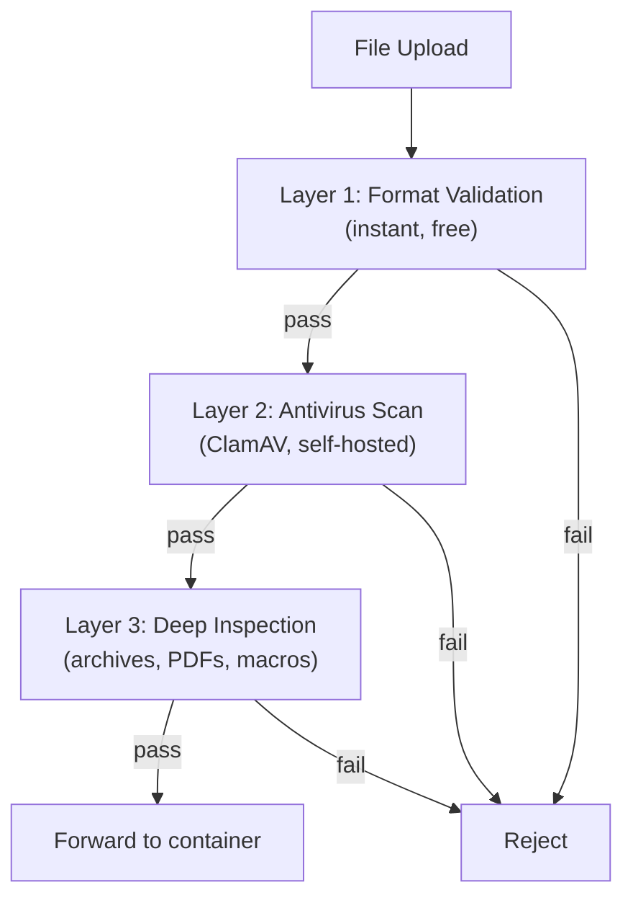

# File Handling: Uploads, Validation, and Storage

## Core Principle

No S3. No database. Files go directly into the user's workspace volume — the agent reads them as local files. The control plane validates files BEFORE they reach OpenClaw.

## Storage Model

### Why Workspace Volume, Not S3 + Database

| | Traditional (S3 + DB) | Workspace Volume |
|---|---|---|
| Storage | S3 bucket (shared) + metadata in DB | User's volume (isolated) |
| Access control | IAM policies, signed URLs, DB lookups | Container boundary — only this user's agent |
| Agent access | Needs S3 SDK, credentials, download step | Just reads a local file |
| Cleanup | Orphaned S3 files, DB records to maintain | Delete volume = delete everything |
| Backup | S3 versioning + DB backup separately | Back up volume = everything backed up |

### What Users Can Upload

- **Files** — CSV, PDF, images, documents → saved to workspace volume
- **Links to spreadsheets** — Google Sheets, etc. → agent fetches via browser/web fetch, saves working copy
- **Website URLs** — agent fetches content, extracts what it needs

## File Validation Gate (Control Plane)

Files are validated in the control plane BEFORE reaching OpenClaw. Three layers:

### Layer 1 — Format Validation (instant, free)

| Check | How | Library |
|---|---|---|
| File size limits | Enforce per-type limits (e.g., 100MB max for documents) | Custom |
| MIME type sniffing | Detect real format from binary headers, not just extension | `file-type` (npm) |
| Extension blocklist | Block .exe, .dll, .bat, .sh, .ps1, .com, .scr, etc. | Custom |
| Filename validation | Reject path separators, null bytes, traversal attempts | Custom |

### Layer 2 — Antivirus Scan (ClamAV)

**Choice: ClamAV via REST API in Docker container**

Why ClamAV:
- Self-hosted — files never leave your infrastructure (privacy)
- Simple REST API via `clamav-rest-api` Docker image — just `POST /scan`
- Good detection for known threats
- Free and open source
- Runs as a sidecar container — standard infrastructure pattern

Why not VirusTotal:
- Sends user files to a third party — privacy concern for business data
- Better detection but unacceptable privacy tradeoff for a SaaS handling sensitive user data

Why not both:
- Unnecessary complexity. ClamAV catches 95%+ of known threats. If detection needs increase later, swap ClamAV for OPSWAT MetaDefender (same pattern, multiple engines, self-hosted, paid).

### Layer 3 — Deep Inspection

| Check | What | Library |
|---|---|---|
| Archive contents | Scan inside ZIP/TAR/RAR before accepting | `adm-zip`, `tar-stream` |
| PDF structure | Detect malicious PDFs (embedded JS, suspicious objects) | `pdf-parse` |
| Macro detection | Flag Office files with macros | Custom or dedicated lib |

## OpenClaw's Built-in File Handling

What OpenClaw already does (inside the container):
- Size limits per media type (6MB images, 16MB audio/video, 100MB documents)
- MIME allowlist for images: JPEG, PNG, GIF, WebP, HEIC, HEIF
- File formats for docs: plain text, Markdown, HTML, CSV, JSON, PDF
- SSRF protection on URL fetches (private network blocking)
- Path traversal protection (symlink blocking, null byte rejection)

What OpenClaw does NOT do (why the control plane gate is critical):
- No antivirus/malware scanning
- No executable detection
- No archive inspection
- No malicious PDF detection
- Credentials stored in plain text

## OpenClaw Security Context (Community Findings)

Important context from community and security researchers:
- CVE-2026-25253: Critical RCE vulnerability was discovered
- ClawHub poisoning: 341 malicious skills found out of 2,857 (12%)
- RedLine and Lumma infostealers already target OpenClaw file paths
- Microsoft, Kaspersky, Malwarebytes, Bitdefender have all published security advisories
- OpenClaw added VirusTotal scanning for ClawHub skills, but NOT for user-uploaded files

**This reinforces the architecture: validate in the control plane, not in OpenClaw.**

## Volume Management

| Concern | Solution |
|---|---|
| Volume size | Limits per tier (free: 1GB, paid: 10GB, enterprise: 100GB) |
| Cleanup | Agent manages workspace, archives/deletes old uploads |
| Large data | Agent processes in streaming fashion without storing full file |
| Backup | Regular volume snapshots |
| Deletion (GDPR) | Delete volume = delete everything |

## References

### OpenClaw Documentation
- [OpenClaw — Media Understanding](https://docs.openclaw.ai/nodes/media-understanding) — inbound image/audio/video handling and provider fallbacks
- [OpenClaw — Security](https://docs.openclaw.ai/gateway/security) — security model and threat considerations
- [OpenClaw — Agent Workspace](https://docs.openclaw.ai/concepts/agent-workspace) — workspace file layout and access

### Open Source Libraries
- [file-type](https://www.npmjs.com/package/file-type) — detect file type from binary headers (MIME sniffing)
- [ClamAV](https://www.clamav.net/) — open-source antivirus engine
- [clamav-rest-api](https://github.com/benzino77/clamav-rest-api) — REST API wrapper for ClamAV in Docker
- [adm-zip](https://www.npmjs.com/package/adm-zip) — ZIP archive reading/creation
- [tar-stream](https://www.npmjs.com/package/tar-stream) — streaming TAR archive parsing
- [pdf-parse](https://www.npmjs.com/package/pdf-parse) — PDF text extraction and inspection

### Security Research
- [OpenClaw Integrates VirusTotal Scanning — The Hacker News](https://thehackernews.com/2026/02/openclaw-integrates-virustotal-scanning.html)
- [OpenClaw Security Crisis — Conscia](https://conscia.com/blog/the-openclaw-security-crisis/)
- [OpenClaw Security Risks — Kaspersky](https://www.kaspersky.com/blog/moltbot-enterprise-risk-management/55317/)
