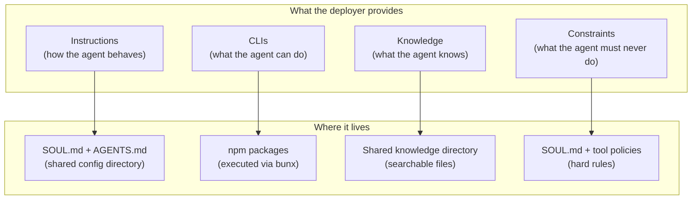
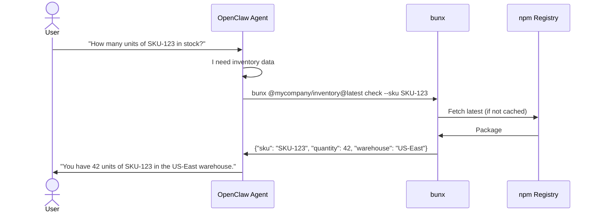

# Agent-Native Paradigm: Rethinking the Backend

## Mental Model

```
User → Frontend → Control Plane → OpenClaw Gateway → Agent uses tools autonomously
```

The agent IS the backend. Its workspace IS the data. It runs CLIs instead of orchestrating services.

## Four Primitives

Everything the deployer provides fits into four categories:



| Primitive | Purpose | Example |
|---|---|---|
| **Instructions** | How the agent behaves, its workflows, its personality | "You are a financial analyst. Always include charts." |
| **CLIs** | Capabilities the agent can execute | `bunx @mycompany/billing@latest charge --customer X` |
| **Knowledge** | Domain expertise, reference data, docs | Product catalog, compliance rules, procedures |
| **Constraints** | Hard rules that override everything | "Never delete production data. Never send money without confirmation." |

## CLIs as the Backend

The deployer's entire "backend" is CLI tools published to npm, executed via `bunx`.

| Property | Detail |
|---|---|
| **Self-documenting** | `--help` tells the agent everything |
| **Always up to date** | `bunx some-cli@latest` — no install, no cache |
| **Testable independently** | Test CLI without needing OpenClaw |
| **Compilable** | [bun compile](https://bun.com/docs/bundler/executables) → standalone binaries |

### How It Works



### Deployer Workflow

```
Write CLI in TypeScript → npm publish → done
```

The agent uses the latest version on next invocation via `bunx`.

### CLI Convention

Deployers build CLIs following these conventions:

| Convention | Requirement |
|---|---|
| **Output** | JSON to stdout by default |
| **Errors** | Stderr with clear messages |
| **Exit codes** | 0 = success, non-zero = error |
| **Help** | `--help` with structured description of all commands and flags |
| **Naming** | Scoped npm packages: `@org/domain-cli` |
| **Auth** | Accept credentials via environment variables or flags |

### Example CLI Structure

```typescript
#!/usr/bin/env bun

// @mycompany/inventory — published to npm
import { Command } from 'commander'

const program = new Command()
  .name('inventory')
  .description('Inventory management tools')

program
  .command('check')
  .description('Check stock level for a SKU')
  .requiredOption('--sku <sku>', 'Product SKU')
  .action(async ({ sku }) => {
    const result = await db.query('SELECT * FROM inventory WHERE sku = ?', [sku])
    console.log(JSON.stringify(result))
  })

program
  .command('restock')
  .description('Restock a product')
  .requiredOption('--sku <sku>', 'Product SKU')
  .requiredOption('--quantity <n>', 'Quantity to add', parseInt)
  .action(async ({ sku, quantity }) => {
    await db.query('UPDATE inventory SET qty = qty + ? WHERE sku = ?', [quantity, sku])
    console.log(JSON.stringify({ success: true, sku, added: quantity }))
  })

program.parse()
```

### Leveraging Bun

| Feature | Usage |
|---|---|
| **bunx** | Execute any npm CLI at latest version, 100x faster than npx |
| **bun compile** | Compile TypeScript CLIs into standalone binaries |
| **TypeScript native** | No build step |
| **Lower memory** | 30-40% less than Node.js — matters with many gateways |

### Public vs Private CLIs

```
# Public CLIs — anyone can use
bunx stripe-cli@latest charges list --limit 5
bunx @openai/cli@latest files upload --file report.pdf

# Deployer's private CLIs
bunx @mycompany/inventory@latest check --sku ABC
bunx @mycompany/billing@latest invoice --customer alice@co.com
```

For private npm packages, the host needs a `.npmrc` with an auth token. One-time setup.

## Knowledge as Files

Deployers place domain knowledge in a directory. The agent searches it when needed.

```
/shared-knowledge/
  product-catalog.md
  compliance-rules.md
  procedures/
    refund-process.md
    onboarding-checklist.md
  reference/
    pricing-tiers.json
    country-codes.csv
```

OpenClaw's [memory search](https://docs.openclaw.ai/concepts/memory) (hybrid vector + BM25) indexes the shared knowledge directory alongside memory files. Drop files in, they're searchable.

### What Goes Where

| Content | Location | Who Writes It |
|---|---|---|
| How the agent behaves | `SOUL.md` / `AGENTS.md` (shared config) | Deployer |
| What the agent knows (shared) | `/shared-knowledge/` | Deployer |
| What the agent knows (per user) | `MEMORY.md` / `memory/` (workspace) | Agent |
| User profile and preferences | `USER.md` (workspace) | Agent |

## Instructions as Markdown

Business logic as markdown instead of code:

```markdown
## Refund Policy
- Full refund within 30 days if item is unused
- Store credit within 90 days
- Beyond 90 days, politely decline
- Use your judgment for edge cases (defective items, loyal customers)
```

Markdown handles edge cases that rigid code doesn't. Changes take effect immediately via hot-reload.

## Constraints as Hard Rules

Some things must NEVER be left to agent judgment:

```markdown
## Hard Constraints (SOUL.md)
- NEVER delete production data without explicit user confirmation
- NEVER process payments exceeding $10,000 without manager approval
- NEVER share one user's data with another user
- NEVER execute commands outside the approved CLI list
```

These go in `SOUL.md` — loaded into every session, every time. Combined with [tool policies](https://docs.openclaw.ai/gateway/sandbox-vs-tool-policy-vs-elevated) at the gateway level for enforcement beyond prompt-level rules.

## Summary: What Replaces What

| Traditional | Agent-Native |
|---|---|
| API server + routes | CLIs via `bunx` |
| PostgreSQL + Redis + ORM | Workspace files |
| Code business logic | Markdown instructions |
| Elasticsearch | Auto-indexed files |
| CI/CD pipeline | `npm publish` → done |
