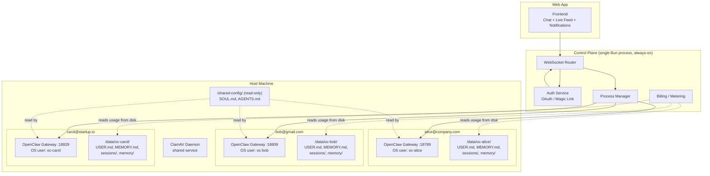
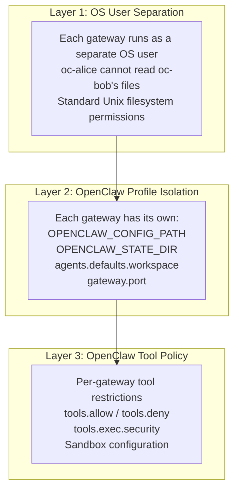
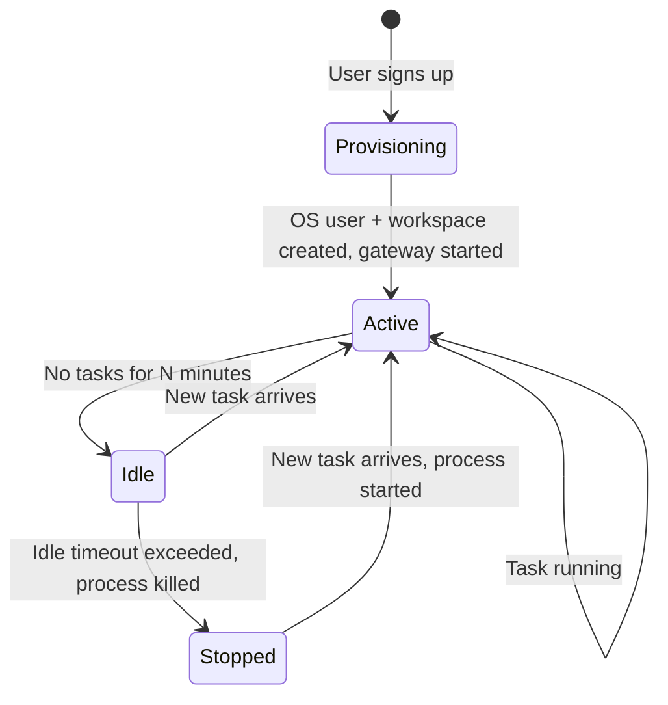
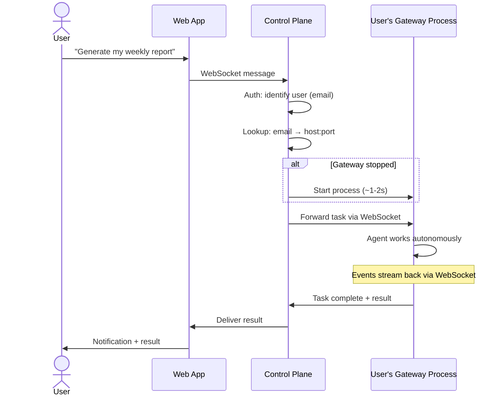

# Architecture: 1 User = 1 Gateway Process

## Core Principle

Every user gets their own dedicated OpenClaw gateway process on a shared host. Process-level isolation via OS user separation, without the overhead of containers or orchestrators.

## Identity Model

Dead simple:

```
1 email = 1 user = 1 OS user = 1 gateway process = 1 workspace directory
```

No multi-email. No shared accounts. No teams (for now). Just one email per user.

## High-Level Architecture



## How OpenClaw Supports This Natively

[OpenClaw's `--profile` flag](https://docs.openclaw.ai/gateway/multiple-gateways) provides built-in multi-gateway support on a single host:

```bash
openclaw --profile alice gateway --port 18789
openclaw --profile bob gateway --port 18809
openclaw --profile carol gateway --port 18829
```

Each profile gets fully isolated: config, state dir, workspace, sessions, memory, auth. OpenClaw handles all the path scoping — no custom code needed.

## Isolation Model

Three layers of isolation without containers:



## Gateway Lifecycle



Starting a gateway process is fast (~1-2s) — much faster than booting a container.

## Task Flow



## Why Multiple Gateways Per Host (Not Containers)

Three approaches were evaluated:

| | Multi-Gateway Per Host | Containers (1:1) | Multi-Agent Packed |
|---|---|---|---|
| **Isolation** | OS user + process level | OS-level (cgroups) | Shared Node.js process |
| **Failure blast radius** | 1 user | 1 user | N users |
| **Security boundary** | Filesystem permissions | Container sandbox | Trust the app code |
| **Infrastructure** | One VM, no orchestrator | Docker/Kubernetes required | One gateway, custom routing |
| **Cold start** | ~1-2s (start process) | ~2-5s (boot container) | Instant |
| **Resource overhead** | Low — just Node.js processes | Higher — container runtime per user | Lowest — shared process |
| **Cost (100 users)** | ~$100-150/mo (one VM) | ~$300-500/mo (K8s + containers) | ~$100-150/mo (one VM) |
| **Complexity** | Low | High (K8s, images, networking) | Medium (custom routing) |
| **Scaling** | Add more VMs | Orchestrator handles it | Rebalance agents |
| **Native OpenClaw support** | Yes — built-in profiles | Deployer configures it | Yes — [multi-agent](https://docs.openclaw.ai/concepts/multi-agent) |

**Verdict:** Multi-gateway per host wins for early-stage deployments. Same isolation guarantees as containers (via OS users), dramatically simpler and cheaper. Migrate to containers later only if needed.

## Cost Projection

Most gateways will be idle most of the time (fire-and-forget = bursts, not constant load). Each active gateway uses ~50-100MB RAM.

| Users | Infrastructure | Est. Monthly Cost |
|---|---|---|
| 0-200 | 1 large VM (32GB RAM, 8 vCPU) | ~$100-150 |
| 200-500 | 2-3 VMs | ~$300-450 |
| 500-1000 | 5 VMs | ~$500-750 |
| 1000+ | Consider containers or keep adding VMs | Depends |

## Scaling: Adding Hosts

No load balancer needed. The control plane has a lookup table:

```
alice@co.com  → host-1:18789
bob@gmail.com → host-1:18809
carol@io.com  → host-2:18789
```

When a host fills up, add another VM and assign new users to it. The routing logic doesn't change — it's still email → host:port.

## What Lives Where


## No Traditional Backend

The gateway IS the database. No Postgres, no Redis, no migrations, no ORM.

**What the framework avoids:**
- No data model design — agent organizes its own data through markdown
- No migration hell — workspace files evolve naturally
- No sync problems — one source of truth (the workspace)
- No API layer for CRUD — agent reads/writes its own workspace
- No backup complexity — daily git push to GitHub

**What the control plane actually does:**
1. Auth — verify identity (OAuth, magic link)
2. User → Gateway mapping — route WebSocket traffic
3. Process lifecycle — start, stop, health check
4. Message relay — frontend ↔ correct gateway
5. Billing/metering — read usage data from disk

## The Complete Stack On One Host

```
One Linux VM:
  ├── Control plane          (1 Bun process)
  ├── TimescaleDB            (1 system service)
  ├── TigerFS mount          (/mnt/tigerfs/ — all data)
  ├── ClamAV daemon          (1 system service)
  └── User gateway processes  (N OpenClaw processes, all read/write via TigerFS)
```

No per-user directories. No git sync. No separate backup infra. Just processes on a Linux box with [TigerFS](tigerfs.md) unifying all storage.

