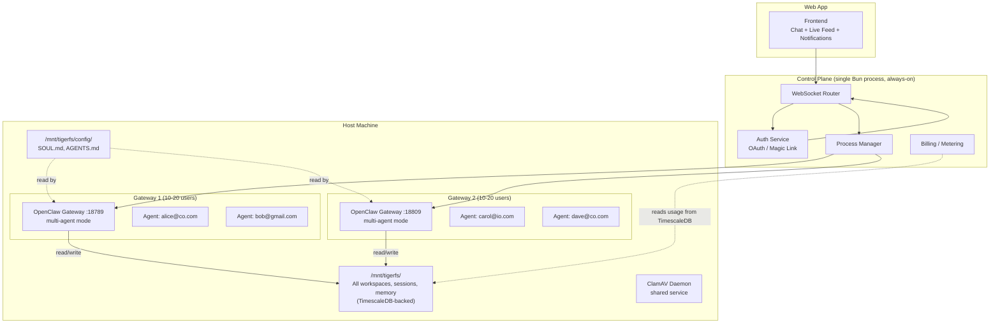
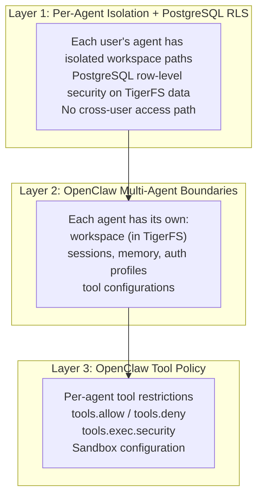
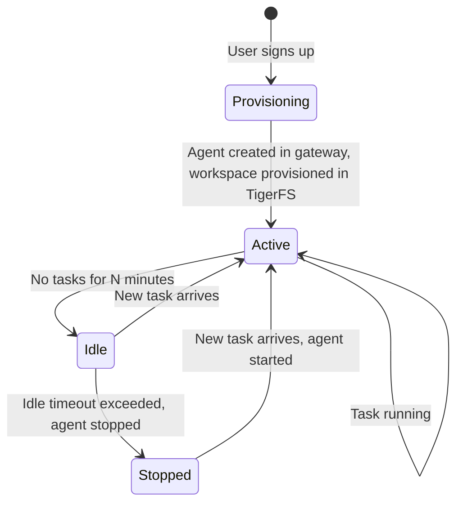
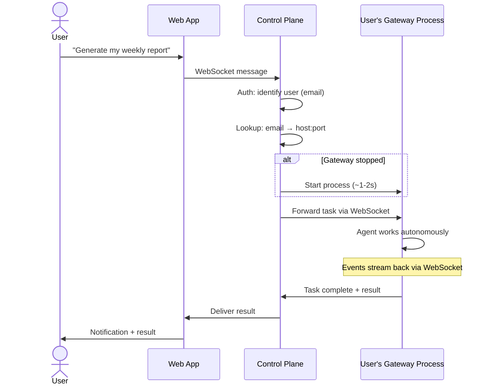
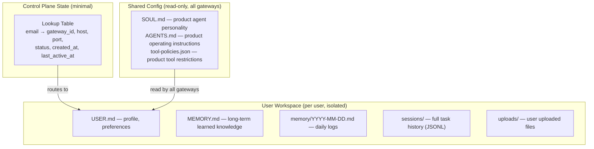

# Architecture: Multi-Agent Gateways, Fully Stateless

## Core Principle

Multiple users share each gateway process (10-20 users per gateway). OpenClaw's [multi-agent](https://docs.openclaw.ai/concepts/multi-agent) architecture provides isolated workspaces, sessions, auth, and tools per user within a single gateway. Gateways are fully stateless — all data lives in TigerFS/TimescaleDB.

## Identity Model

Dead simple:

```
1 email = 1 user = 1 agent (within a shared gateway) = 1 isolated workspace in TigerFS
```

No multi-email. No shared accounts. No teams (for now). Just one email per user.

## High-Level Architecture



## How OpenClaw Supports This Natively

[OpenClaw's multi-agent mode](https://docs.openclaw.ai/concepts/multi-agent) provides built-in per-user isolation within a single gateway process:

- Each user gets an isolated agent with its own workspace, sessions, memory, and auth
- OpenClaw enforces per-agent path boundaries — agents cannot access each other's data
- The gateway manages routing, lifecycle, and resource sharing across agents

## Isolation Model

Three layers of isolation without containers:



## Gateway Lifecycle



Starting an agent within an existing gateway is fast (~100-500ms). Gateway process itself is always running.

## Task Flow



## Why Multi-Agent Gateways (Not 1:1)

Three approaches were evaluated:

| | Multi-Agent Per Gateway | 1 Gateway Per User | Containers (1:1) |
|---|---|---|---|
| **Isolation** | Per-agent boundaries + PostgreSQL RLS | OS user + process level | OS-level (cgroups) |
| **Failure blast radius** | 10-20 users | 1 user | 1 user |
| **Security boundary** | RLS + agent path boundaries + security gate | Filesystem permissions | Container sandbox |
| **Infrastructure** | 500-1000 gateways for 10K users | 10K processes, 50 hosts | Docker/Kubernetes required |
| **Cold start** | ~100-500ms (start agent) | ~1-2s (start process) | ~2-5s (boot container) |
| **Resource overhead** | Lowest — shared processes | Medium — one process per user | Highest — container runtime per user |
| **Cost (10K users)** | ~$200-400/mo (10-20 VMs) | ~$2-5K/mo (50 VMs) | ~$5-10K/mo (K8s + containers) |
| **Complexity** | Low | Medium (process management at scale) | High (K8s, images, networking) |
| **Statefulness** | Fully stateless (TigerFS) | Local disk dependency | Persistent volumes needed |
| **Native OpenClaw support** | Yes — [multi-agent](https://docs.openclaw.ai/concepts/multi-agent) | Yes — built-in profiles | Deployer configures it |

**Verdict:** Multi-agent per gateway wins. Far fewer processes, fully stateless via TigerFS, dramatically cheaper. The 10-20 user blast radius is acceptable given the security gate, RLS, and agent isolation.

## Cost Projection

Most agents will be idle most of the time (fire-and-forget = bursts, not constant load). Each gateway (10-20 users) uses ~200-500MB RAM.

| Users | Gateways | Infrastructure | Est. Monthly Cost |
|---|---|---|---|
| 0-200 | 10-20 | 1 VM (32GB RAM, 8 vCPU) | ~$100-150 |
| 200-1000 | 50-100 | 2-3 VMs | ~$200-300 |
| 1000-5000 | 50-500 | 5-10 VMs | ~$300-600 |
| 10,000 | 500-1000 | 10-20 VMs | ~$600-1200 |

## Scaling: Adding Hosts

No load balancer needed. The control plane has a lookup table:

```
alice@co.com  → gateway-7 on host-1:18789
bob@gmail.com → gateway-7 on host-1:18789
carol@io.com  → gateway-12 on host-2:18789
```

When gateways fill up, Nomad places new ones on available hosts. The routing logic is email → gateway_id → host:port. Because gateways are fully stateless (all data in TigerFS), any gateway can be restarted on any host.

## What Lives Where



## No Traditional Backend

TigerFS + TimescaleDB is the entire data layer. No Redis, no S3, no migrations, no ORM for user data.

**What the framework avoids:**
- No data model design — agent organizes its own data through markdown files in TigerFS
- No migration hell — workspace files evolve naturally
- No sync problems — one source of truth (TigerFS/TimescaleDB)
- No API layer for CRUD — agent reads/writes its own workspace
- No backup complexity — `pg_dump` + TigerFS `.history/`

**What the control plane actually does:**
1. Auth — verify identity (OAuth, magic link)
2. User → Gateway mapping — route WebSocket traffic
3. Gateway lifecycle — manage via Nomad
4. Message relay — frontend ↔ correct gateway ↔ correct agent
5. Billing/metering — read usage data from TimescaleDB continuous aggregates

## The Complete Stack On One Host

```
One Linux VM:
  ├── Control plane          (1 Bun process)
  ├── TimescaleDB            (1 system service)
  ├── TigerFS mount          (/mnt/tigerfs/ — all data)
  ├── ClamAV daemon          (1 system service)
  └── User gateway processes  (N OpenClaw processes, all read/write via TigerFS)
```

No per-user directories. No git sync. No separate backup infra. Just processes on a Linux box with [TigerFS](tigerfs.md) unifying all storage.

