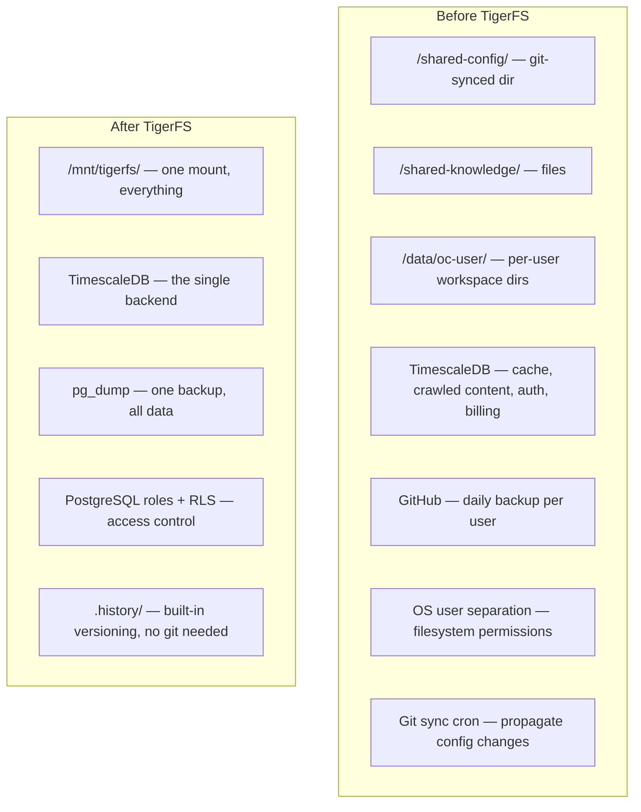
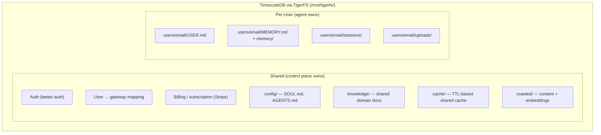

# Data Layer: TimescaleDB + TigerFS, No Overlap

Every piece of data has exactly one source of truth. Nothing stored in two places.

## TigerFS: The Storage Unifier

[TigerFS](https://tigerfs.io/) mounts [TimescaleDB](https://www.timescale.com/) as a regular filesystem. Every file is a row, every write is a transaction, concurrent access is ACID-guaranteed. By the same team as TimescaleDB.

Agents work with files natively. TigerFS makes the database look like a filesystem. No SQL, no ORM, no database client needed from the agent’s perspective.

## Full TigerFS Capabilities

### File-First Mode

- **Markdown with YAML frontmatter** — frontmatter keys auto-become typed database columns, body becomes `_body` column
- **Atomic writes** — each write is a database transaction
- **Concurrent access** — multiple agents/humans write safely to the same directory
- **Atomic moves** — `mv` is a transaction, enables task boards (todo → doing → done)

### Pipeline Queries (via file paths)

Chained segments compiled into a single optimized SQL query:

```
cat /mnt/db/orders/.by/customer_id/123/.order/created_at/.last/10/.export/json
```

| Segment                        | Purpose              |
| ------------------------------ | -------------------- |
| `.by/column/value`             | Index lookup         |
| `.filter/column/value`         | Filter               |
| `.order/column`                | Sort                 |
| `.columns/col1,col2`           | Select columns       |
| `.first/N/`, `.last/N/`        | Pagination           |
| `.sample/N/`                   | Random sample        |
| `.all/`                        | Bypass listing limit |
| `.export/json\|csv\|tsv\|yaml` | Output format        |

### Version History

Requires TimescaleDB. Tracks files across renames via stable row UUIDs:

```
ls /mnt/db/notes/.history/hello.md/           # all versions (timestamped)
cat /mnt/db/notes/.history/hello.md/2026-02-24T150000Z  # specific version
cat /mnt/db/notes/.history/hello.md/.id       # stable UUID
```

Restore: `cat /mnt/db/notes/.history/hello.md/[timestamp] > /mnt/db/notes/hello.md`

### Bulk Import/Export

```bash
cat data.csv > /mnt/db/orders/.import/.append/csv    # add rows
cat data.csv > /mnt/db/orders/.import/.sync/csv      # upsert
cat data.csv > /mnt/db/orders/.import/.overwrite/csv  # replace all
cat /mnt/db/orders/.export/json                       # export all
```

### Row as Directory

```bash
ls /mnt/db/users/123/          # list columns
cat /mnt/db/users/123/email.txt  # read single column
echo 'new@email.com' > /mnt/db/users/123/email.txt  # update column
```

### Schema Management (Staging Pattern)

```bash
mkdir /mnt/db/.create/orders
cat /mnt/db/.create/orders/sql     # view template
echo "CREATE TABLE..." > /mnt/db/.create/orders/sql
touch /mnt/db/.create/orders/.test    # validate
touch /mnt/db/.create/orders/.commit  # execute
```

Same for `.modify/`, `.delete/`, indexes.

### App Creation

```bash
echo "markdown" > /mnt/db/.build/blog           # markdown app
echo "markdown,history" > /mnt/db/.build/notes   # with version history
```

### Ghost (Instant Databases)

Spin up throwaway databases for agents on the fly. Fork existing databases with one command — full copy, independent modifications:

```bash
tigerfs fork /mnt/db my-experiment
```

### Agent Skills

Ships with [Claude Code](https://claude.ai/claude-code) skills that teach agents file-based database patterns. Installable into OpenClaw workspaces.

## What TigerFS Collapses



## What TigerFS Eliminates

| Before                             | After                                                       |
| ---------------------------------- | ----------------------------------------------------------- |
| Git-sync cron for shared config    | Write to TigerFS, all gateways see it instantly (ACID)      |
| OS user separation for isolation   | PostgreSQL row-level security                               |
| Per-user directories on local disk | Per-user paths in TigerFS                                   |
| GitHub daily backup per user       | `.history/` for versioning, `pg_dump` for disaster recovery |
| Separate cache system              | Pipeline queries via file paths                             |
| Separate crawled content index     | Files in TigerFS with pgvector underneath                   |
| SQL/Drizzle for agent data access  | Agents just read/write files                                |
| Bulk data import/export tooling    | `.import/` and `.export/` built-in                          |

## The Unified Layout

```
/mnt/tigerfs/
  config/                   ← shared, all gateways read
    SOUL.md
    AGENTS.md
    auth-profiles.json
  knowledge/                ← shared domain knowledge
    product-docs/
    procedures/
  users/
    alice_at_co.com/        ← per-user workspace
      USER.md
      MEMORY.md
      memory/
      sessions/
      uploads/
    bob_at_gmail.com/
      ...
  cache/                    ← TTL-based shared cache
    .by/key/exchange-rate-usd-eur/.export/json
  crawled/                  ← shared intelligence layer (pgvector)
```

## Updated Host Layout

```
One Linux VM:
  ├── Control plane          (1 Bun process)
  ├── TimescaleDB            (1 system service)
  ├── TigerFS mount          (/mnt/tigerfs/)
  ├── ClamAV daemon          (1 system service)
  └── Gateway processes        (N OpenClaw multi-agent gateways, all read/write via TigerFS)
```

No local disk dependency. No git sync. No OS users. No separate backup infra. Gateways are fully stateless.

## TigerFS Open Questions

- **~~OpenClaw’s `O_NOFOLLOW` flag~~** — RESOLVED (Phase 0.3): FUSE files present as regular files, no symlink errors observed.
- **~~Session transcript append performance~~** — RESOLVED (Phase 0.4): Append 7ms p95 @ 500KB file size. Well within acceptable range.
- **~~File watchers~~** — RESOLVED (Phase 0.4): chokidar detects changes with 5ms p50 latency (80% detection rate via polling). Acceptable for config hot-reload.
- **~~OpenClaw multi-agent compatibility~~** — RESOLVED (Phase 0.3): OpenClaw workspace on TigerFS verified with runtime patch. Ollama integration working.
- **TigerFS maturity** — “early, but core idea is stable” per their docs. Need to evaluate production readiness.
- **Dot-prefix limitation** — TigerFS rejects ALL dot-prefixed entries — both files and directories. Dot prefixes are reserved for TigerFS built-in operations (.build/, .history/, .filter/, etc.). This means OpenClaw’s .openclaw/ workspace state directory cannot exist on TigerFS. PR #53326 submitted to move workspace-state.json to the workspace root. Until merged, a runtime patch is needed (sed in the gateway init script).
- **Runtime patch for OpenClaw on TigerFS** — Until PR #53326 merges upstream, OpenClaw requires a runtime patch to work with TigerFS workspaces. The gateway-init.sh script patches the built JS to remove the .openclaw/ subdir creation. The official Docker image (ghcr.io/openclaw/openclaw:latest) is used with a custom entrypoint that installs TigerFS, applies the patch, mounts the filesystem, and starts the gateway.

---

## Unified Storage via TigerFS

With [TigerFS](https://tigerfs.io/), all data — shared and per-user — lives in TimescaleDB, accessed as files:



### What TimescaleDB Does NOT Store

| Data                | Where Instead                                                                                         | Why                          |
| ------------------- | ----------------------------------------------------------------------------------------------------- | ---------------------------- |
| Gateway status      | Check process live (`kill -0 <pid>`)                                                                  | Stored status goes stale     |
| Live usage/progress | [WebSocket stream](https://docs.openclaw.ai/gateway/protocol) from gateway → control plane → frontend | Real-time, no storage needed |

Everything else is in TimescaleDB.

## TimescaleDB Capabilities We Leverage

### [Hypertables](https://docs.timescale.com/use-timescale/latest/hypertables/)

Auto-partitioned by time. Used for:

- Session transcripts (time-series append-only logs)
- Crawled pages (partitioned by `crawled_at`)
- Usage events (if we ever store them)

### [Compression](https://docs.timescale.com/use-timescale/latest/compression/)

90%+ size reduction on older data. Millions of crawled pages and session transcripts compress dramatically. Storage cost drops by 10x for historical data.

### [Continuous Aggregates](https://docs.timescale.com/use-timescale/latest/continuous-aggregates/)

Auto-refreshing materialized views. Used for:

- Usage analytics across all users (no polling gateways)
- Cache hit rates
- Task completion metrics
- Any cross-user reporting the operator needs

These refresh in the background as data changes — always up to date, no manual refresh.

### [Real-Time Aggregates](https://docs.timescale.com/use-timescale/latest/continuous-aggregates/real-time-aggregates/)

Continuous aggregates + latest raw data = always accurate. No stale aggregates, no eventual consistency. The operator dashboard shows real numbers.

### [Background Jobs](https://docs.timescale.com/use-timescale/latest/user-defined-actions/)

Built-in job scheduler inside the database:

- Cache cleanup (delete expired TTL rows)
- Workspace pruning (old sessions, temp files)
- Compression scheduling (compress data older than N days)
- No external cron needed for database maintenance

### [pgai](https://github.com/timescale/pgai)

Call embedding models from inside the database:

- **Self-hosted confirmed** — Phase 0.1 verified pgai works on self-hosted TimescaleDB (timescale/timescaledb-ha:pg17), not Cloud-only
- **Auto-vectorize** — embeddings generated automatically as data is written
- **Auto-sync** — embeddings update when source data changes
- **Batch processing** — handles model failures, rate limits, latency spikes
- **Semantic Catalog** — natural language to SQL for agentic queries

No separate embedding pipeline. Agent writes crawled content → pgai generates embeddings → vector search works immediately.

### [pgvector](https://github.com/pgvector/pgvector) + [pgvectorscale](https://github.com/timescale/pgvectorscale)

- pgvector: vector data type + HNSW search index
- pgvectorscale: StreamingDiskANN index for billion-scale performance
- Combined: semantic search, reranking, similarity matching at any scale

### [100+ Hyperfunctions](https://docs.timescale.com/use-timescale/latest/hyperfunctions/)

Time-series analysis built into SQL — percentiles, time buckets, interpolation, gap filling, statistical aggregates.

## Shared Cache

Regular table with TTL, auto-cleaned by background job. Cache lookups are by key (not time-range queries), so hypertable partitioning adds no benefit — a regular table with a TTL background job is sufficient:

```sql
CREATE TABLE cache (
    key     TEXT PRIMARY KEY,
    value   JSONB,
    ttl     TIMESTAMPTZ,
    created TIMESTAMPTZ DEFAULT now()
);

-- Background job auto-deletes expired rows
-- Reads: WHERE key = $1 AND ttl > now()
-- Via TigerFS: cat /mnt/tigerfs/cache/.by/key/exchange-rate/.export/json
```

## Shared Intelligence Layer

Crawled content with auto-generated embeddings via pgai:

```sql
CREATE TABLE crawled_pages (
    url         TEXT PRIMARY KEY,
    content     TEXT,
    embedding   vector(1536),  -- auto-generated by pgai
    metadata    JSONB,
    crawled_at  TIMESTAMPTZ DEFAULT now()
);

-- pgai auto-generates embeddings when content is written
-- Vector search: pgvectorscale DiskANN index
-- Full-text search: TimescaleDB FTS
-- Compression: older crawled data compressed 90%+
-- Via TigerFS: cat /mnt/tigerfs/crawled/.by/url/example.com/.export/json
```

## What Changed With Full TimescaleDB + TigerFS

| Before                                | After                                       |
| ------------------------------------- | ------------------------------------------- |
| Poll gateways for usage data          | Continuous aggregates auto-compute          |
| Separate embedding pipeline           | pgai auto-generates embeddings on write     |
| System cron for cache cleanup         | Background jobs inside the database         |
| Usage aggregates go stale             | Real-time aggregates — always fresh         |
| Session transcripts grow unbounded    | Hypertable compression — 90%+ reduction     |
| Manual embedding regeneration         | pgai Vectorizer — auto-syncs on data change |
| Separate storage for time-series data | Hypertables — native time partitioning      |

## Scaling

| Scale            | Strategy                                         |
| ---------------- | ------------------------------------------------ |
| 0-500 users      | TimescaleDB on same host                         |
| 500+ users       | Move TimescaleDB to dedicated host               |
| Large crawl data | pgvectorscale DiskANN + compression              |
| Multi-host       | All hosts connect to single TimescaleDB instance |
| Massive scale    | TimescaleDB Cloud with automatic scaling         |
