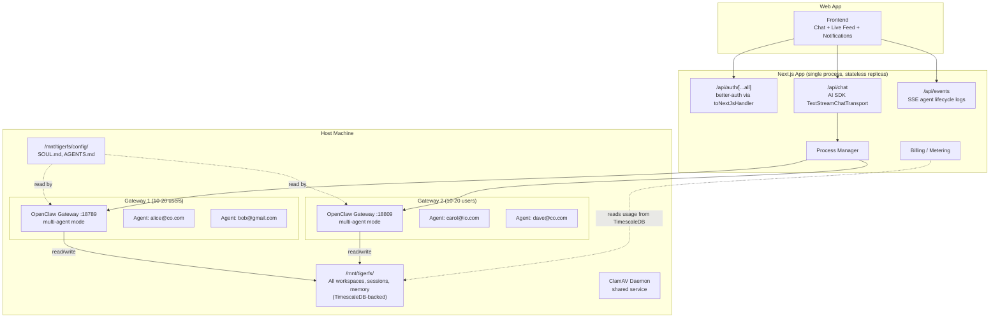
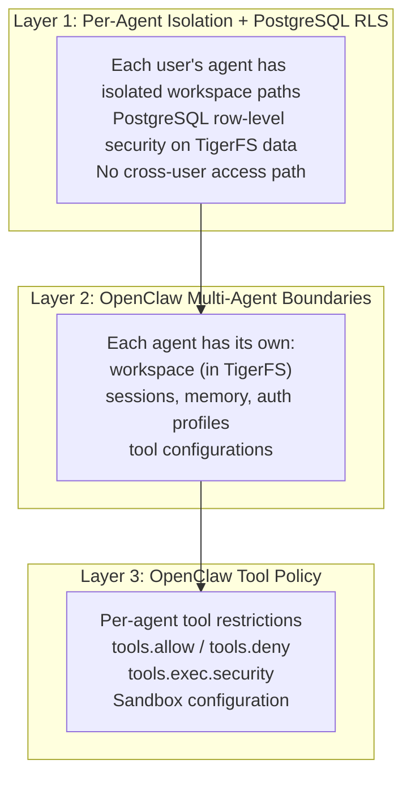
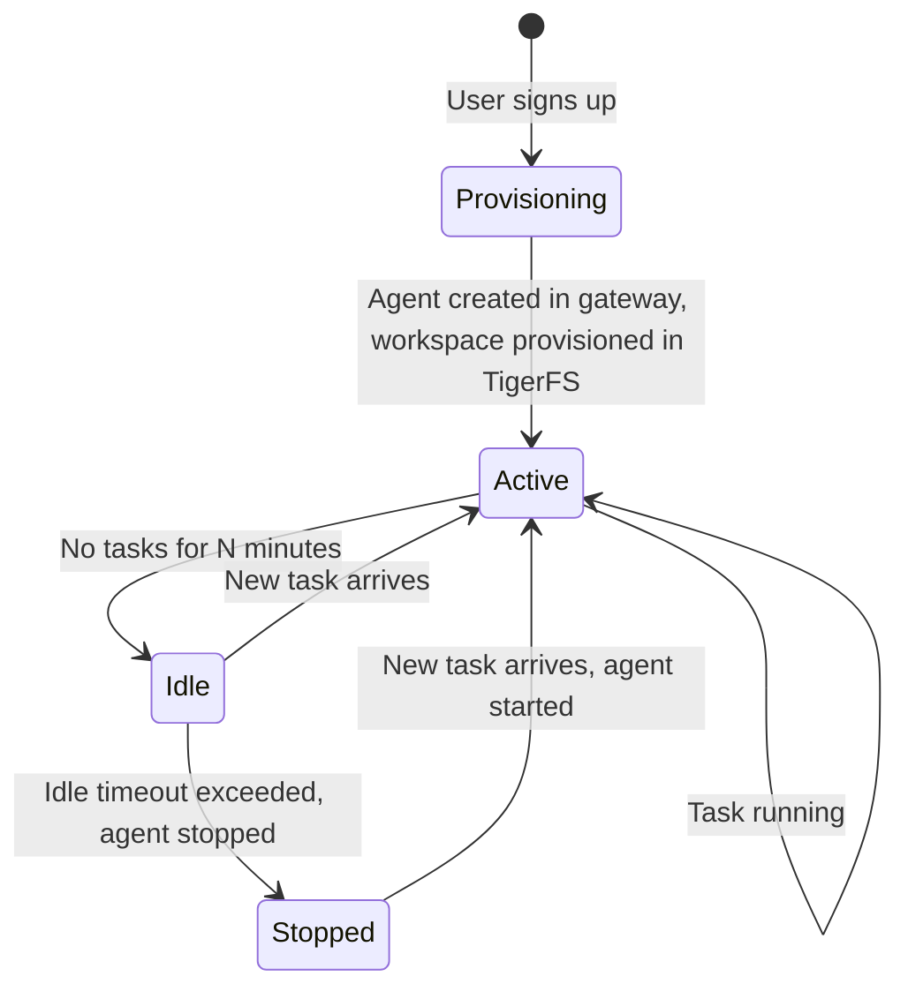
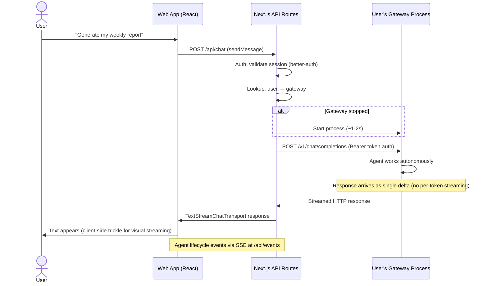
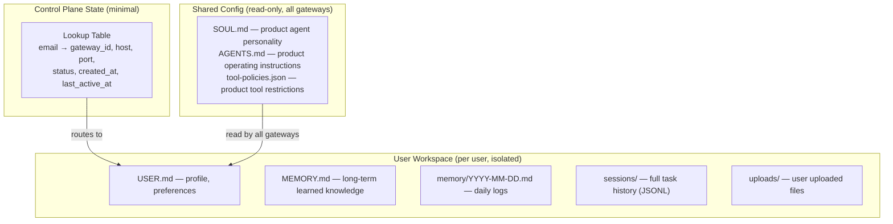
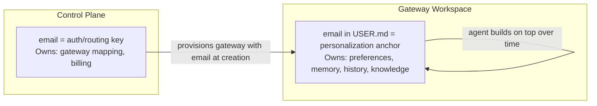

# Architecture: Multi-Agent Gateways, Fully Stateless

## Core Principle

Multiple users share each gateway process (10-20 users per gateway). The default `max_agents` per gateway is determined by Phase 5 load testing. Start with 10 as conservative default, increase based on benchmark results. OpenClaw’s [multi-agent](https://docs.openclaw.ai/concepts/multi-agent) architecture provides isolated workspaces, sessions, auth, and tools per user within a single gateway. Gateways are fully stateless — all data lives in TigerFS/TimescaleDB. Gateway config (`.openclaw/`) uses a Docker volume in dev but TigerFS in production.

## Identity Model

Dead simple:

```
1 email = 1 user = 1 agent (within a shared gateway) = 1 isolated workspace in TigerFS
```

No multi-email. No shared accounts. No teams (for now). Just one email per user.

## High-Level Architecture



## How OpenClaw Supports This Natively

[OpenClaw’s multi-agent mode](https://docs.openclaw.ai/concepts/multi-agent) provides built-in per-user isolation within a single gateway process:

- Each user gets an isolated agent with its own workspace, sessions, memory, and auth
- OpenClaw enforces per-agent path boundaries — agents cannot access each other’s data
- The gateway manages routing, lifecycle, and resource sharing across agents

## Isolation Model

Three layers of isolation without containers:



## Gateway Lifecycle



Starting an agent within an existing gateway is fast (~100-500ms). Gateway process itself is always running.

## Task Flow



## Why Multi-Agent Gateways (Not 1:1)

Three approaches were evaluated:

|                             | Multi-Agent Per Gateway                                            | 1 Gateway Per User                   | Containers (1:1)                     |
| --------------------------- | ------------------------------------------------------------------ | ------------------------------------ | ------------------------------------ |
| **Isolation**               | Per-agent boundaries + PostgreSQL RLS                              | OS user + process level              | OS-level (cgroups)                   |
| **Failure blast radius**    | 10-20 users                                                        | 1 user                               | 1 user                               |
| **Security boundary**       | RLS + agent path boundaries + security gate                        | Filesystem permissions               | Container sandbox                    |
| **Infrastructure**          | 500-1000 gateways for 10K users                                    | 10K processes, 50 hosts              | Docker/Kubernetes required           |
| **Cold start**              | ~100-500ms (start agent)                                           | ~1-2s (start process)                | ~2-5s (boot container)               |
| **Resource overhead**       | Lowest — shared processes                                          | Medium — one process per user        | Highest — container runtime per user |
| **Cost (10K users)**        | ~$600-1200/mo (10-20 VMs)                                          | ~$2-5K/mo (50 VMs)                   | ~$5-10K/mo (K8s + containers)        |
| **Complexity**              | Low                                                                | Medium (process management at scale) | High (K8s, images, networking)       |
| **Statefulness**            | Fully stateless (TigerFS)                                          | Local disk dependency                | Persistent volumes needed            |
| **Native OpenClaw support** | Yes — [multi-agent](https://docs.openclaw.ai/concepts/multi-agent) | Yes — built-in profiles              | Deployer configures it               |

**Verdict:** Multi-agent per gateway wins. Far fewer processes, fully stateless via TigerFS, dramatically cheaper. The 10-20 user blast radius is acceptable given the security gate, RLS, and agent isolation.

### Key Insight: Why Multi-Agent Became Possible

Multi-agent was always an option in OpenClaw, but the original concern was data affinity — each agent’s workspace, sessions, and memory lived on local disk. If a gateway crashed, data could be lost. If we needed to move an agent to another host, we’d have to migrate files.

[TigerFS](data.md) eliminated this entirely. With all data in TimescaleDB:

- **Gateway crash → zero data loss** (data is in the database, not on local disk)
- **Any gateway on any host can serve any agent** (no file migration, no affinity)
- **The downside of multi-agent (shared failure) became a non-issue** — failure means retrying a task, not losing data

This is why multi-agent went from “possible but risky” to “the obvious choice.”

## Cost Projection

Most agents will be idle most of the time (fire-and-forget = bursts, not constant load). Each gateway (10-20 users) uses ~500MB-1.5GB RAM depending on active agent count (at 20 agents × ~50MB idle each = 1GB minimum, plus gateway overhead).

| Users     | Gateways | Infrastructure          | Est. Monthly Cost |
| --------- | -------- | ----------------------- | ----------------- |
| 0-200     | 10-20    | 1 VM (32GB RAM, 8 vCPU) | ~$100-150         |
| 200-1000  | 50-100   | 2-3 VMs                 | ~$200-300         |
| 1000-5000 | 50-500   | 5-10 VMs                | ~$300-600         |
| 10,000    | 500-1000 | 10-20 VMs               | ~$600-1200        |

> **Note:** Infrastructure costs above exclude LLM API costs, which dominate at scale. At 10K users × 5 tasks/day × 50K tokens/task = 2.5B tokens/month. With coding plan providers (~$1/1M tokens): ~~$2,500/month. With premium providers (~~$15/1M tokens): ~$37,500/month. Deployers should budget LLM costs separately. Security gate adds ~100K LLM calls/day for content classification.

## Scaling: Adding Hosts

No load balancer needed. The control plane has a lookup table:

```
alice@co.com  → gateway-7 on host-1:18789
bob@gmail.com → gateway-7 on host-1:18789
carol@io.com  → gateway-12 on host-2:18789
```

When gateways fill up, Nomad places new ones on available hosts. The routing logic is email → gateway_id → host:port. Because gateways are fully stateless (all data in TigerFS), any gateway can be restarted on any host.

## What Lives Where



## Gateway Device Identity Requirement

OpenClaw gateway requires Ed25519 device identity for WebSocket connections. The Next.js app generates a persistent device keypair (stored in `.cache/`), signs a challenge-response payload (v3 format: `deviceId|clientId|mode|role|scopes|signedAt|token|nonce|platform|deviceFamily`), and must be paired/approved on the gateway before messages can flow. Password auth mode (`gateway.auth.mode: "password"`) is used for non-local connections (Docker, remote).

**Important:** `DEVICE_IDENTITY_PATH` env var is needed since Next.js CWD may differ from repo root. Device re-approval may be needed after gateway restart.

## No Traditional Backend

TigerFS + TimescaleDB is the entire data layer. No Redis, no S3, no migrations, no ORM for user data.

**What the framework avoids:**

- No data model design — agent organizes its own data through markdown files in TigerFS
- No migration hell — workspace files evolve naturally
- No sync problems — one source of truth (TigerFS/TimescaleDB)
- No API layer for CRUD — agent reads/writes its own workspace
- No backup complexity — `pg_dump` + TigerFS `.history/`

**What the Next.js app actually does:**

1. Auth — verify identity (Google OAuth via better-auth at `/api/auth/[...all]`)
2. Chat — relay messages to gateway via `/api/chat` (AI SDK TextStreamChatTransport)
3. Events — stream agent lifecycle logs via SSE at `/api/events`
4. Gateway lifecycle — manage via Nomad (future) or direct process management
5. Billing/metering — read usage data from TimescaleDB continuous aggregates

## The Complete Stack On One Host

```
One Linux VM:
  ├── Next.js app            (1 Bun process — auth, chat, events, all API routes)
  ├── TimescaleDB pg18       (1 system service)
  ├── TigerFS mount          (/mnt/tigerfs/ — all data)
  ├── ClamAV daemon          (clamav/clamav-debian:latest — ARM64 support)
  └── User gateway processes  (N OpenClaw processes, all read/write via TigerFS)
```

No per-user directories. No git sync. No separate backup infra. No separate control plane server. Just `bun dev` starts the Next.js app, which handles auth, chat, and events as API routes. Gateway processes are managed separately.

**Deployment note:** Local dev and Phase 0 use Docker (official OpenClaw image + TigerFS in a privileged container). Production deployment may use Nomad with raw_exec or Docker, depending on the host OS and TigerFS requirements (FUSE needs privileged mode in Docker).

---

# Identity: Email as the Universal Key

## The Model

```
email (primary key)
    → auth identity (OAuth provider)
    → gateway routing (which host:port to hit)
    → gateway workspace (USER.md has the email)
    → web app frontend (single channel, user interacts through the deployed instance)
```

## What Email Gives Us for Free

| Benefit                              | Why                                                    |
| ------------------------------------ | ------------------------------------------------------ |
| **Auth identity**                    | Google/Microsoft/GitHub OAuth all return email         |
| **Gateway routing**                  | Email maps deterministically to gateway_id, host, port |
| **Fallback notifications**           | Email itself is a delivery channel                     |
| **Deterministic gateway assignment** | Email maps to gateway_id for routing                   |
| **Human readable**                   | Admin sees `alice@company.com` in logs, not a UUID     |

## Control Plane Data Model

Essentially one table:

```
email (PK) → {
    gateway_id      // which gateway hosts this user's agent
    host            // which host the gateway runs on
    port            // gateway process port
    status          // active | idle | stopped | provisioning
    created_at
    last_active_at
}
```

Stored in TimescaleDB. Gateway assignment is managed by the control plane; gateways are fully stateless so users can be rebalanced across gateways without data migration.

## Identity Split



The two stay in sync naturally:

- Control plane provisions gateway with email at creation
- Agent builds the full user profile on top through conversation
- No sync mechanism needed — email is set once, everything else grows organically

## Filesystem Paths

Filesystem paths use email as the folder name: `/mnt/tigerfs/users/alice@company.com/`. Email is the universal key — consistent across auth, routing, and storage.

Email normalization: the framework lowercases email addresses and strips `+` aliases (e.g., `User+Tag@Gmail.com` normalizes to `user@gmail.com`). This prevents duplicate accounts from email aliases and case variations. Email normalization (lowercase + strip `+` aliases) MUST be applied by better-auth BEFORE creating the user record. The `email` column in the users table stores the NORMALIZED email. This prevents two accounts (`alice+1@company.com` and `alice@company.com`) from creating separate auth records that map to the same workspace. Add a better-auth `beforeSignup` hook that normalizes email before account creation. After normalization, the `@` is the only special character remaining — it is replaced with `_at_` in filesystem paths (e.g., `alice@company.com` becomes `alice_at_company.com`).

## Simplicity Constraints

- 1 email per user (no multi-email)
- No shared/team accounts (for now)
- No org hierarchy (for now)
