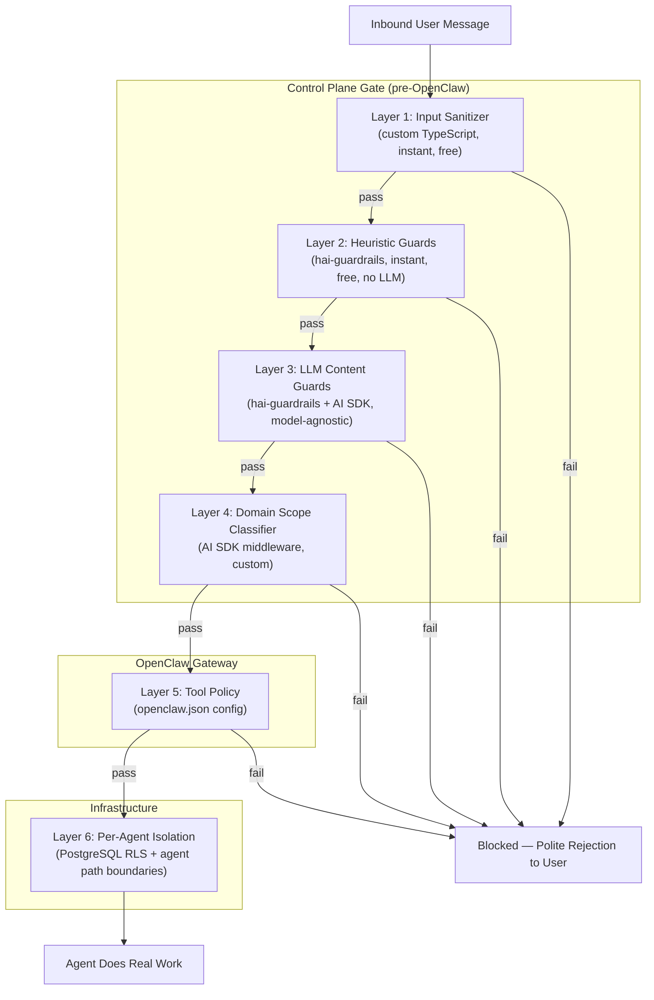

# Security: Defense in Depth — 7 Layers

## Core Principle

Block threats BEFORE they reach OpenClaw. Let OpenClaw focus on real work, not noisy filtering decisions. Every layer is independent — an attacker must beat ALL seven to do meaningful damage.

## Architecture Overview



## Layer Details

### Layer 1 — Input Sanitizer (custom TypeScript)

**Cost:** Free, instant
**Dependencies:** None (custom code, ~50 lines)

What it does:
- Strip hidden unicode characters, zero-width spaces, invisible markup
- Enforce max message length limits
- Reject malformed payloads
- Basic structure validation — does it look like a normal user message?

Catches: Encoding tricks, oversized payloads, malformed inputs.

---

### Layer 2 — Heuristic Guards ([hai-guardrails](https://github.com/presidio-oss/hai-guardrails), local mode)

**Cost:** Free, instant, no network calls
**Dependencies:** `@presidio-dev/hai-guardrails`

Guards enabled in heuristic/pattern mode:

| Guard | Mode | What It Catches |
|-------|------|-----------------|
| **Injection Guard** | Heuristic | Known prompt injection patterns, instruction overrides |
| **Leakage Guard** | Heuristic | System prompt extraction attempts |
| **PII Guard** | Pattern matching | Personal data (names, emails, SSNs, phone numbers) |
| **Secret Guard** | Pattern + entropy | API keys, credentials, tokens, secrets |

Catches: Known attack patterns, accidental secret/PII exposure.

---

### Layer 3 — LLM Content Guards (hai-guardrails + [AI SDK](https://ai-sdk.dev))

**Cost:** LLM call per message (cheap model, fast)
**Dependencies:** `@presidio-dev/hai-guardrails`, `ai` (Vercel AI SDK)

Uses AI SDK as the model provider so hai-guardrails is fully model-agnostic. Can use Claude, GPT, Gemini, or any provider — swappable without code changes.

Guards enabled in LLM mode:

| Guard | What It Catches |
|-------|-----------------|
| **Toxic Guard** | Harmful, dangerous content |
| **Hate Speech Guard** | Discriminatory language |
| **Bias Detection Guard** | Unfair generalizations |
| **Adult Content Guard** | NSFW content |
| **Copyright Guard** | Copyrighted material reproduction |
| **Profanity Guard** | Inappropriate language |

Catches: Content policy violations, harmful intent, inappropriate requests.

---

### Layer 4 — Domain Scope Classifier (AI SDK middleware)

**Cost:** LLM call (can batch with Layer 3)
**Dependencies:** `ai` (Vercel AI SDK)

Custom middleware that validates whether the request falls within the deployed product's domain. This is product-specific — each deployer defines their own scope.

Example for a financial reporting product:
```
ALLOW: "Generate my Q3 revenue report"
ALLOW: "Compare this quarter to last quarter"
BLOCK: "Write me a poem about cats"
BLOCK: "Help me debug this Python script"
```

Implementation: AI SDK middleware with a tight classification prompt. Can be combined with the Layer 3 LLM call to minimize latency (one call, multiple checks).

Catches: Out-of-scope requests, misuse of the service.

---

### Layer 5 — OpenClaw [Tool Policy](https://docs.openclaw.ai/gateway/sandbox-vs-tool-policy-vs-elevated) (built-in)

**Cost:** Free (configuration only)
**Dependencies:** OpenClaw native

Configured in `openclaw.json` per gateway:
- `tools.allow` / `tools.deny` — whitelist/blacklist tools
- `tools.exec.security` — execution security mode
- `tools.exec.safeBins` — restrict to safe binaries only
- Remove unnecessary capabilities entirely (no bash, no browser, no file system escape)

Catches: Even if a manipulated prompt reaches the agent, it can only use tools the deployer has explicitly allowed.

---

### Layer 6 — Per-Agent Isolation + PostgreSQL RLS (infrastructure)

**Cost:** Infrastructure cost (already part of architecture)
**Dependencies:** PostgreSQL row-level security, OpenClaw per-agent path boundaries

Each user's agent runs within a shared gateway but with strict isolation:
- **PostgreSQL RLS** on TigerFS data — each agent can only access rows belonging to its user
- **OpenClaw per-agent path boundaries** — each agent is scoped to its own workspace path in TigerFS
- **Security gate** (Layers 1-4) — validates all input before it reaches any agent

No cross-user access path exists. Even a fully compromised agent can only access that one user's own data within TigerFS.

Catches: Everything else. The blast radius of a compromised agent is one user's data, not the gateway's other users.

---

### Layer 7 — Architectural Blast Radius

This isn't a "layer" you implement — it's a property of the per-agent isolation architecture:

| Attack Scenario | Traditional SaaS | This Architecture |
|---|---|---|
| Prompt injection succeeds | Access shared DB → all users' data | RLS + path boundaries → one user's data only |
| Agent goes rogue | Shared infra at risk | One agent's scoped workspace at risk |
| Credentials leaked | Shared secrets exposed | One user's auth profiles only (per-agent isolation) |
| Data exfiltration | Entire database | One user's workspace files (RLS enforced) |

## Tech Stack Summary

| Component | Library | Why |
|---|---|---|
| Input sanitization | Custom TypeScript | Trivial, no dependency needed |
| Heuristic guards | `@presidio-dev/hai-guardrails` | TypeScript-native, battle-tested, no LLM needed for heuristic mode |
| LLM content guards | `@presidio-dev/hai-guardrails` | Covers toxic, hate, bias, adult, copyright, profanity |
| Model provider for guards | `ai` (Vercel AI SDK) | Model-agnostic — swap providers without code changes |
| Domain scope classifier | `ai` (Vercel AI SDK) middleware | Custom per deployed product, clean middleware pattern |
| Tool restrictions | OpenClaw native (`openclaw.json`) | Already built-in, zero code |
| Per-agent isolation | PostgreSQL RLS + OpenClaw path boundaries | Per-agent data isolation within shared gateways |

## Flow Timing Estimate

```mermaid
gantt
    title Request Processing Timeline
    dateFormat X
    axisFormat %L ms

    section Gate
    Input Sanitizer           :0, 1
    Heuristic Guards          :1, 5
    LLM Guards + Scope Check  :5, 200

    section OpenClaw
    Agent Processing          :200, 5000
```



Layers 1-2: <5ms (free, local)
Layers 3-4: ~100-200ms (one LLM call, cheap model)
Total gate overhead: <200ms — imperceptible to a fire-and-forget user.

---

# Isolation Audit: Code-Level Verification

Deep code-level verification that two users' agents on the same gateway can never access each other's data.

## Verified Boundaries

### File Read/Write — Isolated
`src/infra/fs-safe.ts:171` — every file operation passes through `isPathInside(workspaceRoot, requestedPath)`. Blocks:
- Absolute paths outside workspace
- Relative path traversal (`../../../`)
- Symlink escapes (real-path re-check after resolution)
- Hardlink attacks (`nlink > 1` rejection)

### Sessions — Isolated
`src/routing/session-key.ts:73-76` — session keys encode agent ID (`agent:<agentId>:<rest>`). Agent A cannot access Agent B's session history. Server validates key ownership.

### Memory Search — Isolated
`src/agents/tools/memory-tool.ts:35-103` — memory manager instantiated per-agent, indexes only files from that agent's workspace. No cross-agent search.

### Context/Prompts — Isolated
`src/agents/workspace.ts:56-88` — bootstrap files (SOUL.md, USER.md, MEMORY.md) loaded from agent's own workspace only via `readWorkspaceFileWithGuards()`.

### Inter-Agent Communication — Isolated
Off by default. No tool exposes agent enumeration or cross-agent messaging.

### Auth/API Keys — Not a user isolation concern
API keys are process-global but belong to the deployer, not individual users. All agents should use the same key pool.

## Gaps Requiring Configuration

### Exec Commands — Requires tool policy
Shell commands bypass OpenClaw's file boundary checks. A command like `cat /other-user/file` could theoretically succeed.

**Framework must enforce:**
- `tools.exec.security: "deny"` explicitly in shared config — OpenClaw's default depends on exec host: `sandbox` → `deny`, `gateway` → `allowlist`. Since uniclaw doesn't use Docker sandboxes, exec runs on gateway host where the default is `allowlist`, NOT `deny`. The framework MUST set this explicitly.
- Deployer configures `safeBins` for allowed commands
- Security gate blocks prompt injection before OpenClaw

### memory-timescaledb Plugin — Our responsibility
Shared pgvector table in TimescaleDB. Every query MUST include `WHERE agent_id = $1`. The table schema enforces this:

```sql
CREATE TABLE memory_chunks (
    agent_id    TEXT NOT NULL,  -- scoping key
    chunk       TEXT,
    embedding   vector(1536),
    source_file TEXT,
    created_at  TIMESTAMPTZ DEFAULT now()
);

-- RLS policy: each agent connection can only see its own rows
-- Every search query: WHERE agent_id = $1 AND embedding <=> $query_vector
-- Every insert: agent_id set from runtime context, never from user input
```

This is enforced in code AND at the database level via RLS. Both must be implemented.

## Framework Security Defaults

The framework ships with these non-negotiable defaults in shared config:

```json5
{
  tools: {
    exec: {
      security: "deny",     // MUST be set explicitly — OpenClaw's default for gateway host is "allowlist", not "deny"
      safeBins: []           // deployer explicitly allows what's needed
    },
    deny: ["browser"]        // deny browser by default
  }
}
```

**⚠ Critical:** The `security: "deny"` setting is NOT automatic. OpenClaw's default depends on exec host: `sandbox` → `deny`, `gateway` → `allowlist`. Since this architecture runs exec on the gateway host (no Docker sandboxes), the default would be `allowlist` — permitting any binary. The framework MUST explicitly set `security: "deny"` in the shared config that all gateways read.

Deployers can relax these for their use case, but the defaults are secure.

---

## Additional Security Notes

### RLS Requires Per-Gateway Database Roles

RLS only works if each gateway connects with a distinct PostgreSQL role. A single shared credential makes RLS meaningless — all gateways would see all rows. The control plane should create per-gateway roles and configure each gateway's TigerFS mount with its scoped role.

Each gateway process starts TigerFS with a connection string using its gateway-specific PostgreSQL role. This means each gateway has its own TigerFS mount point (e.g., `/mnt/tigerfs/gw-{gateway_id}/`). The control plane provisions the role and mount at gateway creation time.

### FUSE Mount Bypasses RLS

TigerFS FUSE mount presents all data as regular files regardless of RLS. RLS only protects SQL-level access. If a process escapes OpenClaw's path boundary checks, it can read any file on the mount. Mitigation: restrict FUSE mount permissions to the gateway user group, and ensure exec is denied by default.

### Output Validation

The 7-layer gate only validates INPUT. Agent responses should be scanned for PII/secrets before delivery to the user. This can use the same hai-guardrails library on the output path — run the PII Guard and Secret Guard on agent output before forwarding to the frontend.

### `bunx @latest` Supply Chain Risk

`bunx @package@latest` executes arbitrary code from npm. Deployers should pin versions in production, use `bun audit`, and maintain an allowlist of permitted CLI packages in tool policy. Unpinned `@latest` tags are acceptable for development but a supply chain risk in production.

### Gateway HTTP API Protection

OpenClaw gateways expose HTTP APIs (`/v1/chat/completions`, `/tools/invoke`, etc.) on their bound port. These must be: (a) bound to localhost only, (b) protected with gateway auth tokens, (c) firewall-restricted. The control plane is the ONLY authorized client.
