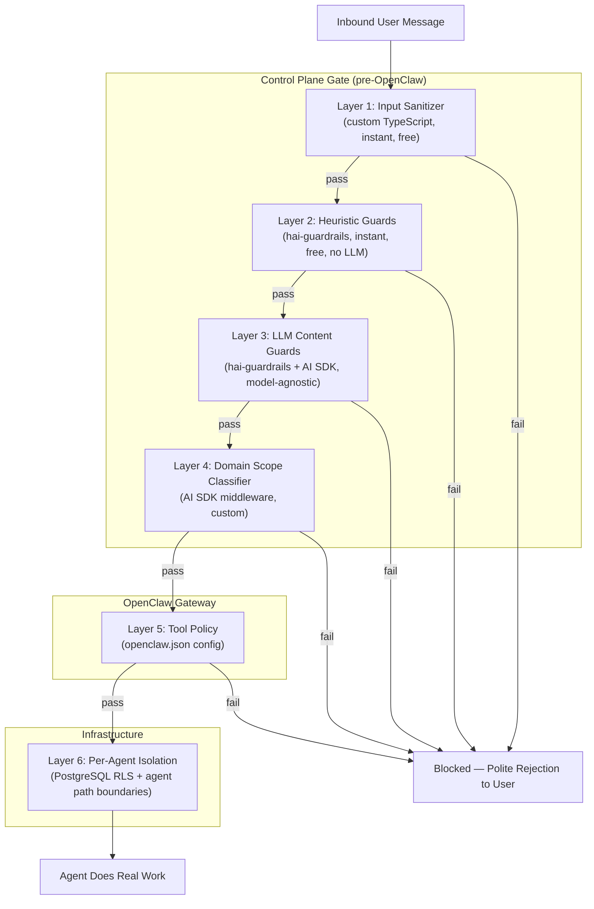

# Security: Defense in Depth — 7 Layers

## Core Principle

Block threats BEFORE they reach OpenClaw. Let OpenClaw focus on real work, not noisy filtering decisions. Every layer is independent — an attacker must beat ALL seven to do meaningful damage.

## Architecture Overview



## Layer Details

### Layer 1 — Input Sanitizer (custom TypeScript)

**Cost:** Free, instant
**Dependencies:** None (custom code, ~50 lines)

What it does:
- Strip hidden unicode characters, zero-width spaces, invisible markup
- Enforce max message length limits
- Reject malformed payloads
- Basic structure validation — does it look like a normal user message?

Catches: Encoding tricks, oversized payloads, malformed inputs.

---

### Layer 2 — Heuristic Guards ([hai-guardrails](https://github.com/presidio-oss/hai-guardrails), local mode)

**Cost:** Free, instant, no network calls
**Dependencies:** `@presidio-dev/hai-guardrails`

Guards enabled in heuristic/pattern mode:

| Guard | Mode | What It Catches |
|-------|------|-----------------|
| **Injection Guard** | Heuristic | Known prompt injection patterns, instruction overrides |
| **Leakage Guard** | Heuristic | System prompt extraction attempts |
| **PII Guard** | Pattern matching | Personal data (names, emails, SSNs, phone numbers) |
| **Secret Guard** | Pattern + entropy | API keys, credentials, tokens, secrets |

Catches: Known attack patterns, accidental secret/PII exposure.

---

### Layer 3 — LLM Content Guards (hai-guardrails + [AI SDK](https://ai-sdk.dev))

**Cost:** LLM call per message (cheap model, fast)
**Dependencies:** `@presidio-dev/hai-guardrails`, `ai` (Vercel AI SDK)

Uses AI SDK as the model provider so hai-guardrails is fully model-agnostic. Can use Claude, GPT, Gemini, or any provider — swappable without code changes.

Guards enabled in LLM mode:

| Guard | What It Catches |
|-------|-----------------|
| **Toxic Guard** | Harmful, dangerous content |
| **Hate Speech Guard** | Discriminatory language |
| **Bias Detection Guard** | Unfair generalizations |
| **Adult Content Guard** | NSFW content |
| **Copyright Guard** | Copyrighted material reproduction |
| **Profanity Guard** | Inappropriate language |

Catches: Content policy violations, harmful intent, inappropriate requests.

---

### Layer 4 — Domain Scope Classifier (AI SDK middleware)

**Cost:** Separate LLM call (Layer 3 uses hai-guardrails, Layer 4 uses AI SDK — different libraries, cannot share one call)
**Dependencies:** `ai` (Vercel AI SDK)

Custom middleware that validates whether the request falls within the deployed product's domain. This is product-specific — each deployer defines their own scope.

Example for a financial reporting product:
```
ALLOW: "Generate my Q3 revenue report"
ALLOW: "Compare this quarter to last quarter"
BLOCK: "Write me a poem about cats"
BLOCK: "Help me debug this Python script"
```

Implementation: AI SDK `generateText()` with `Output.object()` + Zod schema. Runs as a separate LLM call from Layer 3 (hai-guardrails uses its own LLM invocation). Total gate latency: ~200-400ms for two sequential LLM calls.

Catches: Out-of-scope requests, misuse of the service.

---

### Layer 5 — OpenClaw [Tool Policy](https://docs.openclaw.ai/gateway/sandbox-vs-tool-policy-vs-elevated) (built-in)

**Cost:** Free (configuration only)
**Dependencies:** OpenClaw native

Configured in `openclaw.json` per gateway:
- `tools.allow` / `tools.deny` — whitelist/blacklist tools
- `tools.exec.security` — execution security mode
- `tools.exec.safeBins` — restrict to safe binaries only
- Remove unnecessary capabilities entirely (no bash, no browser, no file system escape)

Catches: Even if a manipulated prompt reaches the agent, it can only use tools the deployer has explicitly allowed.

---

### Layer 6 — Per-Agent Isolation + PostgreSQL RLS (infrastructure)

**Cost:** Infrastructure cost (already part of architecture)
**Dependencies:** PostgreSQL row-level security, OpenClaw per-agent path boundaries

Each user's agent runs within a shared gateway but with strict isolation:
- **PostgreSQL RLS** on TigerFS data — each agent can only access rows belonging to its user
- **OpenClaw per-agent path boundaries** — each agent is scoped to its own workspace path in TigerFS
- **Security gate** (Layers 1-4) — validates all input before it reaches any agent

No cross-user access path exists. Even a fully compromised agent can only access that one user's own data within TigerFS.

Catches: Everything else. The blast radius of a compromised agent is one user's data, not the gateway's other users.

---

### Layer 7 — Architectural Blast Radius

This isn't a "layer" you implement — it's a property of the per-agent isolation architecture:

| Attack Scenario | Traditional SaaS | This Architecture |
|---|---|---|
| Prompt injection succeeds | Access shared DB → all users' data | RLS + path boundaries → one user's data only |
| Agent goes rogue | Shared infra at risk | One agent's scoped workspace at risk |
| Credentials leaked | Shared secrets exposed | One user's auth profiles only (per-agent isolation) |
| Data exfiltration | Entire database | One user's workspace files (RLS enforced) |

## Tech Stack Summary

| Component | Library | Why |
|---|---|---|
| Input sanitization | Custom TypeScript | Trivial, no dependency needed |
| Heuristic guards | `@presidio-dev/hai-guardrails` | TypeScript-native, battle-tested, no LLM needed for heuristic mode |
| LLM content guards | `@presidio-dev/hai-guardrails` | Covers toxic, hate, bias, adult, copyright, profanity |
| Model provider for guards | `ai` (Vercel AI SDK) | Model-agnostic — swap providers without code changes |
| Domain scope classifier | `ai` (Vercel AI SDK) middleware | Custom per deployed product, clean middleware pattern |
| Tool restrictions | OpenClaw native (`openclaw.json`) | Already built-in, zero code |
| Per-agent isolation | PostgreSQL RLS + OpenClaw path boundaries | Per-agent data isolation within shared gateways |

## Flow Timing Estimate

```mermaid
gantt
    title Request Processing Timeline
    dateFormat X
    axisFormat %L ms

    section Gate
    Input Sanitizer           :0, 1
    Heuristic Guards          :1, 5
    LLM Guards + Scope Check  :5, 200

    section OpenClaw
    Agent Processing          :200, 5000
```



Layers 1-2: <5ms (free, local)
Layers 3-4: ~100-200ms (one LLM call, cheap model)
Total gate overhead: ~200-400ms (two sequential LLM calls for Layers 3+4) — imperceptible to a fire-and-forget user where tasks take seconds to minutes.

---

# Isolation Audit: Code-Level Verification

Deep code-level verification that two users' agents on the same gateway can never access each other's data.

## Verified Boundaries

### File Read/Write — Isolated
`src/infra/fs-safe.ts:171` — every file operation passes through `isPathInside(workspaceRoot, requestedPath)`. Blocks:
- Absolute paths outside workspace
- Relative path traversal (`../../../`)
- Symlink escapes (real-path re-check after resolution)
- Hardlink attacks (`nlink > 1` rejection)

### Sessions — Isolated
`src/routing/session-key.ts:73-76` — session keys encode agent ID (`agent:<agentId>:<rest>`). Agent A cannot access Agent B's session history. Server validates key ownership.

### Memory Search — Isolated
`src/agents/tools/memory-tool.ts:35-103` — memory manager instantiated per-agent, indexes only files from that agent's workspace. No cross-agent search.

### Context/Prompts — Isolated
`src/agents/workspace.ts:56-88` — bootstrap files (SOUL.md, USER.md, MEMORY.md) loaded from agent's own workspace only via `readWorkspaceFileWithGuards()`.

### Inter-Agent Communication — Isolated
Off by default. No tool exposes agent enumeration or cross-agent messaging.

### Auth/API Keys — Not a user isolation concern
API keys are process-global but belong to the deployer, not individual users. All agents should use the same key pool.

## Gaps Requiring Configuration

### Exec Commands — Requires tool policy
Shell commands bypass OpenClaw's file boundary checks. A command like `cat /other-user/file` could theoretically succeed.

**Framework must enforce:**
- `tools.exec.security: "allowlist"` with `safeBins: ["bunx"]` explicitly in shared config — OpenClaw's default depends on exec host: `sandbox` → `deny`, `gateway` → `allowlist` (all binaries). Since uniclaw doesn't use Docker sandboxes, exec runs on gateway host where the default allows ALL binaries. The framework MUST explicitly set `safeBins: ["bunx"]` to restrict execution to only the CLI runner.
- Deployer can add additional safe binaries to `safeBins` as needed
- Security gate blocks prompt injection before OpenClaw

### memory-timescaledb Plugin — Our responsibility
Shared pgvector table in TimescaleDB. Every query MUST scope by agent_id. The RLS policy allows access to the agent's own rows AND rows with `agent_id = '__shared__'` (shared knowledge).

**How `app.agent_id` is set:** The `memory-timescaledb` plugin calls `SET LOCAL app.agent_id = '<agent_id>'` at the start of every transaction before issuing any query. `SET LOCAL` scopes the setting to the current transaction only, so it works correctly with connection pooling. The database must have a default: `ALTER DATABASE uniclaw SET app.agent_id = '__none__'` — this ensures unset sessions get no data (RLS blocks `__none__` since no rows have that agent_id).

The table schema enforces this:

```sql
CREATE TABLE memory_chunks (
    agent_id    TEXT NOT NULL,  -- scoping key
    chunk       TEXT,
    embedding   vector(1536),
    source_file TEXT,
    created_at  TIMESTAMPTZ DEFAULT now()
);

-- SELECT RLS policy: each agent can see its own rows + shared knowledge
-- USING (agent_id = current_setting('app.agent_id') OR agent_id = '__shared__')
-- INSERT RLS policy: WITH CHECK (agent_id = current_setting('app.agent_id')) — agents can only write their own agent_id. The `__shared__` rows are inserted by the control plane's knowledge indexer using a separate privileged database role that bypasses RLS.
-- Every search query: WHERE agent_id IN ($1, '__shared__') AND embedding <=> $query_vector
-- Every insert: agent_id set from runtime context, never from user input
```

This is enforced in code AND at the database level via RLS. Both must be implemented.

## Framework Security Defaults

The framework ships with these non-negotiable defaults in shared config:

```json5
{
  tools: {
    exec: {
      security: "allowlist",  // allowlist mode — only safeBins are permitted
      safeBins: ["bunx"]      // ONLY bunx allowed — the core CLI execution mechanism
    },
    deny: ["browser"]         // deny browser by default
  }
}
```

**⚠ Critical: exec security and `bunx` interaction.** The agent-native paradigm requires `bunx` for CLI execution. Setting `security: "deny"` blocks ALL exec including `bunx`, breaking the core backend model. The correct setting is `security: "allowlist"` with `safeBins: ["bunx"]` — this permits ONLY `bunx` execution while blocking all other shell commands. Deployers can add additional safe binaries as needed.

OpenClaw's default for gateway host is `allowlist` with no safeBins restriction (all binaries allowed). The framework MUST explicitly set `safeBins: ["bunx"]` to restrict execution to only the CLI runner.

Deployers can relax these for their use case, but the defaults are secure.

---

## Additional Security Notes

### RLS Requires Per-Gateway Database Roles

RLS only works if each gateway connects with a distinct PostgreSQL role. A single shared credential makes RLS meaningless — all gateways would see all rows. The control plane should create per-gateway roles and configure each gateway's TigerFS mount with its scoped role.

Each gateway process connects to TimescaleDB using its gateway-specific PostgreSQL role. There are two mount strategies:

- **Single shared mount (simpler, default):** One TigerFS mount at `/mnt/tigerfs/` per host. All gateways on the host share it. RLS is enforced at the SQL level only (for `memory_chunks` and `usage_events`). FUSE-level file access relies on OpenClaw's path boundary enforcement for isolation. This is the strategy used throughout the architecture and plan docs.
- **Per-gateway mounts (stronger isolation):** Each gateway gets its own TigerFS mount scoped to its PostgreSQL role. More secure but adds mount management complexity. Consider for high-security deployments.

The default is the single shared mount — it matches the architecture described in all other docs and provides sufficient isolation via OpenClaw's path boundaries + RLS on SQL queries.

### FUSE Mount Bypasses RLS

TigerFS FUSE mount presents all data as regular files regardless of RLS. RLS only protects SQL-level access. Two attack vectors:

1. **Process escape:** If a process escapes OpenClaw's path boundary checks (e.g., via a `bunx`-executed CLI that reads arbitrary paths), it can access other users' files on the mount.
2. **Legitimate user request:** A user could ask their agent "read the file at /mnt/tigerfs/users/other@email.com/USER.md" — the security gate (Layer 4) would not catch this because it's a plausible in-scope file operation.

**Mitigations (layered):**
- **OpenClaw path boundaries** (`isPathInside()`) restrict read/write to the agent's own workspace. The agent's workspace root is set per-agent — requests for paths outside it are rejected at the tool level (verified in isolation audit above).
- **Per-gateway TigerFS mounts** scope the FUSE mount to only the gateway's agents' data, so even a process escape can't see other gateways' users. However, users on the SAME gateway (10-20) share the mount — cross-agent isolation within a gateway depends entirely on OpenClaw's path boundary enforcement.
- **`safeBins: ["bunx"]`** restricts exec to only `bunx`. The `bunx`-executed CLI runs as a child process inheriting the gateway's filesystem access. CLIs should NOT accept arbitrary file paths from the agent — deployers must design CLIs to read from their own data sources, not from workspace paths.
- **Security gate Layer 4** can be configured to block requests mentioning other users' paths or identifiers. Deployers should include path-related restrictions in their domain scope classifier prompt.

**Accepted architectural limitation:** A deployer-written CLI that accepts arbitrary `--file` flags could be used by the agent to read other users' files on the shared FUSE mount. This is analogous to any multi-tenant backend where application code has database access — a poorly-written backend endpoint can leak data. The framework mitigates this through documentation, CLI design guidelines, and the security gate, but cannot enforce it at the OS level without per-user containers (which was rejected for cost/complexity). Deployers building CLIs that handle files MUST validate that paths are within the requesting user's workspace. The framework provides the user's workspace path as an environment variable for CLIs to check against.

### Output Validation

The 7-layer gate only validates INPUT. Agent responses should be scanned for PII/secrets before delivery to the user. This can use the same hai-guardrails library on the output path — run the PII Guard and Secret Guard on agent output before forwarding to the frontend.

Output validation covers WebSocket text responses. For agent-generated files (reports, exports written to workspace), the deployer should configure the agent's instructions to avoid writing sensitive data. File-level output scanning is deferred post-MVP — deployers handling sensitive data should implement file scanning in their CLIs.

### `bunx @latest` Supply Chain Risk

`bunx @package@latest` executes arbitrary code from npm. Deployers should pin versions in production, use `bun audit`, and maintain an allowlist of permitted CLI packages in tool policy. Unpinned `@latest` tags are acceptable for development but a supply chain risk in production.

### Gateway HTTP API Protection

OpenClaw gateways expose HTTP APIs (`/v1/chat/completions`, `/tools/invoke`, etc.) on their bound port. These must be: (a) bound to localhost only, (b) protected with gateway auth tokens, (c) firewall-restricted. The control plane is the ONLY authorized client.
