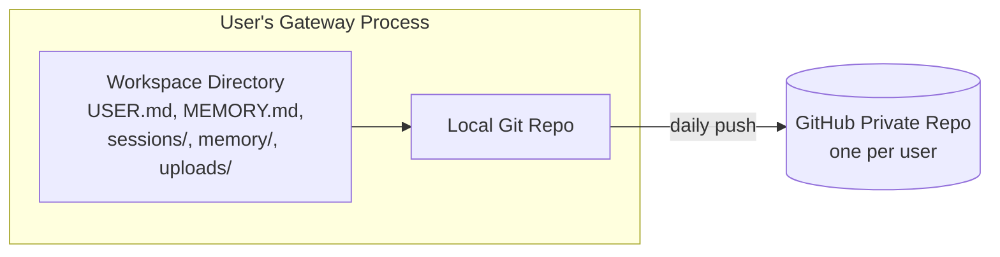
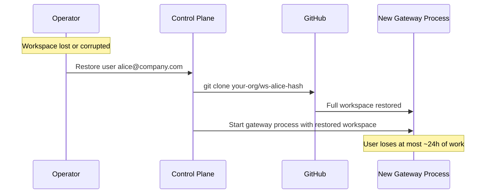

# Backup & Disaster Recovery: Git-Based Workspace Backup

## Core Principle

Each user's workspace is a git repo. Auto-commit and push to GitHub daily. Free, version-controlled, rollbackable.

## How It Works

1. Each user's workspace is initialized as a git repo
2. A daily cron job (system-level, not LLM) runs `git add . && git commit && git push`
3. Each user has their own private repo under a GitHub org (e.g., `<deployer-org>/ws-<user-hash>`)
4. Full version history of every workspace change

## What Gets Backed Up

| Content | Backed Up | Notes |
|---|---|---|
| `USER.md` | Yes | User profile and preferences |
| [`MEMORY.md`](https://docs.openclaw.ai/concepts/memory) | Yes | Long-term agent memory |
| `memory/` | Yes | Daily logs |
| `sessions/` | Yes | Full task history (JSONL) |
| `uploads/` | Yes | User-uploaded files (within size limits) |
| [`SOUL.md`](https://docs.openclaw.ai/concepts/agent-workspace) | No | Shared config, lives in shared config directory |
| `AGENTS.md` | No | Shared config, lives in shared config directory |

## Why GitHub

- **Free** — unlimited private repos on free plan
- **Version history** — full git log of every change, diffable
- **Rollback** — restore to any point in time with `git checkout`
- **Disaster recovery** — workspace lost? `git clone` and the workspace is back
- **No extra infrastructure** — no snapshot service, no S3, no backup jobs to manage

## Rate Limits (Not a Problem)

GitHub allows 500 content-generating requests per hour. Daily pushes:

| Users | Pushes/Day | Pushes/Hour | Within Limit? |
|---|---|---|---|
| 100 | 100 | ~4 | Yes |
| 1,000 | 1,000 | ~42 | Yes |
| 5,000 | 5,000 | ~208 | Yes |
| 10,000 | 10,000 | ~417 | Yes |

Even at 10,000 users with daily pushes, well within limits. Stagger push times across the day for safety.

## Storage Limits

GitHub recommends repos under 1GB, hard limit at 5GB. File uploads capped at 100MB per file.

For workspace files (markdown, JSONL, small uploads), 1GB per user is plenty. The file validation gate enforces upload size limits, so this is controlled.

## Recovery Flow

## Worst Case Data Loss

- Daily push at midnight → workspace lost at 11pm → lose ~23 hours of work
- Acceptable tradeoff for early-stage deployments — free backup with no infrastructure
- If needed later, increase push frequency (every 6h, every hour) while staying within rate limits

## Scaling Beyond GitHub

If GitHub becomes a bottleneck (unlikely with daily pushes):

| Scale | Strategy |
|---|---|
| 0-10,000 users | GitHub — free, simple |
| 10,000+ users | Self-hosted [Gitea](https://gitea.io/) (no rate limits) or filesystem snapshots ($0.05/GB/month) |

