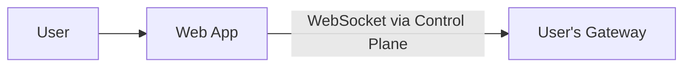
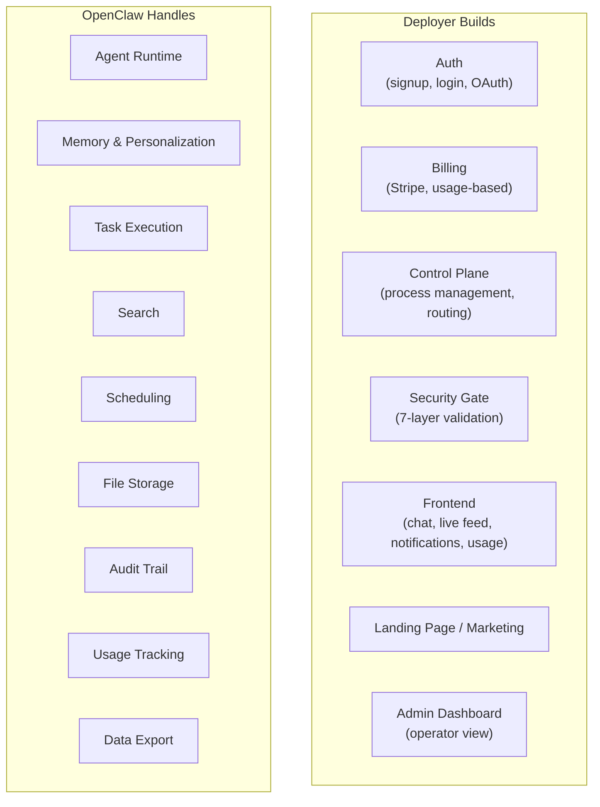

# SaaS Simplification: What OpenClaw Already Solves

## Core Principle

The framework uses the web app as the **single channel**. No WhatsApp, Telegram, Slack, or any other messaging platform. One frontend, one consistent UX, fully controlled.

## Single Channel Architecture

No channel configuration, no bot tokens, no QR codes, no multi-channel routing. Just the deployer’s frontend talking to the gateway’s [WebSocket API](https://docs.openclaw.ai/gateway/protocol).

## The Frontend

Four surfaces, all powered by the gateway’s WebSocket event stream:

| Surface             | What It Does                                              |
| ------------------- | --------------------------------------------------------- |
| **Chat**            | Submit tasks, receive results                             |
| **Live Feed**       | Readonly stream of agent progress (security camera model) |
| **Notifications**   | Task completion alerts                                    |
| **Usage / History** | Token usage, cost, past tasks                             |

## What OpenClaw Eliminates

Typical SaaS components the deployer does NOT need to build:

### User Onboarding

- **Traditional:** Build onboarding wizard, tutorial screens, tooltips
- **With OpenClaw:** Agent talks to user. “Tell me about yourself.” Populates `USER.md` through conversation.

### User Settings & Preferences

- **Traditional:** Settings page, dropdowns, toggles, database columns
- **With OpenClaw:** User says “I prefer PDF reports.” Agent updates `USER.md` and [`MEMORY.md`](https://docs.openclaw.ai/concepts/memory). No settings UI needed.

### Task Queue / Job System

- **Traditional:** Redis, Bull, worker processes, retry logic, dead letter queues
- **With OpenClaw:** Gateway IS the task runner. Message comes in, agent processes, delivers result.

### Scheduling / Cron

- **Traditional:** Separate scheduler service, cron library, job persistence
- **With OpenClaw:** Built-in [cron](https://docs.openclaw.ai/automation/cron-jobs). User says “run this every Monday at 9am.” Done.

### Search

- **Traditional:** Elasticsearch, Algolia, search indexing, query API
- **With OpenClaw:** Hybrid vector + BM25 search over memory. User asks “what was that report from last month?” Agent finds it.

### File Storage

- **Traditional:** S3, presigned URLs, metadata database, upload service
- **With OpenClaw:** Workspace directory. Agent reads/writes local files.

### Audit Trail / Activity Log

- **Traditional:** Event sourcing, audit log table, log viewer UI
- **With OpenClaw:** [Session transcripts](https://docs.openclaw.ai/concepts/session) are append-only JSONL. Complete record of every interaction.

### Notifications

- **Traditional:** Push notification service, email templates, notification preferences
- **With OpenClaw:** Results delivered directly through the WebSocket event stream. Frontend shows notification.

### Reporting / Analytics (User-Facing)

- **Traditional:** Build report generation, charting, PDF export
- **With OpenClaw:** User asks “summarize my usage this month.” Agent queries its own sessions.

### Multi-Language Support

- **Traditional:** i18n framework, translation files, locale management
- **With OpenClaw:** LLM handles multiple languages naturally. Zero config.

### Data Export

- **Traditional:** Build export API, format converters, background job
- **With OpenClaw:** User asks “export all my data.” Agent packages workspace files.

### GDPR Data Deletion

- **Traditional:** Hunt through 15 database tables, S3 buckets, logs, caches
- **With OpenClaw:** Delete the workspace directory. Everything gone. One operation.

### Help / Support

- **Traditional:** Help desk system, knowledge base, ticket system
- **With OpenClaw:** The agent IS the support. It knows the product and the user’s context.

## What the Deployer Still Builds

## Comparison: Traditional SaaS Stack vs This Architecture

| Component             | Traditional SaaS                       | This Architecture                                   |
| --------------------- | -------------------------------------- | --------------------------------------------------- |
| **Backend framework** | Express/Nest/Django + dozens of routes | Thin control plane (auth + WebSocket proxy + admin) |
| **Database**          | PostgreSQL + Redis + migrations + ORM  | TimescaleDB via TigerFS (workspace files)           |
| **Task queue**        | Redis + Bull + workers                 | OpenClaw gateway                                    |
| **File storage**      | S3 + metadata DB                       | Workspace directory                                 |
| **Search**            | Elasticsearch/Algolia                  | OpenClaw memory search                              |
| **Notifications**     | FCM/APNS/SendGrid                      | WebSocket events                                    |
| **Scheduler**         | Custom cron service                    | OpenClaw cron                                       |
| **Audit log**         | Event sourcing / log tables            | Session transcripts                                 |
| **i18n**              | Translation framework                  | LLM handles it                                      |
| **Settings UI**       | Complex forms + DB columns             | Conversation + USER.md                              |
| **Onboarding**        | Wizard UI + state machine              | Agent conversation                                  |
| **Data export**       | Export jobs + formatters               | Agent packages files                                |
| **GDPR deletion**     | Multi-table purge scripts              | Delete workspace directory                          |
