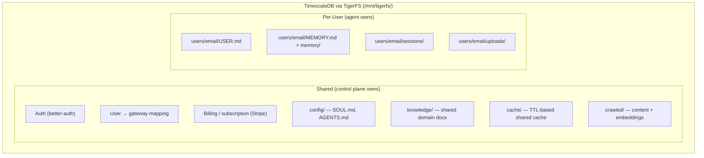

# Data Layer: [TimescaleDB](https://www.timescale.com/) + [TigerFS](tigerfs.md), No Overlap

Every piece of data has exactly one source of truth. Nothing stored in two places.

## Unified Storage via TigerFS

With [TigerFS](tigerfs.md), all data — shared and per-user — lives in TimescaleDB, accessed as files:



### What TimescaleDB Does NOT Store

| Data | Where Instead | Why |
|---|---|---|
| Gateway status | Check process live (`kill -0 <pid>`) | Stored status goes stale |
| Live usage/progress | [WebSocket stream](https://docs.openclaw.ai/gateway/protocol) from gateway → control plane → frontend | Real-time, no storage needed |

Everything else is in TimescaleDB.

## TimescaleDB Capabilities We Leverage

### [Hypertables](https://docs.timescale.com/use-timescale/latest/hypertables/)

Auto-partitioned by time. Used for:
- Session transcripts (time-series append-only logs)
- Cached data with TTL (auto-partition by `created` timestamp)
- Crawled pages (partitioned by `crawled_at`)
- Usage events (if we ever store them)

### [Compression](https://docs.timescale.com/use-timescale/latest/compression/)

90%+ size reduction on older data. Millions of crawled pages and session transcripts compress dramatically. Storage cost drops by 10x for historical data.

### [Continuous Aggregates](https://docs.timescale.com/use-timescale/latest/continuous-aggregates/)

Auto-refreshing materialized views. Used for:
- Usage analytics across all users (no polling gateways)
- Cache hit rates
- Task completion metrics
- Any cross-user reporting the operator needs

These refresh in the background as data changes — always up to date, no manual refresh.

### [Real-Time Aggregates](https://docs.timescale.com/use-timescale/latest/continuous-aggregates/real-time-aggregates/)

Continuous aggregates + latest raw data = always accurate. No stale aggregates, no eventual consistency. The operator dashboard shows real numbers.

### [Background Jobs](https://docs.timescale.com/use-timescale/latest/user-defined-actions/)

Built-in job scheduler inside the database:
- Cache cleanup (delete expired TTL rows)
- Workspace pruning (old sessions, temp files)
- Compression scheduling (compress data older than N days)
- No external cron needed for database maintenance

### [pgai](https://github.com/timescale/pgai)

Call embedding models from inside the database:
- **Auto-vectorize** — embeddings generated automatically as data is written
- **Auto-sync** — embeddings update when source data changes
- **Batch processing** — handles model failures, rate limits, latency spikes
- **Semantic Catalog** — natural language to SQL for agentic queries

No separate embedding pipeline. Agent writes crawled content → pgai generates embeddings → vector search works immediately.

### [pgvector](https://github.com/pgvector/pgvector) + [pgvectorscale](https://github.com/timescale/pgvectorscale)

- pgvector: vector data type + HNSW search index
- pgvectorscale: StreamingDiskANN index for billion-scale performance
- Combined: semantic search, reranking, similarity matching at any scale

### [100+ Hyperfunctions](https://docs.timescale.com/use-timescale/latest/hyperfunctions/)

Time-series analysis built into SQL — percentiles, time buckets, interpolation, gap filling, statistical aggregates.

## Shared Cache

Hypertable with TTL, auto-cleaned by background job:

```sql
CREATE TABLE cache (
    key     TEXT PRIMARY KEY,
    value   JSONB,
    ttl     TIMESTAMPTZ,
    created TIMESTAMPTZ DEFAULT now()
);

-- Background job auto-deletes expired rows
-- Reads: WHERE key = $1 AND ttl > now()
-- Via TigerFS: cat /mnt/tigerfs/cache/.by/key/exchange-rate/.export/json
```

## Shared Intelligence Layer

Crawled content with auto-generated embeddings via pgai:

```sql
CREATE TABLE crawled_pages (
    url         TEXT PRIMARY KEY,
    content     TEXT,
    embedding   vector(1536),  -- auto-generated by pgai
    metadata    JSONB,
    crawled_at  TIMESTAMPTZ DEFAULT now()
);

-- pgai auto-generates embeddings when content is written
-- Vector search: pgvectorscale DiskANN index
-- Full-text search: TimescaleDB FTS
-- Compression: older crawled data compressed 90%+
-- Via TigerFS: cat /mnt/tigerfs/crawled/.by/url/example.com/.export/json
```

## What Changed With Full TimescaleDB + TigerFS

| Before | After |
|---|---|
| Poll gateways for usage data | Continuous aggregates auto-compute |
| Separate embedding pipeline | pgai auto-generates embeddings on write |
| System cron for cache cleanup | Background jobs inside the database |
| Usage aggregates go stale | Real-time aggregates — always fresh |
| Session transcripts grow unbounded | Hypertable compression — 90%+ reduction |
| Manual embedding regeneration | pgai Vectorizer — auto-syncs on data change |
| Separate storage for time-series data | Hypertables — native time partitioning |

## Scaling

| Scale | Strategy |
|---|---|
| 0-500 users | TimescaleDB on same host |
| 500+ users | Move TimescaleDB to dedicated host |
| Large crawl data | pgvectorscale DiskANN + compression |
| Multi-host | All hosts connect to single TimescaleDB instance |
| Massive scale | TimescaleDB Cloud with automatic scaling |
