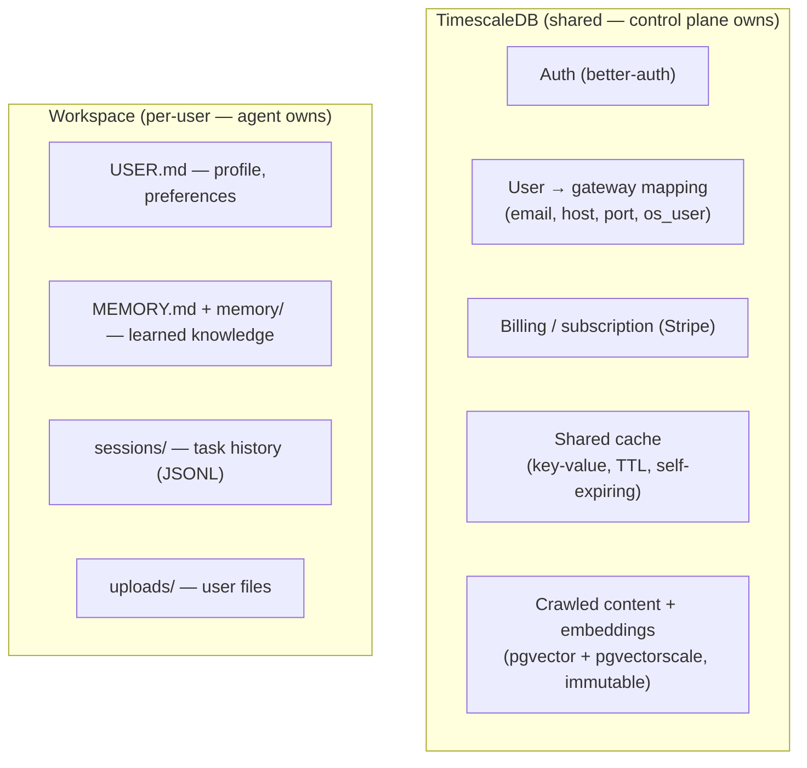
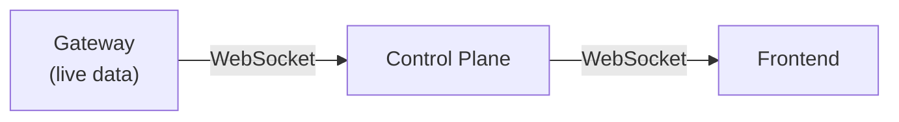

# Data Layer: [TimescaleDB](https://www.timescale.com/) + Workspace, No Overlap

## Core Principle

Every piece of data has exactly one source of truth. Nothing is stored in two places. Nothing can go stale.

## Two Storage Systems



### What TimescaleDB Stores (Source of Truth)

| Data | Why TimescaleDB | Stale? |
|---|---|---|
| Auth | [better-auth](https://www.better-auth.com/) manages it | No — it IS the source of truth |
| User → gateway mapping | Control plane needs fast lookups | No — it IS the source of truth |
| Billing/subscription | Stripe integration | No — it IS the source of truth |
| Shared cache | Cross-user deduplication, TTL-based | No — expired rows self-invalidate |
| Crawled content + embeddings | Concurrent access from all gateways, vector search | No — immutable once written |

### What TimescaleDB Does NOT Store

| Data | Where Instead | Why Not TimescaleDB |
|---|---|---|
| Gateway status | Check process live (`kill -0 <pid>`) | Stored status goes stale |
| Usage data | Query gateway API on demand | Aggregates go stale |
| User profile/preferences | `USER.md` in workspace | Agent owns this |
| Agent memory | `MEMORY.md` + `memory/` in workspace | Agent owns this |
| Task history | `sessions/` in workspace | Agent owns this |
| User files | `uploads/` in workspace | Agent owns this |

## Real-Time Data

For anything that needs to be monitored live (usage numbers, token counts, task progress):



No polling. No stored state. The [gateway event stream](https://docs.openclaw.ai/gateway/protocol) pipes through the control plane to the frontend in real-time. When the user closes the page, the stream stops. No stale data because there's no stored data.

## Shared Cache

[TimescaleDB](https://www.postgresql.org/) table with TTL:

```sql
CREATE TABLE cache (
    key     TEXT PRIMARY KEY,
    value   JSONB,
    ttl     TIMESTAMPTZ,
    created TIMESTAMPTZ DEFAULT now()
);

-- Auto-expire: periodic cleanup of expired rows
-- Reads: WHERE key = $1 AND ttl > now()
```

Any form of cached data — strings, JSON, crawl results — stored as JSONB. TTL enforces freshness. Cross-user deduplication is just a cache hit.

## Shared Intelligence Layer

Crawled content and embeddings using [pgvector](https://github.com/pgvector/pgvector) + [pgvectorscale](https://github.com/timescale/pgvectorscale):

```sql
CREATE TABLE crawled_pages (
    url         TEXT PRIMARY KEY,
    content     TEXT,
    embedding   vector(1536),
    metadata    JSONB,
    crawled_at  TIMESTAMPTZ DEFAULT now()
);

-- Vector search: semantic matching / reranking
-- Full-text search: TimescaleDB built-in FTS
-- Concurrent reads/writes: TimescaleDB handles natively
```

- 50 users crawl overlapping websites → each URL stored once
- Agent needs semantic search → pgvector similarity query
- Agent needs full-text filter → TimescaleDB FTS
- Millions of pages over time → pgvectorscale (DiskANN) for performance

## Host Layout

```
One Linux VM:
  ├── Control plane          (1 Bun process)
  ├── TimescaleDB            (1 system service)
  ├── ClamAV daemon          (1 system service)
  ├── Shared config dir      (/shared-config/, git-synced)
  ├── User gateway processes  (N OpenClaw processes)
  └── User workspace dirs    (/data/oc-<user>/, git-backed)
```

## Scaling TimescaleDB

When the host can't handle the database load alongside gateways:

| Scale | Strategy |
|---|---|
| 0-500 users | TimescaleDB on same host |
| 500+ users | Move TimescaleDB to dedicated host |
| Large crawl data | pgvectorscale DiskANN index for performance |
| Multi-host | All hosts connect to single TimescaleDB instance |
