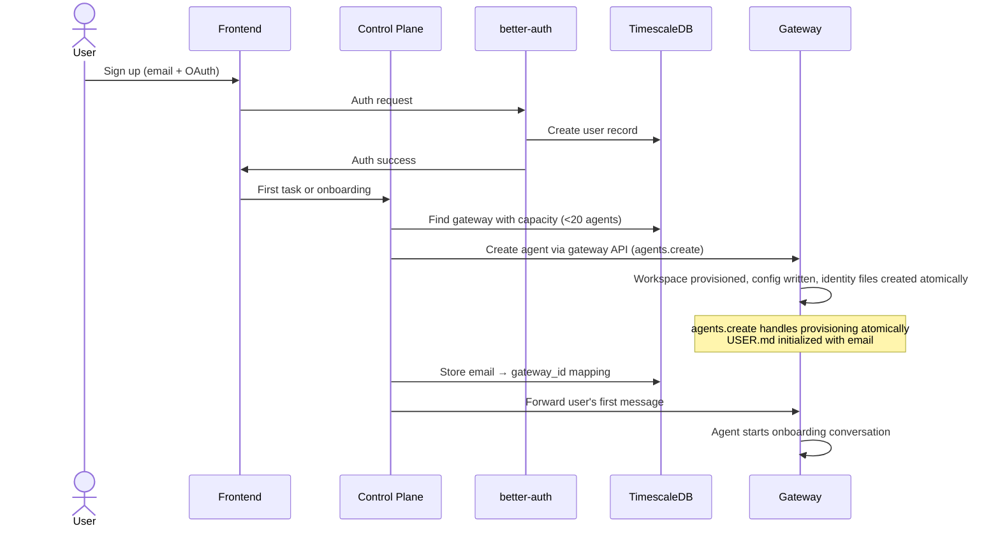

# Open Questions: Implementation Details for Planning

Questions identified during brainstorming that need resolution during implementation planning.

## User Signup Flow

End-to-end flow when a new user signs up:



OpenClaw supports this via:

- `agents.create` [gateway API method](https://docs.openclaw.ai/cli/agents) — handles workspace provisioning, config writing, and identity files atomically
- Config hot-reload — new agent available immediately, no restart
- `agents.delete` for account deletion (corresponding deletion method)

## CLI Environment Access

When the agent runs `bunx @mycompany/inventory@latest check --sku ABC`, the CLI may need:

- Database connection strings
- API endpoints
- Auth tokens for third-party services

**Options:**

- Environment variables set per-gateway (deployer configures in OpenClaw config)
- TigerFS config files the CLI reads from a known path
- Flags passed by the agent (agent knows the credentials from its workspace)

This is the deployer’s responsibility — the framework provides the mechanism (env vars via OpenClaw config), the deployer wires their CLIs to it.

## Local Development

How does a deployer test locally?

```
docker-compose.yml:
  - TimescaleDB (+ pgvector + pgvectorscale)
  - TigerFS (mount local PostgreSQL)
  - ClamAV

Then:
  - openclaw gateway (single gateway, single agent = the deployer testing)
  - bun run dev (control plane)
  - bun run dev --filter web (Next.js frontend)
```

Template repo includes `docker-compose.yml` for local dependencies only (not for production). OpenClaw and the control plane run directly on the host for fast iteration.

## Gateway Capacity Management

When a gateway reaches 20 agents:

1. Control plane detects capacity via agent count in TimescaleDB
2. Submits new gateway job to Nomad
3. Nomad starts gateway on best host
4. New users assigned to the new gateway

When a gateway has 0 active agents for extended period:

1. Control plane detects idle gateway
2. Migrates remaining agents to other gateways (config update + hot-reload)
3. Stops idle gateway via Nomad

## Agent Migration Between Gateways

Since gateways are stateless (all data in TigerFS):

1. Add agent to destination gateway (config update)
2. Remove agent from source gateway (config update)
3. Update email → gateway_id mapping in TimescaleDB
4. Next user request routes to new gateway

No file migration. No downtime. Just config changes.
