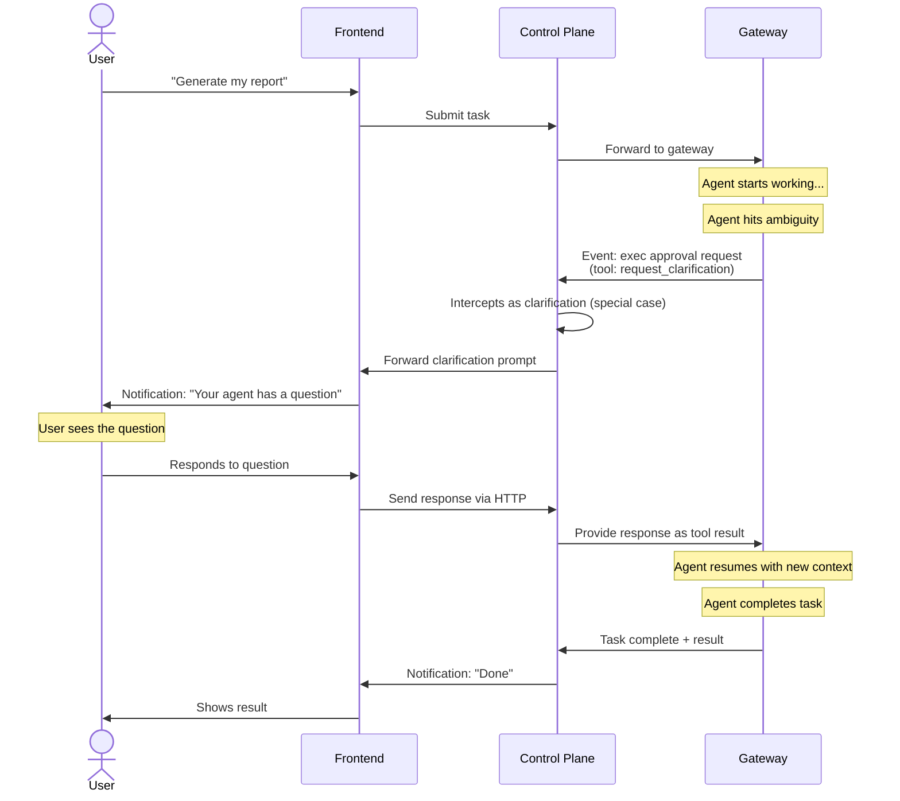
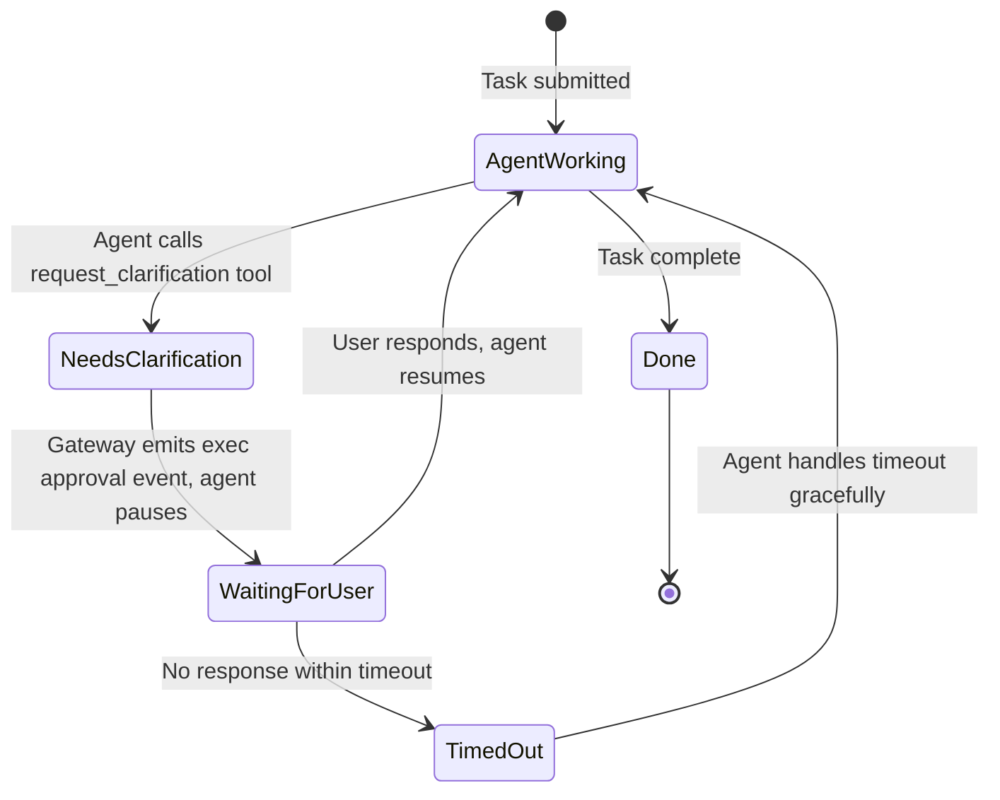

# Error Handling, Recovery, and Clarification

## Two Categories of Failure

### Infrastructure Failures (Prevent Before Launch)

These are reliability problems, not error handling. They must be solved at the infrastructure level before users touch the system.

| Failure                         | Prevention                                                                                                                 |
| ------------------------------- | -------------------------------------------------------------------------------------------------------------------------- |
| **LLM rate limits**             | Sufficient API quota + OpenClaw [model failover](https://docs.openclaw.ai/concepts/model-failover) + auth profile rotation |
| **Provider outage**             | Fallback models configured in OpenClaw                                                                                     |
| **Context window exceeded**     | OpenClaw [compaction](https://docs.openclaw.ai/concepts/compaction) handles this natively                                  |
| **Content filter triggered**    | 7-layer security gate catches this before OpenClaw                                                                         |
| **Process crash (OOM)**         | Process manager auto-restart + proper resource limits                                                                      |
| **Process eviction**            | OS-level resource limits + proper sizing                                                                                   |
| **Workspace directory failure** | TigerFS backed by TimescaleDB — ACID durability                                                                            |
| **Network partition**           | Redundant networking + health probes                                                                                       |
| **Tool execution errors**       | OpenClaw retries tools internally                                                                                          |
| **Agent loops**                 | OpenClaw has built-in [loop detection](https://docs.openclaw.ai/tools/loop-detection)                                      |
| **Task timeout**                | Configure max task duration                                                                                                |
| **Control plane down**          | Process manager auto-restarts (single process initially, replicas when scaling)                                            |
| **Host failure**                | Nomad reschedules gateways to other hosts — fully stateless, zero data loss                                                |
| **Storage failure**             | TigerFS `.history/` + `pg_dump` recovery                                                                                   |

**Principle:** If infrastructure is properly set up, these are non-events. Standard process management and cloud reliability practices.

### Agent-Level Failures (Handle at Runtime)

The agent is running fine but cannot deliver the outcome. These cannot be prevented — they must be handled gracefully.

| Failure                      | Example                                                        |
| ---------------------------- | -------------------------------------------------------------- |
| **Ambiguous request**        | “Make it better” — better how?                                 |
| **Missing info**             | “Pull my Salesforce numbers” — no Salesforce access configured |
| **Missing credentials**      | Task needs an API key not provided                             |
| **Impossible task**          | “Predict stock prices with certainty”                          |
| **Conflicting instructions** | New request contradicts existing preferences                   |
| **Quality failure**          | Agent completes task but output is wrong or low quality        |
| **Out of scope**             | Request slipped past the gate but agent can’t handle it        |

**Principle:** The agent must communicate, not guess. When uncertain, ask. When blocked, explain.

## Clarification Mechanism

### The Problem

User doesn’t talk directly to OpenClaw. The control plane proxies everything. So when the agent needs to ask a question, it must flow through the proxy cleanly.

### The Solution: Custom Tool Following Exec Approval Pattern

OpenClaw has a built-in two-phase pattern for “agent asks, pauses, waits for response, resumes” — used for [exec approvals](https://docs.openclaw.ai/tools/exec-approvals). The framework registers a custom `request_clarification` tool that follows the same pattern.

### Flow

### How It Works (Two-Phase Pattern)

**Phase 1 — Agent calls tool:**

- Agent calls `request_clarification` tool with question + optional choices
- Gateway emits an exec approval event (the standard tool approval mechanism)
- Control plane intercepts this as a special case — recognizes `request_clarification` as requiring user input
- Control plane forwards the clarification prompt to the frontend via SSE

**Phase 2 — User responds:**

- Agent is paused waiting for the tool result
- User’s response is sent back via HTTP to the control plane
- Control plane provides the response as the tool result to the gateway
- Agent resumes with the response

### What the Frontend Shows

Three types of messages from the agent, distinguishable by event type:

| Event Type                                | Frontend Behavior                                             |
| ----------------------------------------- | ------------------------------------------------------------- |
| `agent` (progress/tool events)            | Route to **readonly live feed**                               |
| Exec approval for `request_clarification` | Route to **interactive prompt** (question + optional choices) |
| `chat` with final state                   | Route to **notification + result view**                       |

### Agent Behavior Guidelines (SOUL.md / AGENTS.md)

The agent must be instructed to:

1. **When uncertain — ask, don’t guess.** Never assume on ambiguous requests.
2. **When missing info — explain what’s needed.** “I need X to do Y. Can you provide it?”
3. **When impossible — explain why and suggest alternatives.** “I can’t do X because Y. Would Z work instead?”
4. **When conflicting — surface the conflict.** “You previously said X but now you’re asking Y. Which do you prefer?”
5. **When risky — confirm before proceeding.** “This will affect X. Should I go ahead?”
6. **Limit clarification rounds.** Don’t ask 10 questions in a row. Batch related questions. Max 2-3 rounds per task.
7. **Respect timeouts.** If user doesn’t respond within timeout, gracefully abort with an explanation.

### Timeout Behavior

If the user doesn’t respond to a clarification request:

- Default timeout: 5 minutes
- On timeout: agent receives an error, handles gracefully
- Agent should either abort with explanation or proceed with best guess + disclaimer
- Frontend shows: “Your agent’s question expired. You can resubmit the task.”
