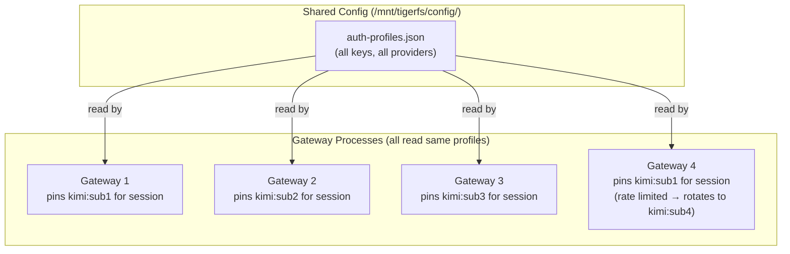

# Key Pool: LLM API Key Management at Scale

## The Problem

Multiple users = multiple concurrent LLM calls. A single API key per provider will hit rate limits fast. Deployers need multiple keys per provider, distributed across all gateways.

## How OpenClaw Solves This Natively

OpenClaw’s [auth profile rotation](https://docs.openclaw.ai/concepts/model-failover) handles multiple keys per provider out of the box:

- **Multiple auth profiles** per provider — each key is a separate profile
- **Round-robin rotation** — least-recently-used first
- **Per-session stickiness** — pins a key per session for provider cache warmth, rotates on rate limit
- **Exponential backoff** — rate-limited keys cool down (1min → 5min → 25min → 1h cap)
- **Billing disable** — keys with exhausted credits auto-disabled (5h backoff, doubles, 24h cap)
- **Model fallback** — if ALL keys for a provider fail, falls back to next model in `agents.defaults.model.fallbacks`

## How It Works



All gateways read the same `auth-profiles.json` from the shared config directory. Each gateway independently selects and rotates keys. No coordination needed — OpenClaw handles it.

## Deployer Setup

Add keys to one file in the shared config:

```json
{
  "profiles": {
    "kimi:sub1": { "type": "api_key", "provider": "kimi", "key": "sk-..." },
    "kimi:sub2": { "type": "api_key", "provider": "kimi", "key": "sk-..." },
    "kimi:sub3": { "type": "api_key", "provider": "kimi", "key": "sk-..." },
    "anthropic:key1": {
      "type": "api_key",
      "provider": "anthropic",
      "key": "sk-..."
    },
    "anthropic:key2": {
      "type": "api_key",
      "provider": "anthropic",
      "key": "sk-..."
    },
    "openai:key1": { "type": "api_key", "provider": "openai", "key": "sk-..." }
  }
}
```

Push to the config repo → all gateways pick it up → done.

## Cost Optimization: Coding Plans

For high-volume deployments, pay-per-token gets expensive. Deployers can use subscription-based providers with coding plans (e.g., Kimi, MiniMax) for much cheaper per-token costs at scale.

**Strategy:** Use cheap coding-plan providers as primary, premium providers (Claude, GPT) as fallbacks. Most tasks hit the cheap provider. Premium kicks in only when primary is rate-limited or fails. This can cut LLM costs 5-10x at high volume while maintaining quality as a safety net.

**Sizing the key pool:**

```
Keys needed = peak concurrent requests per minute / provider rate limit per key per minute
```

| Provider                 | Rate limit/key | 200 active users (~200 req/min) | Keys needed |
| ------------------------ | -------------- | ------------------------------- | ----------- |
| Example: 60 req/min/key  | 60             | 200                             | 4           |
| Example: 30 req/min/key  | 30             | 200                             | 7           |
| Example: 120 req/min/key | 120            | 200                             | 2           |

Deployer buys enough subscriptions to cover their user base. The framework distributes load automatically.

## Multi-Provider Strategy

Deployers can mix providers and OpenClaw handles failover:

```json
{
  "agents": {
    "defaults": {
      "model": {
        "primary": "kimi/kimi-k2",
        "fallbacks": ["anthropic/claude-sonnet-4-6", "openai/gpt-5.2"]
      }
    }
  }
}
```

- Primary: cheap provider with coding plans (high volume)
- Fallbacks: premium providers (better quality, used only when primary exhausted)

All keys for all providers in one `auth-profiles.json`. OpenClaw rotates within a provider first, then falls back to the next provider. Zero custom code.

## Security Note: Plaintext API Keys

`auth-profiles.json` stores API keys in plaintext on TigerFS. For production, deployers should use a secrets manager (Vault, SOPS) or inject keys via environment variables. The framework should support both file-based and env-var-based credential sources.
