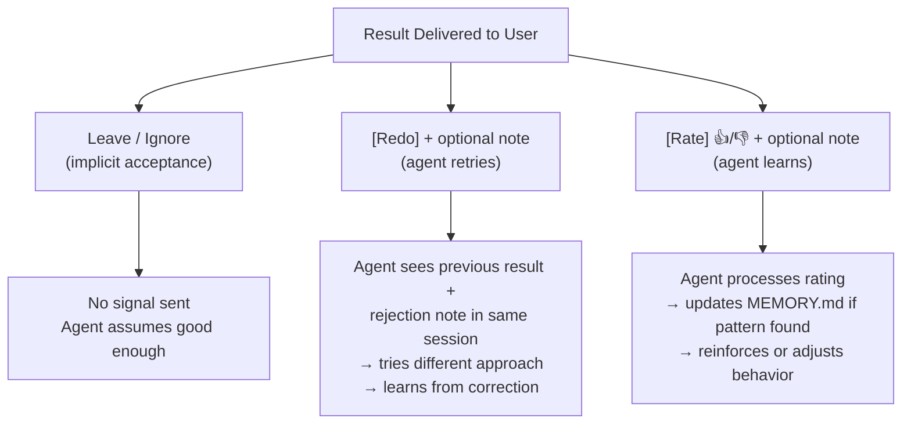
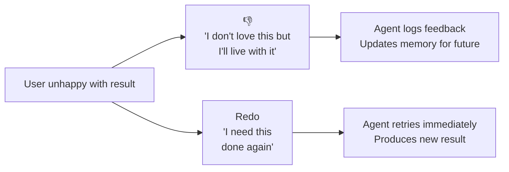
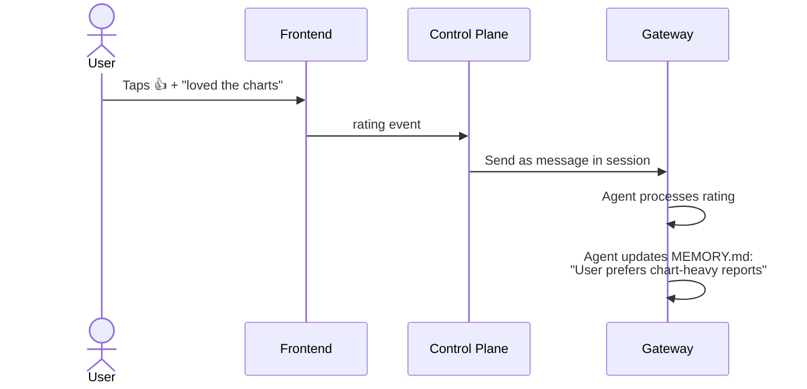
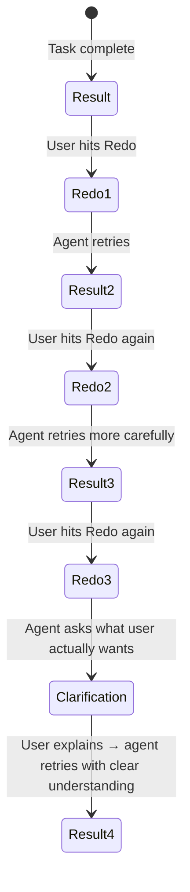

# Feedback: Ratings, Redo, and Agent Learning

The conversation IS the feedback mechanism. The memory system IS the learning mechanism.

## UX When a Result Arrives

## The Three Actions

### 1. Leave (Implicit Acceptance)
User sees the result and moves on. No action needed. Strongest positive signal is when the user actually uses the output.

### 2. Redo + Optional Note
User needs the task done again differently.

| Redo Input | What Agent Receives |
|---|---|
| Redo (no note) | "User rejected the output. Try a different approach." |
| Redo + "too formal" | "User rejected: too formal. Make it more casual." |
| Redo + "keep charts, redo the text" | "User rejected partially: keep charts, redo the text." |
| Redo + "wrong data, use Q3" | "User rejected: wrong data source. Use Q3 data." |

**Redo is an action** — the agent must produce a new result.

### 3. Rate (👍/👎) + Optional Note
User wants to leave feedback without requesting new work.

| Rating Input | What Agent Receives |
|---|---|
| 👍 (no note) | "User rated positively." |
| 👍 + "loved the chart format" | "User rated positively: loved the chart format." |
| 👎 (no note) | "User rated negatively." |
| 👎 + "too verbose" | "User rated negatively: too verbose." |

**Rating is feedback** — the agent learns but doesn't produce new output.

## Distinction: 👎 vs Redo

- **👎** = passive feedback, agent learns for next time
- **Redo** = active request, agent acts now

## How Ratings Reach the Agent

Every rating is sent directly to the agent as a message. No batching, no deferred processing, no feedback files.

Rating cost (~500 tokens) is negligible vs the task (50,000+ tokens). Positive ratings reinforce behavior via OpenClaw's [memory](https://docs.openclaw.ai/concepts/memory) system.

## Multiple Redos

After 2-3 redos on the same task, the problem is understanding, not execution. The agent should switch to clarification:

This is handled via `AGENTS.md` instructions, not a system feature:
> "After 2 failed redo attempts, stop retrying and ask the user to describe specifically what they want."

## Long-Term Learning from Feedback

The agent is instructed (via `AGENTS.md`) to look for patterns across feedback:

| Pattern | Agent Action |
|---|---|
| User rates 👎 "too formal" 3 times | Update `USER.md`: "Prefers casual tone" |
| User rates 👍 on chart-heavy reports | Update `MEMORY.md`: "Charts are valued" |
| User always redoes executive summaries | Update `MEMORY.md`: "Summaries need extra care for this user" |
| User never uses Redo | No action — agent is performing well |

## What the Agent Notices (Summary)

| Event | Source | How Agent Learns |
|---|---|---|
| Task request | User via frontend | Normal session message |
| Redo + note | User via frontend | Session message → retry + learn |
| Rating + note | User via frontend | Session message → update memory |
| File upload | User via frontend | File appears in workspace |
| Profile changes | User tells agent | Conversation → updates USER.md |
| Returns after absence | User opens app | Agent has memory/session history |
| Scheduled task done | OpenClaw [cron](https://docs.openclaw.ai/automation/cron-jobs) | Results in [session transcripts](https://docs.openclaw.ai/concepts/session) |
| Config updates | Shared config directory | Hot-reload, automatic |
| Tier/plan change | Control plane | Config patch via gateway API |
| Account deletion | Control plane | Gateway process killed, agent not notified |

