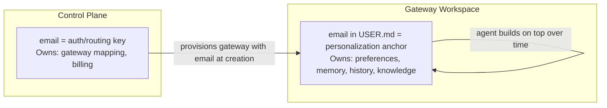

# Identity: Email as the Universal Key

## The Model

```
email (primary key)
    → auth identity (OAuth provider)
    → gateway routing (which host:port to hit)
    → gateway workspace (USER.md has the email)
    → web app frontend (single channel, user interacts through the deployed instance)
```

## What Email Gives Us for Free

| Benefit | Why |
|---|---|
| **Auth identity** | Google/Microsoft/GitHub OAuth all return email |
| **Gateway routing** | Email maps deterministically to gateway_id, host, port |
| **Fallback notifications** | Email itself is a delivery channel |
| **Deterministic gateway assignment** | Email maps to gateway_id for routing |
| **Human readable** | Admin sees `alice@company.com` in logs, not a UUID |

## Control Plane Data Model

Essentially one table:

```
email (PK) → {
    gateway_id      // which gateway hosts this user's agent
    host            // which host the gateway runs on
    port            // gateway process port
    status          // active | idle | stopped | provisioning
    created_at
    last_active_at
}
```

Stored in TimescaleDB. Gateway assignment is managed by the control plane; gateways are fully stateless so users can be rebalanced across gateways without data migration.

## Identity Split



The two stay in sync naturally:
- Control plane provisions gateway with email at creation
- Agent builds the full user profile on top through conversation
- No sync mechanism needed — email is set once, everything else grows organically

## Simplicity Constraints

- 1 email per user (no multi-email)
- No shared/team accounts (for now)
- No org hierarchy (for now)

