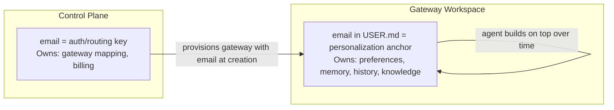

# Identity: Email as the Universal Key

## The Model

```
email (primary key)
    → auth identity (OAuth provider)
    → gateway routing (which host:port to hit)
    → gateway workspace (USER.md has the email)
    → web app frontend (single channel, user interacts through the deployed instance)
```

## Why Email

- OAuth providers all return it
- Deterministic mapping: hash email → OS user + port
- Fallback notification channel
- Human readable in logs

## Control Plane Data Model

Essentially one table:

```
email (PK) → {
    host            // which host this user's gateway runs on
    port            // gateway process port
    os_user         // dedicated OS user (e.g., oc-<hash>)
    workspace_dir   // workspace directory path
    status          // active | idle | stopped | provisioning
    created_at
    last_active_at
}
```

Could be a database table, a key-value store, or even a flat file.

## Identity Split



Email is set once at provisioning; everything else grows organically through conversation.

## Constraints

- 1 email per user
- No shared/team accounts (for now)
- No org hierarchy (for now)

