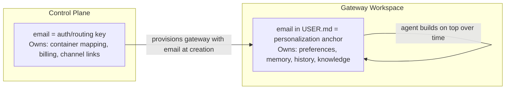

# Identity: Email as the Universal Key

## The Model

```
email (primary key)
    → auth identity (OAuth provider)
    → container routing (which container to hit)
    → gateway workspace (USER.md has the email)
    → channel linking (WhatsApp/Telegram/Slack all map back to same email)
```

## What Email Gives Us for Free

| Benefit | Why |
|---|---|
| **Auth identity** | Google/Microsoft/GitHub OAuth all return email |
| **Channel linking** | User signs up with email, connects messaging accounts, all map to same gateway |
| **Fallback notifications** | Email itself is a delivery channel |
| **Deterministic container naming** | Hash email → container ID, no lookup needed |
| **Human readable** | Admin sees `alice@company.com` in logs, not a UUID |

## Control Plane Data Model

Essentially one table:

```
email (PK) → {
    container_id    // deterministic from email hash
    volume_id       // persistent workspace storage
    status          // active | suspended | provisioning
    channels        // linked messaging accounts
    created_at
    last_active_at
}
```

Could be a database table, a key-value store, or even a flat file.

## Identity Split



The two stay in sync naturally:
- Control plane provisions gateway with email at creation
- Agent builds the full user profile on top through conversation
- No sync mechanism needed — email is set once, everything else grows organically

## Simplicity Constraints

- 1 email per user (no multi-email)
- No shared/team accounts (for now)
- No org hierarchy (for now)

