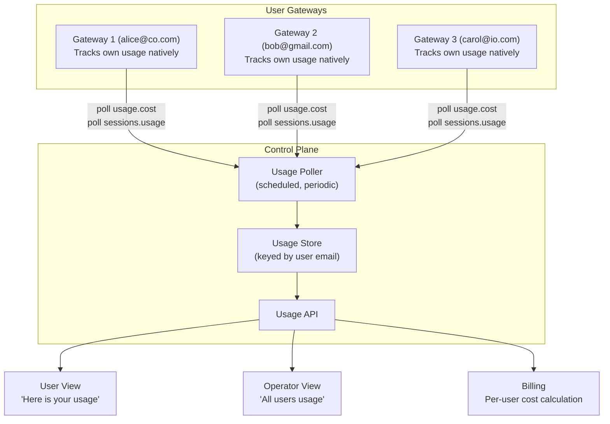

# Observability: Usage Tracking and Metering

## Core Principle

Leverage OpenClaw's native [usage tracking](https://docs.openclaw.ai/concepts/usage-tracking). No extra observability infrastructure needed at launch. The control plane simply polls each gateway and aggregates.

## What OpenClaw Tracks Out of the Box (Per Gateway)

OpenClaw already provides comprehensive per-message and per-session usage data:

### Per Message
| Metric | Detail |
|---|---|
| Input tokens | Including cache read/write breakdown |
| Output tokens | Completion tokens |
| Cost (USD) | Calculated from model pricing |
| Latency | Duration in ms |
| Model + Provider | Which model handled this message |
| Tool calls | Which tools were invoked, count |
| Stop reason | Why the agent stopped (end_turn, tool_use, etc.) |

### Per Session
| Metric | Detail |
|---|---|
| Total tokens | Aggregated across all messages |
| Total cost | USD |
| Message counts | User, assistant, tool calls |
| Latency stats | avg, p95, min, max |
| Daily breakdown | Tokens, cost, messages per day |
| Model usage | Breakdown by model/provider |
| Tool usage | Count per tool name |
| Timeseries | Usage points over time for charting |

### Per Provider
| Metric | Detail |
|---|---|
| Quota usage | Percentage of plan used |
| Reset time | When quota resets |
| Plan | Current plan name |

### Gateway API Methods Available

| Method | Returns |
|---|---|
| `usage.cost` | Aggregated cost summary for date range (daily breakdown, totals) |
| `usage.status` | Provider quota snapshots |
| `sessions.usage` | Per-session usage with aggregates (by model, provider, agent, channel) |
| `sessions.usage.timeseries` | Usage over time for charting |
| `sessions.usage.logs` | Per-message usage detail (up to 200 entries) |

### In-Chat Commands
- `/usage off` — disable usage footer
- `/usage tokens` — show tokens per response
- `/usage full` — show tokens + cost per response
- `/usage cost` — show local cost summary

## Architecture: Simple Aggregation

## How It Works

### Collection
1. Control plane runs a scheduled poller (e.g., every 5 minutes)
2. For each **active** gateway, call `usage.cost` via [WebSocket API](https://docs.openclaw.ai/gateway/protocol)
3. Store results keyed by user email + timestamp
4. For deeper detail on demand, call `sessions.usage` or `sessions.usage.logs`

### User-Facing View
- User asks "how much have I used?" → query the store filtered by their email
- Or user asks their agent directly → `/usage full` already works natively in OpenClaw
- Data: tokens consumed, estimated cost, tasks completed, breakdown by day

### Operator-Facing View
- Aggregate across all users: total tokens, total cost, active users, tasks/day
- Per-user drill-down: who's using the most, cost distribution
- Per-model: which models are being used, relative cost

### Billing Integration
- Usage store has per-user cost in USD already calculated by OpenClaw
- Billing service reads from usage store
- Simple: sum cost per user per billing period → charge

## What the Framework Doesn't Need (Yet)

| Tool | Why Not Now |
|---|---|
| [Langfuse](https://langfuse.com/) | Rich tracing/eval — overkill for launch |
| [OpenTelemetry](https://opentelemetry.io/) | Standard protocol — useful later for cross-system tracing |
| [Helicone](https://www.helicone.ai/) | Proxy-based logging — unnecessary, OpenClaw already tracks everything |
| Custom metrics pipeline | Over-engineering — polling gateway API is sufficient |

These can be added later if needed (e.g., for prompt debugging, A/B testing models, quality evaluation). The gateway API provides everything needed for usage, billing, and basic observability at launch.

## Data Available Per User (Verbose)

The "most verbose" view a user or operator can get:

| Metric | Granularity | Source |
|---|---|---|
| Token usage (in/out/cache) | Per message | `sessions.usage.logs` |
| Cost (USD) | Per message | `sessions.usage.logs` |
| Model used | Per message | `sessions.usage.logs` |
| Tool calls | Per call | `sessions.usage.logs` |
| Latency | Per message | `sessions.usage.logs` |
| Tasks completed | Per session | `sessions.usage` |
| Daily totals | Per day | `usage.cost` |
| Monthly totals | Per month | Aggregated from `usage.cost` |
| Provider quota | Real-time | `usage.status` |
| Storage used | Per user | Workspace directory metrics |
| File uploads | Per upload | Control plane logs |
| Gate rejections | Per attempt | Control plane logs |
| Compute time | Per gateway | Process runtime metrics (from process manager) |

