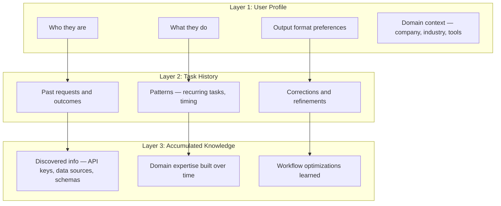

# Personalization: Why Memory is Core, Not Optional

## The Problem

Same request from 2 different users must produce 2 different outcomes.

## Example

> "Write me a weekly report"

- **User A (CFO):** Expects financial summaries, charts, KPIs, board-ready formatting
- **User B (Eng Lead):** Expects sprint velocity, blockers, deployment stats, team-level detail

The agent must know this **without being told every time**.

## Three Layers of Personalization

All three persist across tasks and grow over time.

## How OpenClaw Solves This

OpenClaw's workspace IS the personalization layer:

| Personalization Need | OpenClaw Mechanism |
|---|---|
| User profile & preferences | `USER.md` (editable by user or agent) |
| Agent personality & instructions | [`SOUL.md`](https://docs.openclaw.ai/concepts/agent-workspace) + `AGENTS.md` |
| Long-term memory | [`MEMORY.md`](https://docs.openclaw.ai/concepts/memory) + vector search |
| Daily activity & context | `memory/YYYY-MM-DD.md` |
| Task history | [Session transcripts](https://docs.openclaw.ai/concepts/session) (JSONL) |
| Accumulated knowledge | Workspace files the agent creates/maintains |

## How Users Configure Their Profile

Users talk to their agent:
> "I prefer charts over tables"
> "Always use formal tone"
> "My fiscal year starts in April"

The agent updates `USER.md` and `MEMORY.md` itself.

