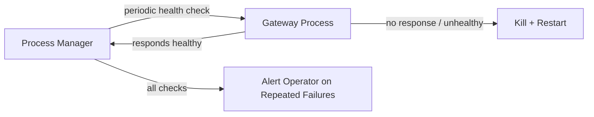

# Reliability: Auto-Recovery Without Formal SLA

## Core Principle

No formal SLA required at launch. No on-call rotation. No status page. Things auto-heal, and the deployer gets notified when they don't.

## What Auto-Recovery Covers

| Failure | Recovery |
|---|---|
| Gateway process crashes | Process manager (systemd/PM2) auto-restarts it |
| Gateway becomes unresponsive | Health check detects, kills and restarts process |
| Host machine reboots | Process manager starts all gateways on boot |
| Control plane crashes | Process manager auto-restarts it |
| Disk fills up | Alerting notifies operator to add space or clean up |
| LLM provider goes down | OpenClaw [model failover](https://docs.openclaw.ai/concepts/model-failover) switches to fallback model |

## Health Check Design

Each gateway exposes a health endpoint. The process manager pings it periodically:
- Responds healthy → no action
- No response within timeout → restart the process
- Fails 3+ times in a row → alert the operator

## What the Framework Doesn't Include (Yet)

| Capability | Why Not Now |
|---|---|
| Formal SLA (99.9%) | No paying enterprise customers demanding it |
| Status page | Build when users start asking |
| On-call rotation | Single operator is enough at startup scale |
| Multi-region redundancy | One host (or a few) is sufficient |
| Automated failover across hosts | Add when multi-host becomes necessary |

These are all "good problems to have" — they mean the deployed product is growing.
