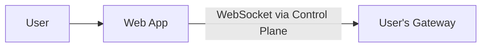
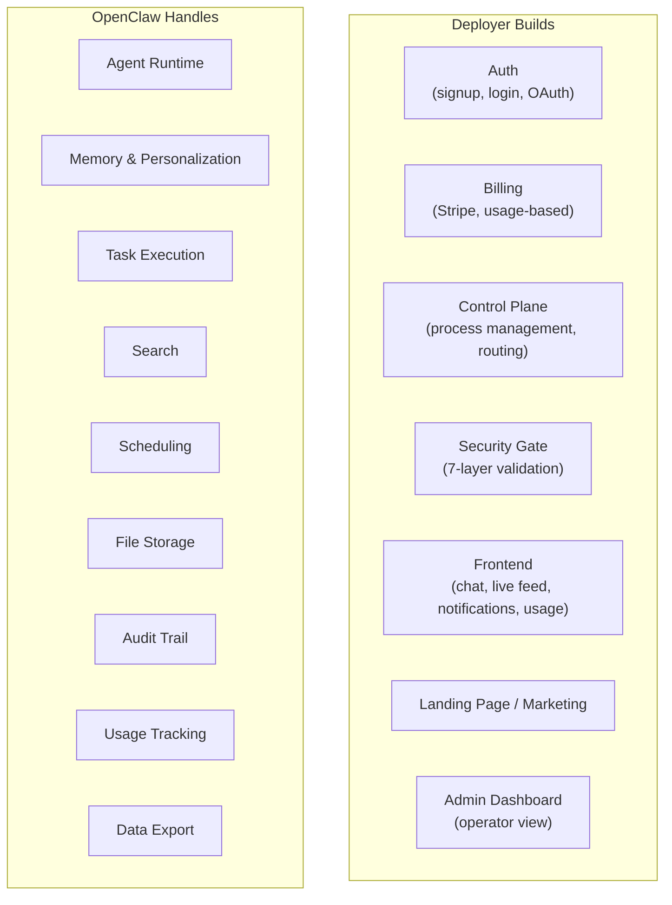

# SaaS Simplification: What OpenClaw Already Solves

## Single Channel: Web App Only

One frontend talking to the gateway's [WebSocket API](https://docs.openclaw.ai/gateway/protocol). No multi-channel routing.

## What OpenClaw Eliminates

Typical SaaS components the deployer does NOT need to build:

| Component | How OpenClaw Replaces It |
|---|---|
| **Onboarding** | Agent conversations populate `USER.md` |
| **Settings UI** | User tells agent preferences → `USER.md` + [`MEMORY.md`](https://docs.openclaw.ai/concepts/memory) |
| **Task queue** | Gateway IS the task runner |
| **Cron** | Built-in [cron](https://docs.openclaw.ai/automation/cron-jobs) |
| **Search** | Hybrid vector + BM25 over memory |
| **File storage** | Workspace directory |
| **Audit trail** | [Session transcripts](https://docs.openclaw.ai/concepts/session) (append-only JSONL) |
| **Notifications** | WebSocket event stream |
| **Reporting** | Agent queries its own sessions |
| **i18n** | LLM handles it natively |
| **Data export** | Agent packages workspace files |
| **GDPR deletion** | Delete workspace directory |
| **Help / Support** | The agent IS the support |

## What the Deployer Still Builds

