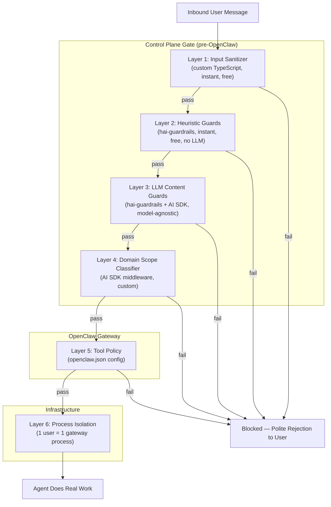

# Security: Defense in Depth — 7 Layers

## Core Principle

Block threats BEFORE they reach OpenClaw. Let OpenClaw focus on real work, not noisy filtering decisions. Every layer is independent — an attacker must beat ALL seven to do meaningful damage.

## Architecture Overview



## Layer Details

### Layer 1 — Input Sanitizer (custom TypeScript)

**Cost:** Free, instant
**Dependencies:** None (custom code, ~50 lines)

What it does:
- Strip hidden unicode characters, zero-width spaces, invisible markup
- Enforce max message length limits
- Reject malformed payloads
- Basic structure validation — does it look like a normal user message?

Catches: Encoding tricks, oversized payloads, malformed inputs.

---

### Layer 2 — Heuristic Guards ([hai-guardrails](https://github.com/presidio-oss/hai-guardrails), local mode)

**Cost:** Free, instant, no network calls
**Dependencies:** `@presidio-dev/hai-guardrails`

Guards enabled in heuristic/pattern mode:

| Guard | Mode | What It Catches |
|-------|------|-----------------|
| **Injection Guard** | Heuristic | Known prompt injection patterns, instruction overrides |
| **Leakage Guard** | Heuristic | System prompt extraction attempts |
| **PII Guard** | Pattern matching | Personal data (names, emails, SSNs, phone numbers) |
| **Secret Guard** | Pattern + entropy | API keys, credentials, tokens, secrets |

Catches: Known attack patterns, accidental secret/PII exposure.

---

### Layer 3 — LLM Content Guards (hai-guardrails + [AI SDK](https://ai-sdk.dev))

**Cost:** LLM call per message (cheap model, fast)
**Dependencies:** `@presidio-dev/hai-guardrails`, `ai` (Vercel AI SDK)

Uses AI SDK as the model provider so hai-guardrails is fully model-agnostic. Can use Claude, GPT, Gemini, or any provider — swappable without code changes.

Guards enabled in LLM mode:

| Guard | What It Catches |
|-------|-----------------|
| **Toxic Guard** | Harmful, dangerous content |
| **Hate Speech Guard** | Discriminatory language |
| **Bias Detection Guard** | Unfair generalizations |
| **Adult Content Guard** | NSFW content |
| **Copyright Guard** | Copyrighted material reproduction |
| **Profanity Guard** | Inappropriate language |

Catches: Content policy violations, harmful intent, inappropriate requests.

---

### Layer 4 — Domain Scope Classifier (AI SDK middleware)

**Cost:** LLM call (can batch with Layer 3)
**Dependencies:** `ai` (Vercel AI SDK)

Custom middleware that validates whether the request falls within the SaaS product's domain. This is product-specific — each SaaS defines its own scope.

Example for a financial reporting SaaS:
```
ALLOW: "Generate my Q3 revenue report"
ALLOW: "Compare this quarter to last quarter"
BLOCK: "Write me a poem about cats"
BLOCK: "Help me debug this Python script"
```

Implementation: AI SDK middleware with a tight classification prompt. Can be combined with the Layer 3 LLM call to minimize latency (one call, multiple checks).

Catches: Out-of-scope requests, misuse of the service.

---

### Layer 5 — OpenClaw [Tool Policy](https://docs.openclaw.ai/gateway/sandbox-vs-tool-policy-vs-elevated) (built-in)

**Cost:** Free (configuration only)
**Dependencies:** OpenClaw native

Configured in `openclaw.json` per gateway:
- `tools.allow` / `tools.deny` — whitelist/blacklist tools
- `tools.exec.security` — execution security mode
- `tools.exec.safeBins` — restrict to safe binaries only
- Remove unnecessary capabilities entirely (no bash, no browser, no file system escape)

Catches: Even if a manipulated prompt reaches the agent, it can only use tools you've explicitly allowed.

---

### Layer 6 — Process Isolation via OS User Separation (infrastructure)

**Cost:** Infrastructure cost (already part of architecture)
**Dependencies:** OS user separation (Unix filesystem permissions)

Each user runs in their own gateway process under a dedicated OS user with their own workspace directory. There is no shared state, no shared database, no cross-user access path.

Catches: Everything else. Even a fully compromised agent can only access that one user's own data.

---

### Layer 7 — Architectural Blast Radius

This isn't a "layer" you implement — it's a property of the 1:1 architecture:

| Attack Scenario | Traditional SaaS | This Architecture |
|---|---|---|
| Prompt injection succeeds | Access shared DB → all users' data | Access one gateway process → one user's data |
| Agent goes rogue | Shared infra at risk | One gateway process at risk |
| Credentials leaked | Shared secrets exposed | One user's auth profiles only |
| Data exfiltration | Entire database | One user's workspace files |

## Tech Stack Summary

| Component | Library | Why |
|---|---|---|
| Input sanitization | Custom TypeScript | Trivial, no dependency needed |
| Heuristic guards | `@presidio-dev/hai-guardrails` | TypeScript-native, battle-tested, no LLM needed for heuristic mode |
| LLM content guards | `@presidio-dev/hai-guardrails` | Covers toxic, hate, bias, adult, copyright, profanity |
| Model provider for guards | `ai` (Vercel AI SDK) | Model-agnostic — swap providers without code changes |
| Domain scope classifier | `ai` (Vercel AI SDK) middleware | Custom per-product, clean middleware pattern |
| Tool restrictions | OpenClaw native (`openclaw.json`) | Already built-in, zero code |
| Process isolation | OS user separation | Unix filesystem permissions per gateway process |

## Flow Timing Estimate

```mermaid
gantt
    title Request Processing Timeline
    dateFormat X
    axisFormat %L ms

    section Gate
    Input Sanitizer           :0, 1
    Heuristic Guards          :1, 5
    LLM Guards + Scope Check  :5, 200

    section OpenClaw
    Agent Processing          :200, 5000
```



Layers 1-2: <5ms (free, local)
Layers 3-4: ~100-200ms (one LLM call, cheap model)
Total gate overhead: <200ms — imperceptible to a fire-and-forget user.

