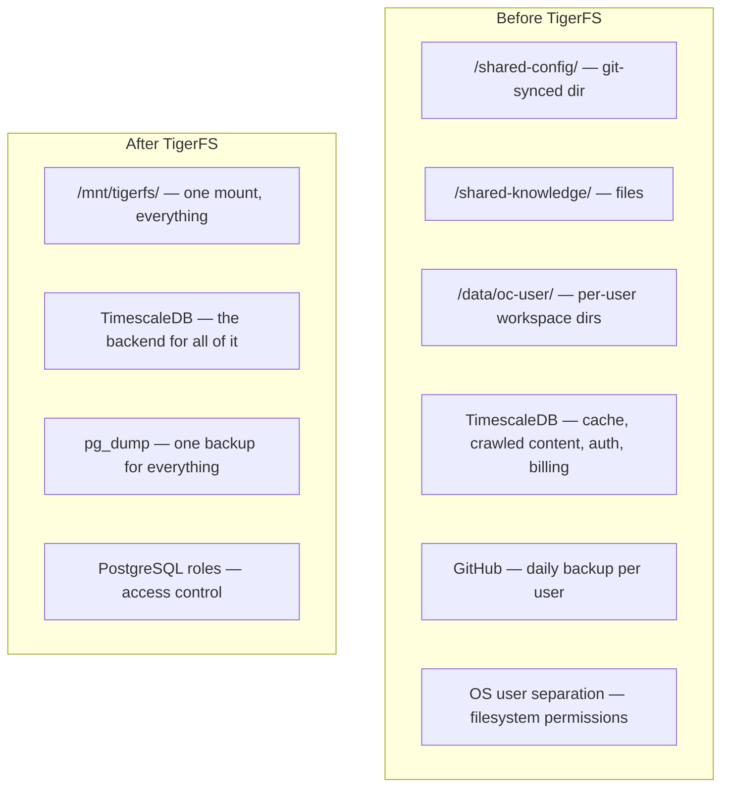

# TigerFS: The Storage Unifier

[TigerFS](https://tigerfs.io/) is a filesystem backed by [TimescaleDB](https://www.timescale.com/) (PostgreSQL). By the same team. It mounts a PostgreSQL database as a regular directory. Every file is a row, every write is a transaction, concurrent access is ACID-guaranteed.

Agents already work with files natively — `read`, `write`, `ls`, `cat`, `grep`. TigerFS makes the database look like a filesystem. The agent doesn't need SQL, an ORM, or a database client. It just reads and writes files.

## What This Collapses



## The Unified Layout

```
/mnt/tigerfs/
  config/                   ← shared, all gateways read
    SOUL.md
    AGENTS.md
    auth-profiles.json
  knowledge/                ← shared domain knowledge
    product-docs/
    procedures/
  users/
    alice@co.com/           ← per-user workspace
      USER.md
      MEMORY.md
      memory/
      sessions/
      uploads/
    bob@gmail.com/
      ...
  cache/                    ← TTL-based shared cache
  crawled/                  ← shared intelligence layer (pgvector)
```

OpenClaw reads `SOUL.md` from `/mnt/tigerfs/config/SOUL.md`. It's a regular file path. OpenClaw doesn't know it's backed by PostgreSQL.

## What This Eliminates

| Before | After |
|---|---|
| Separate git-sync cron for shared config | Update the file in TigerFS, all gateways see it instantly (ACID) |
| OS user separation for isolation | PostgreSQL row-level security |
| Per-user directories on local disk | Per-user rows in TimescaleDB |
| GitHub daily backup per user | `pg_dump` — one backup for all users |
| Separate shared cache (SQLite or TimescaleDB table) | Just files in `/mnt/tigerfs/cache/` |
| Separate crawled content index | Files in `/mnt/tigerfs/crawled/` with pgvector |
| Multiple storage systems to manage | One: TimescaleDB |

## Why This Works

- **FUSE mount appears as regular files** — applications (including OpenClaw) can't tell the difference
- **ACID transactions** — concurrent reads/writes across all gateways, no corruption
- **PostgreSQL access control** — row-level security replaces OS user separation
- **Latency** — a few ms per file read via FUSE, negligible vs seconds-long LLM calls
- **Ships with agent skills** — TigerFS includes skills that teach agents how to work with mounted databases
- **Same team as TimescaleDB** — tight integration guaranteed

## Versioning (Simplified)

Deployer updates `SOUL.md`:

```
Before: git push → cron pulls to /shared-config/ → OpenClaw hot-reloads
After:  write to /mnt/tigerfs/config/SOUL.md → instantly visible to all gateways
```

No git sync. No cron. No propagation delay. One write, all gateways see it. ACID.

## Backup (Simplified)

```
Before: daily git push per user to GitHub (1000 users = 1000 repos)
After:  pg_dump (one command, all users, all data)
```

## Access Control (Simplified)

```
Before: OS user per gateway, filesystem permissions
After:  PostgreSQL roles + row-level security
        (each gateway connects with a role scoped to its user's rows)
```

## Updated Host Layout

```
One Linux VM:
  ├── Control plane          (1 Bun process)
  ├── TimescaleDB            (1 system service)
  ├── TigerFS mount          (/mnt/tigerfs/ — FUSE on Linux, NFS on macOS)
  ├── ClamAV daemon          (1 system service)
  ├── User gateway processes  (N OpenClaw processes, all read/write via TigerFS)
  └── No per-user directories, no git sync, no OS users needed
```

## Open Questions

- **OpenClaw's `O_NOFOLLOW` flag** — OpenClaw blocks symlinks for security. FUSE files present as regular files (not symlinks), so this should be fine. Needs testing.
- **Session transcript performance** — OpenClaw appends to JSONL files frequently. FUSE write latency for append-heavy workloads needs benchmarking.
- **File watchers** — OpenClaw watches workspace files for hot-reload. Does FUSE trigger `inotify`/`FSEvents` correctly? TigerFS docs should clarify this.
- **OpenClaw `--profile` compatibility** — each profile expects `OPENCLAW_STATE_DIR` and workspace as filesystem paths. TigerFS paths should work, but needs verification.
