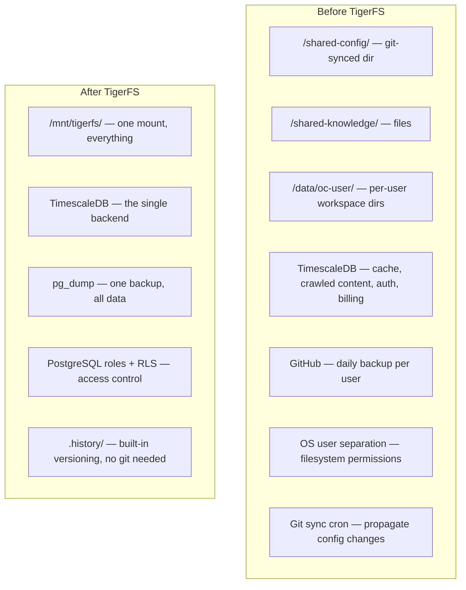

# TigerFS: The Storage Unifier

[TigerFS](https://tigerfs.io/) mounts [TimescaleDB](https://www.timescale.com/) as a regular filesystem. Every file is a row, every write is a transaction, concurrent access is ACID-guaranteed. By the same team as TimescaleDB.

Agents work with files natively. TigerFS makes the database look like a filesystem. No SQL, no ORM, no database client needed from the agent's perspective.

## Full Capabilities

### File-First Mode

- **Markdown with YAML frontmatter** — frontmatter keys auto-become typed database columns, body becomes `_body` column
- **Atomic writes** — each write is a database transaction
- **Concurrent access** — multiple agents/humans write safely to the same directory
- **Atomic moves** — `mv` is a transaction, enables task boards (todo → doing → done)

### Pipeline Queries (via file paths)

Chained segments compiled into a single optimized SQL query:

```
cat /mnt/db/orders/.by/customer_id/123/.order/created_at/.last/10/.export/json
```

| Segment | Purpose |
|---|---|
| `.by/column/value` | Index lookup |
| `.filter/column/value` | Filter |
| `.order/column` | Sort |
| `.columns/col1,col2` | Select columns |
| `.first/N/`, `.last/N/` | Pagination |
| `.sample/N/` | Random sample |
| `.all/` | Bypass listing limit |
| `.export/json\|csv\|tsv\|yaml` | Output format |

### Version History

Requires TimescaleDB. Tracks files across renames via stable row UUIDs:

```
ls /mnt/db/notes/.history/hello.md/           # all versions (timestamped)
cat /mnt/db/notes/.history/hello.md/2026-02-24T150000Z  # specific version
cat /mnt/db/notes/.history/hello.md/.id       # stable UUID
```

Restore: `cat /mnt/db/notes/.history/hello.md/[timestamp] > /mnt/db/notes/hello.md`

### Bulk Import/Export

```bash
cat data.csv > /mnt/db/orders/.import/.append/csv    # add rows
cat data.csv > /mnt/db/orders/.import/.sync/csv      # upsert
cat data.csv > /mnt/db/orders/.import/.overwrite/csv  # replace all
cat /mnt/db/orders/.export/json                       # export all
```

### Row as Directory

```bash
ls /mnt/db/users/123/          # list columns
cat /mnt/db/users/123/email.txt  # read single column
echo 'new@email.com' > /mnt/db/users/123/email.txt  # update column
```

### Schema Management (Staging Pattern)

```bash
mkdir /mnt/db/.create/orders
cat /mnt/db/.create/orders/sql     # view template
echo "CREATE TABLE..." > /mnt/db/.create/orders/sql
touch /mnt/db/.create/orders/.test    # validate
touch /mnt/db/.create/orders/.commit  # execute
```

Same for `.modify/`, `.delete/`, indexes.

### App Creation

```bash
echo "markdown" > /mnt/db/.build/blog           # markdown app
echo "markdown,history" > /mnt/db/.build/notes   # with version history
```

### Ghost (Instant Databases)

Spin up throwaway databases for agents on the fly. Fork existing databases with one command — full copy, independent modifications:

```bash
tigerfs fork /mnt/db my-experiment
```

### Agent Skills

Ships with [Claude Code](https://claude.ai/claude-code) skills that teach agents file-based database patterns. Installable into OpenClaw workspaces.

## What This Collapses



## The Unified Layout

```
/mnt/tigerfs/
  config/                   ← shared, all gateways read
    SOUL.md
    AGENTS.md
    auth-profiles.json
  knowledge/                ← shared domain knowledge
    product-docs/
    procedures/
  users/
    alice@co.com/           ← per-user workspace
      USER.md
      MEMORY.md
      memory/
      sessions/
      uploads/
    bob@gmail.com/
      ...
  cache/                    ← TTL-based shared cache
    .by/key/exchange-rate-usd-eur/.export/json
  crawled/                  ← shared intelligence layer (pgvector)
```

## What This Eliminates

| Before | After |
|---|---|
| Git-sync cron for shared config | Write to TigerFS, all gateways see it instantly (ACID) |
| OS user separation for isolation | PostgreSQL row-level security |
| Per-user directories on local disk | Per-user paths in TigerFS |
| GitHub daily backup per user | `.history/` for versioning, `pg_dump` for disaster recovery |
| Separate cache system | Pipeline queries via file paths |
| Separate crawled content index | Files in TigerFS with pgvector underneath |
| SQL/Drizzle for agent data access | Agents just read/write files |
| Bulk data import/export tooling | `.import/` and `.export/` built-in |

## Updated Host Layout

```
One Linux VM:
  ├── Control plane          (1 Bun process)
  ├── TimescaleDB            (1 system service)
  ├── TigerFS mount          (/mnt/tigerfs/)
  ├── ClamAV daemon          (1 system service)
  └── Gateway processes        (N OpenClaw multi-agent gateways, all read/write via TigerFS)
```

No local disk dependency. No git sync. No OS users. No separate backup infra. Gateways are fully stateless.

## Open Questions

- **OpenClaw's `O_NOFOLLOW` flag** — FUSE files present as regular files (not symlinks), should be fine. Needs testing.
- **Session transcript append performance** — OpenClaw appends to JSONL files frequently. FUSE write latency for append-heavy workloads needs benchmarking.
- **File watchers** — OpenClaw watches workspace files for hot-reload. Does FUSE trigger `inotify`/`FSEvents` correctly?
- **OpenClaw multi-agent compatibility** — each agent expects filesystem paths for its workspace. TigerFS paths should work but needs verification.
- **TigerFS maturity** — "early, but core idea is stable" per their docs. Need to evaluate production readiness.
