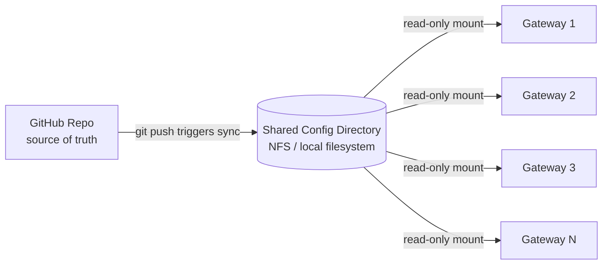
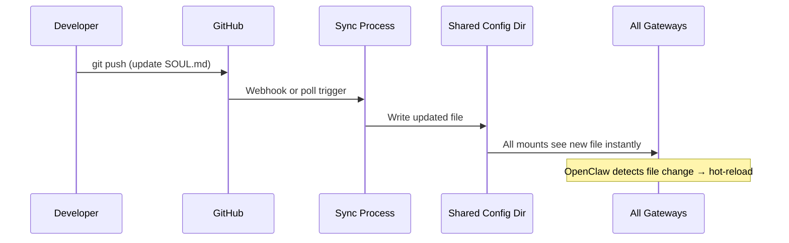

# Versioning & Updates: Rolling Out Changes Across All Gateways

## What Changes and How Often

At a startup, agent behavior is iterated constantly — daily or multiple times a day:

- [`SOUL.md`](https://docs.openclaw.ai/concepts/agent-workspace) — agent personality, tone, boundaries
- `AGENTS.md` — operating instructions, workflows
- [Tool policies](https://docs.openclaw.ai/gateway/sandbox-vs-tool-policy-vs-elevated) — what tools are enabled/disabled

These are product-level files shared across ALL users. They must update instantly across all gateways.

**Per-user files (`USER.md`, [`MEMORY.md`](https://docs.openclaw.ai/concepts/memory), `memory/`, `sessions/`) are never touched by updates.**

## Solution: Shared Config Directory



### How It Works

1. Shared config files live in a GitHub repo (version controlled, auditable, rollbackable)
2. A single sync process keeps the shared config directory in sync with the repo
3. All gateway processes access that directory as a read-only path (e.g., `/shared-config/`)
4. OpenClaw reads `SOUL.md`, `AGENTS.md` from the mounted path
5. When the file changes on disk, OpenClaw detects it and hot-reloads

### Update Flow



### Why This Is Optimal

| Property | |
|---|---|
| **Write operations** | One (to the shared config directory) |
| **Fan-out** | Zero (filesystem handles distribution) |
| **Per-gateway work** | Zero (no sync, no pull, no webhook handler) |
| **Latency** | Near-instant (filesystem write) |
| **Polling** | None |
| **Restart required** | No (OpenClaw hot-reloads on file change) |
| **Version control** | Git history |
| **Rollback** | Git revert → sync → all gateways rolled back |
| **Scales with gateways** | Adding gateways just means another process reading the directory |

### Workspace Layout Per Gateway

```
/shared-config/          ← shared directory (read-only)
  SOUL.md                ← product agent personality
  AGENTS.md              ← product operating instructions
  tool-policies.json     ← product tool restrictions

/workspace/              ← per-user workspace directory (read-write)
  USER.md                ← user profile, preferences
  MEMORY.md              ← user long-term memory
  memory/                ← user daily logs
  sessions/              ← user task history
  uploads/               ← user uploaded files
```

### Stopped Gateways

Stopped gateway processes don't need updating — they're not running. When they start and read the shared config directory, they automatically get the latest version. No special handling.

### Alternatives Considered and Rejected

| Approach | Why Rejected |
|---|---|
| Bake into process startup script | Too slow for frequent iteration — restart all processes every time |
| GitHub webhook → fan-out to gateways | Per-gateway work, control plane complexity |
| Agent fetches from URL per task | Burns tokens, adds latency, fragile |
| OpenClaw [cron](https://docs.openclaw.ai/automation/cron-jobs) job to git pull | LLM cost per gateway per interval |
| Git clone in workspace + periodic pull | Polling, per-gateway work |
| Entrypoint fetch + webhook restart | Restart required, slower |

