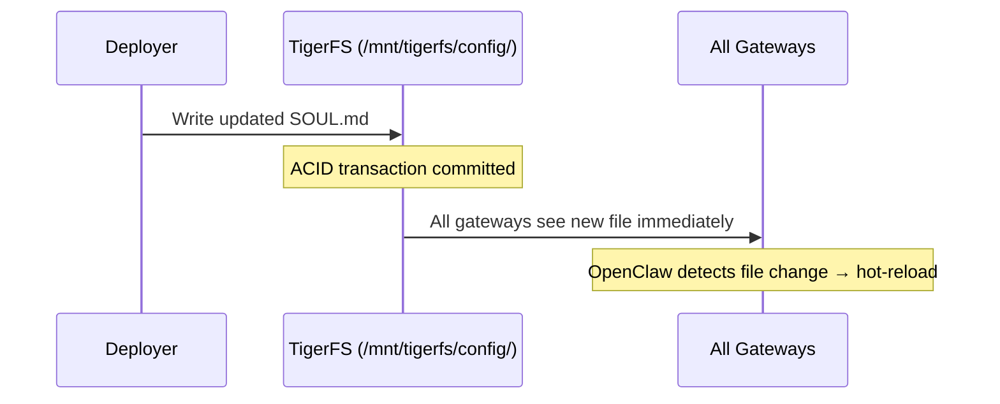

# Versioning & Updates: Rolling Out Changes Across All Gateways

## What Changes and How Often

In a deployed instance, agent behavior is iterated constantly — daily or multiple times a day:

- [`SOUL.md`](https://docs.openclaw.ai/concepts/agent-workspace) — agent personality, tone, boundaries
- `AGENTS.md` — operating instructions, workflows
- [Tool policies](https://docs.openclaw.ai/gateway/sandbox-vs-tool-policy-vs-elevated) — what tools are enabled/disabled

These are product-level files shared across ALL users. They must update instantly across all gateways.

**Per-user files (`USER.md`, [`MEMORY.md`](https://docs.openclaw.ai/concepts/memory), `memory/`, `sessions/`) are never touched by updates.**

## With TigerFS

All shared config lives in [TigerFS](tigerfs.md) at `/mnt/tigerfs/config/`. Since TigerFS is backed by TimescaleDB, a write to any file is instantly visible to all gateways reading from the same mount. ACID-guaranteed.



### Why This Is Optimal

| Property | |
|---|---|
| **Write operations** | One (to TigerFS) |
| **Fan-out** | Zero (all gateways read same mount) |
| **Propagation** | Instant (ACID commit) |
| **Polling** | None |
| **Cron jobs** | None |
| **Restart required** | No (OpenClaw hot-reloads on file change) |
| **Version history** | TigerFS `.history/` — timestamped snapshots of every change |
| **Rollback** | Restore from `.history/` |

### Rollback

```bash
# See all versions of SOUL.md
ls /mnt/tigerfs/config/.history/SOUL.md/

# Restore a previous version
cat /mnt/tigerfs/config/.history/SOUL.md/2026-03-22T100000Z > /mnt/tigerfs/config/SOUL.md
```

### Stopped Gateways

Stopped gateway processes don't need updating — they're not running. When they start and read from TigerFS, they get the latest version immediately. No special handling.

### Alternatives Considered and Rejected

| Approach | Why Rejected |
|---|---|
| Git-synced shared directory with cron | Polling, propagation delay, extra infrastructure |
| Bake into process startup script | Restart all processes every time |
| GitHub webhook → fan-out to gateways | Per-gateway work, control plane complexity |
| Agent fetches from URL per task | Burns tokens, adds latency, fragile |
| OpenClaw [cron](https://docs.openclaw.ai/automation/cron-jobs) job to git pull | LLM cost per gateway per interval |
