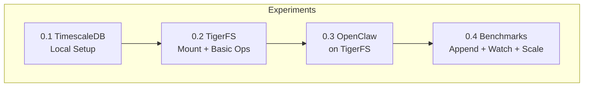
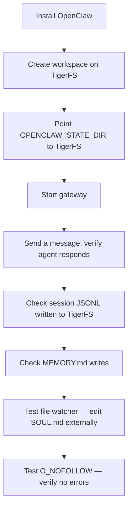
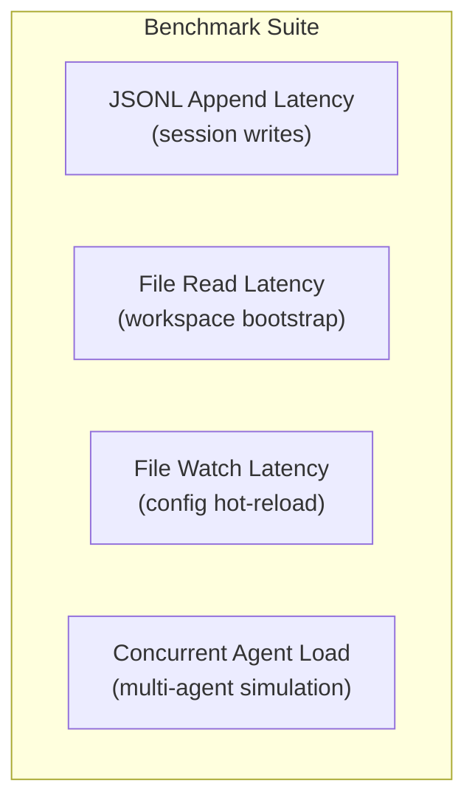
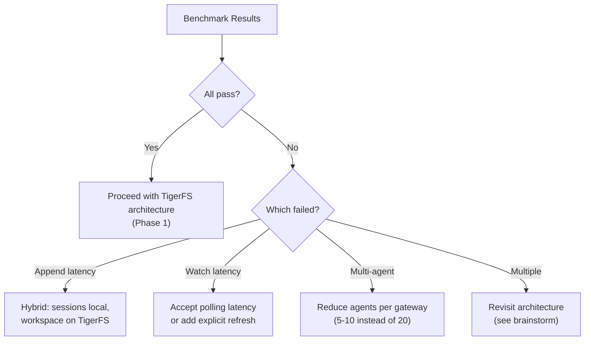

# Phase 0: Infrastructure Experimentation

## Goal

Validate every risky assumption before writing production code. If anything fails here, we rethink the architecture before investing.

## Overview



---

## Stage 0.1: TimescaleDB Local Setup

### Goal
Run TimescaleDB locally with pgvector and pgvectorscale extensions.

### Dependencies
- Docker installed

### Steps
1. Create a `docker-compose.yml` with TimescaleDB image including pgvector
2. Start the container, verify PostgreSQL is accessible
3. Enable pgvector and pgvectorscale extensions
4. Create a test table with a vector column
5. Insert test embeddings, run a similarity query
6. Verify pgai is available (or note if it requires Timescale Cloud)

### External References
- [TimescaleDB self-hosted install](https://www.tigerdata.com/docs/self-hosted/latest/install)
- [pgvector GitHub](https://github.com/pgvector/pgvector)
- [pgvectorscale GitHub](https://github.com/timescale/pgvectorscale)
- [pgai GitHub](https://github.com/timescale/pgai)
- [TimescaleDB Docker image](https://hub.docker.com/r/timescale/timescaledb-ha)

### Verification Checklist
- [ ] TimescaleDB container running and accessible on localhost
- [ ] `CREATE EXTENSION vector` succeeds
- [ ] `CREATE EXTENSION vectorscale` succeeds (or documented why not available locally)
- [ ] Insert + KNN query on vector column returns correct results
- [ ] pgai extension status documented (available locally or Cloud-only)
- [ ] Hypertable creation succeeds on a test table
- [ ] Compression policy can be applied to hypertable

---

## Stage 0.2: TigerFS Mount + Basic Operations

### Goal
Mount TimescaleDB via TigerFS and verify basic file operations.

### Dependencies
- Stage 0.1 complete

### Steps
1. Install TigerFS on local machine
2. Mount the local TimescaleDB instance via TigerFS
3. Create a "markdown,history" app via `.build/`
4. Write a markdown file with YAML frontmatter, verify it appears as a row
5. Read the file back, verify content matches
6. Append to a file, verify append works
7. Check `.history/` — verify version history is tracked
8. Test pipeline queries (`.by/`, `.filter/`, `.export/`)
9. Test bulk import via `.import/`
10. Test concurrent writes from two terminals

### External References
- [TigerFS docs](https://tigerfs.io/docs)
- [TigerFS GitHub](https://github.com/timescale/tigerfs)

### Verification Checklist
- [ ] TigerFS mount succeeds on local machine
- [ ] File write creates a row in TimescaleDB (verify via SQL)
- [ ] File read returns correct content
- [ ] File append works correctly (content grows, not replaced)
- [ ] `.history/` shows timestamped versions after edits
- [ ] Pipeline queries return correct filtered results
- [ ] `.import/.append/csv` ingests data correctly
- [ ] Two concurrent writes from different terminals don't corrupt data
- [ ] File delete removes the row from TimescaleDB
- [ ] Directory creation and listing work as expected

---

## Stage 0.3: OpenClaw on TigerFS

### Goal
Run a single OpenClaw gateway with its workspace on TigerFS. Validate that OpenClaw's core operations work correctly.

### Dependencies
- Stage 0.2 complete
- OpenClaw installed (`npm install -g openclaw@latest`)

### Steps



1. Create workspace directory structure on TigerFS mount:
   ```
   /mnt/tigerfs/test-workspace/
     SOUL.md
     AGENTS.md
     USER.md
   ```
2. Configure OpenClaw to use TigerFS paths:
   - `OPENCLAW_STATE_DIR` → TigerFS path
   - `agents.defaults.workspace` → TigerFS path
3. Start gateway, send a test message via CLI
4. Verify agent responds correctly
5. Check that session JSONL was written to TigerFS path
6. Verify `MEMORY.md` and `memory/` files are written to TigerFS
7. Edit `SOUL.md` externally (from another terminal), verify OpenClaw detects the change via hot-reload
8. Check logs for any `O_NOFOLLOW`, `ELOOP`, or `symlink` errors
9. Run multiple conversations, verify sessions accumulate correctly
10. Kill the gateway, restart, verify it picks up existing sessions from TigerFS

### External References
- [OpenClaw getting started](https://docs.openclaw.ai/start/getting-started)
- [OpenClaw agent workspace](https://docs.openclaw.ai/concepts/agent-workspace)
- [OpenClaw configuration](https://docs.openclaw.ai/gateway/configuration)

### Verification Checklist
- [ ] Gateway starts with workspace on TigerFS without errors
- [ ] Agent responds to messages correctly
- [ ] Session JSONL files appear on TigerFS (verifiable via SQL)
- [ ] Memory files (MEMORY.md, memory/*.md) written to TigerFS
- [ ] Hot-reload triggers when SOUL.md is edited externally
- [ ] No `O_NOFOLLOW` or symlink errors in logs
- [ ] Gateway restart picks up existing sessions from TigerFS
- [ ] Auth profiles (auth-profiles.json) read/write correctly from TigerFS
- [ ] `/usage` command returns correct token counts
- [ ] Cron job (if configured) executes and persists results to TigerFS

---

## Stage 0.4: Benchmarks

### Goal
Quantify performance to validate or invalidate the architecture.

### Dependencies
- Stage 0.3 complete

### Steps



#### Benchmark 1: JSONL Append Latency
- Write a script that appends lines to a JSONL file on TigerFS
- Measure latency per append at file sizes: 1KB, 10KB, 100KB, 500KB, 1MB
- Compare against local filesystem baseline
- Run 1000 appends, report p50, p95, p99 latencies

#### Benchmark 2: File Read Latency
- Read workspace bootstrap files (SOUL.md, AGENTS.md, USER.md, MEMORY.md) from TigerFS
- Measure latency per read at file sizes: 1KB, 10KB, 50KB, 100KB
- Compare against local filesystem baseline
- Run 1000 reads, report p50, p95, p99 latencies

#### Benchmark 3: File Watch Latency
- Start a chokidar watcher on a TigerFS directory
- Write a file from another process
- Measure time from write to watcher event firing
- Run 100 write-watch cycles, report latencies

#### Benchmark 4: Cross-Mount Change Detection
- Write a file directly to TimescaleDB via SQL (simulating write from another host)
- Measure time until TigerFS mount reflects the change (via stat or chokidar)
- Report detection latency

#### Benchmark 5: Concurrent Multi-Agent Simulation
- Configure OpenClaw with 5, 10, 15, 20 agents on one gateway
- Send simultaneous messages to different agents
- Measure response latency per agent
- Monitor memory usage and CPU
- Report at what agent count performance degrades

### Verification Checklist
- [ ] JSONL append p95 latency < 50ms at 500KB file size (acceptable for fire-and-forget)
- [ ] File read p95 latency < 20ms for 100KB files (acceptable for bootstrap)
- [ ] File watch detects changes within 500ms (chokidar polling acceptable)
- [ ] Cross-mount change detection within 1s
- [ ] 10 concurrent agents: response latency within 2x of single-agent baseline
- [ ] 20 concurrent agents: response latency within 3x of single-agent baseline
- [ ] Memory usage per idle agent < 50MB
- [ ] No data corruption under concurrent load
- [ ] All benchmark results documented with exact numbers

### Decision Gate



If benchmarks fail, we don't abandon — we adjust. The fallback paths are documented in [brainstorm architecture](../brainstorm/architecture/overview.md).
