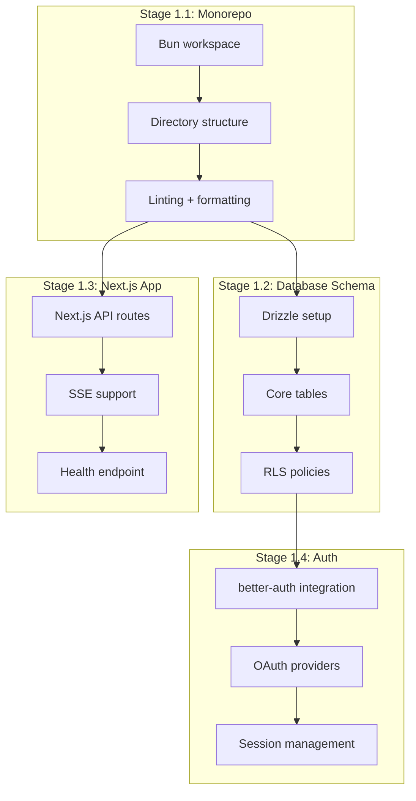
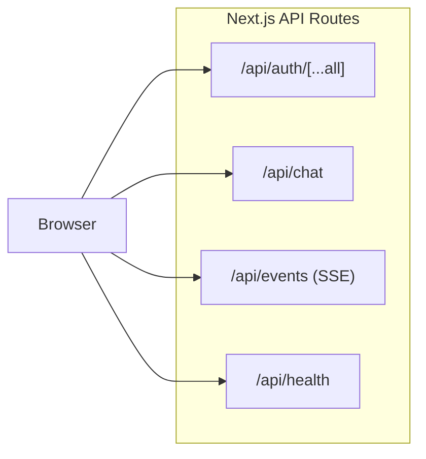
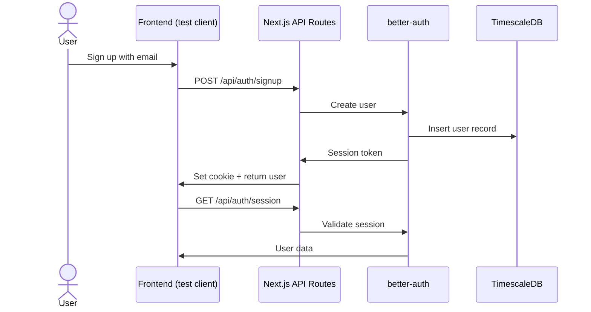

# Phase 1: Foundation

## Goal

Set up the monorepo, control plane skeleton, authentication, and database schema. Everything needed before integrating OpenClaw.

### Environment Variables

Single `.env` at project root (symlinked to `apps/web/.env.local` for Next.js). Validated via `@a/env` package (`@t3-oss/env-core` + Zod) in `packages/env/src/env.ts`. To add a new var: add to the schema, add to `.env`, add to `docker-compose.yml` if gateway needs it. See CLAUDE.md for env rules.

## Overview



---

## Stage 1.1: Monorepo Setup

### Goal

Initialize a Bun workspace monorepo with the project structure.

### Dependencies

- Phase 0 complete (TigerFS validated)
- Bun installed

### Steps

1. Initialize the repo with Bun workspace configuration
2. Create package structure:
   ```
   apps/web/              ← Next.js App Router (auth, chat, events — all API routes)
   lib/ui/                ← read-only shadcn + ai-elements from noboil (ignored by lintmax)
   config/
     SOUL.md            ← default agent personality
     AGENTS.md          ← default operating instructions
   docker-compose.yml   ← TimescaleDB + TigerFS + ClamAV (from Phase 0)
   ```
3. Configure TypeScript (strict, ESM, path aliases)
4. Set up Oxlint + Oxfmt (matching OpenClaw’s tooling)
5. Set up `bun test` for testing (Jest-compatible, built into Bun — not Vitest)
6. Create `bun run` scripts: `dev`, `build`, `test`, `lint`, `format`
7. Use `bun-types` (not `@types/bun`) for proper eslint type resolution

### External References

- [Bun workspace docs](https://bun.sh/docs/install/workspaces)
- [Bun quickstart](https://bun.sh/docs/quickstart)
- [Bun test runner](https://bun.sh/docs/cli/test)

### Verification Checklist

- [ ] `bun install` succeeds from repo root
- [ ] `bun run build` succeeds (even if empty)
- [ ] `bun run test` runs bun test (even with zero tests)
- [ ] `bun run lint` runs Oxlint with zero errors
- [ ] `bun run format` runs Oxfmt
- [ ] TypeScript strict mode enabled, no errors
- [ ] Workspace packages can import from each other

---

## Stage 1.2: Database Schema

### Goal

Define the core TimescaleDB schema via Drizzle with RLS policies.

### Dependencies

- Stage 1.1 complete
- docker-compose running (TimescaleDB from Phase 0)

### Steps

```mermaid
erDiagram
    user {
        text id PK
        text email UNIQUE
        text name
        timestamptz created_at
        timestamptz last_active_at
    }

    gateways {
        text id PK
        text host
        int port
        text status
        int agent_count
        int max_agents
        timestamptz created_at
    }

    user_gateway {
        text user_id FK
        text gateway_id FK
        text agent_id
        text workspace_path
        text status
        timestamptz created_at
    }

    cache {
        text key PK
        jsonb value
        timestamptz ttl
        timestamptz created_at
    }

    usage_events {
        timestamptz time PK
        text user_id FK
        text gateway_id FK
        text model
        text provider
        int input_tokens
        int output_tokens
        numeric cost_usd
        int latency_ms
        text task_type
    }

    user ||--o{ user_gateway : "assigned to"
    gateways ||--o{ user_gateway : "hosts"
    user ||--o{ usage_events : "generates"
```

1. Install Drizzle ORM + drizzle-kit as dependencies
2. Define schema tables:
   - `user` — generated by better-auth via `bunx @better-auth/cli generate`. The `user` table uses `text` ID (not UUID), table named `user` (not `users`). Auto-generated `auth-schema.ts` is excluded from linting. Do not define a conflicting custom user table. Use better-auth’s schema as the source of truth and extend it if needed.
   - `gateways` — id, host, port, status, agent_count, max_agents
   - `user_gateway` — user.id → gateway mapping with agent_id and workspace_path (references better-auth’s `user.id` field)
   - `cache` — shared key-value store with TTL. Used by deployer CLIs and the shared intelligence layer for cross-user data deduplication (e.g., caching API responses, crawled content). The framework provides the table; deployers decide what to cache.
   - `usage_events` — TimescaleDB hypertable (partitioned by time) for usage tracking. Control plane writes token counts, cost, model, latency from gateway WebSocket events. Continuous aggregates in Phase 6 query this table for billing and analytics.
3. Define RLS policies:
   - Each gateway connection can only access its own agents’ data
   - Control plane has full access
4. Create per-gateway PostgreSQL roles: when creating a gateway, the control plane also creates a PostgreSQL role for that gateway with RLS policies scoped to its agents. TigerFS mounts for that gateway use this scoped role.
5. **Set database-level default for RLS:** `ALTER DATABASE uniclaw SET app.agent_id = '__none__'`. This ensures any connection that forgets to `SET LOCAL app.agent_id` gets no data (no rows match `__none__`).
6. Run `drizzle-kit push` to apply schema to local TimescaleDB
7. Write tests: schema creation, RLS enforcement, basic CRUD

### External References

- [Drizzle + PostgreSQL setup](https://orm.drizzle.team/docs/get-started/postgresql-new)
- [Drizzle RLS](https://orm.drizzle.team/docs/rls)
- [Drizzle Kit](https://orm.drizzle.team/docs/kit-overview)

### Verification Checklist

- [ ] All tables created in TimescaleDB
- [ ] `drizzle-kit push` succeeds without errors
- [ ] Insert + read on every table works
- [ ] RLS policy blocks cross-agent data access (test with different roles)
- [ ] RLS policy blocks cross-gateway data access (test with different roles)
- [ ] Cache table: insert with TTL, read before expiry succeeds, read after expiry returns null
- [ ] Schema types are inferred correctly in TypeScript
- [ ] Unset session returns zero rows from memory_chunks (RLS default blocks access)
- [ ] Migration is reproducible (drop + push from scratch)

---

## Stage 1.3: Next.js App Skeleton

### Goal

Next.js app with API routes for auth, chat, and events. Single process — `bun dev` starts everything.

### Dependencies

- Stage 1.1 complete

### Steps



1. Create Next.js app (App Router) as the main application
2. Add `/api/health` route returning server status
3. Add `/api/auth/[...all]` route (placeholder, wired in Stage 1.4)
4. Add `/api/chat` route (placeholder, wired in Phase 2)
5. Add `/api/events` SSE route (placeholder, wired in Phase 2)
6. Configure security headers via `next.config.ts` (CSP, X-Frame-Options, HSTS, etc.)
7. Write tests: health check returns 200

### External References

- [Next.js Route Handlers](https://nextjs.org/docs/app/building-your-application/routing/route-handlers)
- [AI SDK streamText + @ai-sdk/openai](https://ai-sdk.dev)

### Verification Checklist

- [ ] `bun dev` starts Next.js dev server
- [ ] `GET /api/health` returns 200 with status JSON
- [ ] Security headers present (CSP, X-Frame-Options, HSTS, etc.)
- [ ] All tests pass

---

## Stage 1.4: Authentication

### Goal

Integrate better-auth with Next.js for user signup, login, and session management.

### Dependencies

- Stage 1.2 complete (database schema)
- Stage 1.3 complete (Next.js app)

### Steps



1. Install better-auth
2. Configure better-auth with Drizzle adapter pointing to TimescaleDB
3. Mount better-auth handler at `/api/auth/[...all]` via `toNextJsHandler` from `better-auth/next-js`
4. Enable email + password signup (minimal for testing)
5. Enable at least one OAuth provider (Google — matches production provider)
6. Configure session management (cookie-based)
7. Add auth middleware to API routes — reject unauthenticated requests. Use `createAuthClient` from `better-auth/react` with `useSession()` hook on the frontend. Configure Google OAuth via `socialProviders.google` and `trustedOrigins` for same-origin
8. **Email normalization at signup:** Email normalization (lowercase + strip `+` aliases) MUST be applied by better-auth BEFORE creating the user record. The `email` column in the users table stores the NORMALIZED email. This prevents two accounts (`alice+1@company.com` and `alice@company.com`) from creating separate auth records that map to the same workspace. Add a better-auth `beforeSignup` hook that normalizes email before account creation.
9. **Enable better-auth CAPTCHA for signup** to prevent bot-driven account creation.
10. **Admin role assignment:** The first user does NOT auto-become admin. Admin role is assigned explicitly by the deployer via better-auth CLI or database. The admin plugin must be configured with `requireAdminCreation: true` or equivalent. Document this in the template repo README.
11. Write tests: signup, login, session validation, logout, unauthenticated rejection

### External References

- [better-auth installation](https://www.better-auth.com/docs/installation)
- [better-auth Next.js integration](https://www.better-auth.com/docs/integrations/next-js) — use `toNextJsHandler`
- [better-auth Drizzle adapter](https://www.better-auth.com/docs/storage/drizzle)

### Verification Checklist

- [ ] User signup creates record in TimescaleDB
- [ ] User login returns session token
- [ ] Session token validates on subsequent requests
- [ ] Logout invalidates session
- [ ] Unauthenticated API requests are rejected
- [ ] Authenticated API requests succeed
- [ ] OAuth flow works (Google)
- [ ] better-auth admin plugin accessible (user management)
- [ ] Two signups with `user+tag@gmail.com` and `user@gmail.com` result in ONE account (not two)
- [ ] Regular user cannot access /admin/\* endpoints
- [ ] All tests pass
