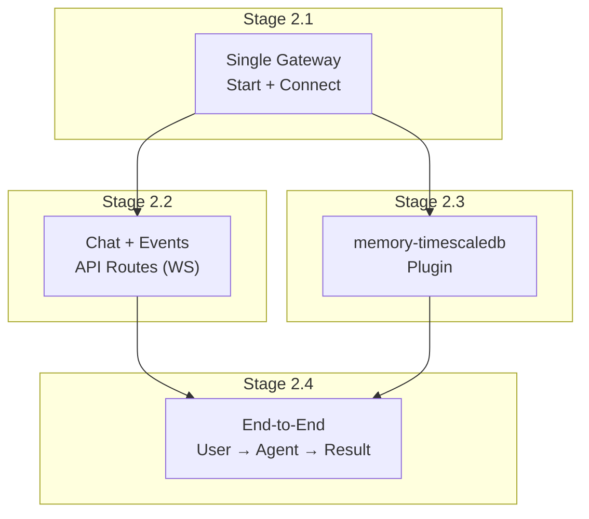
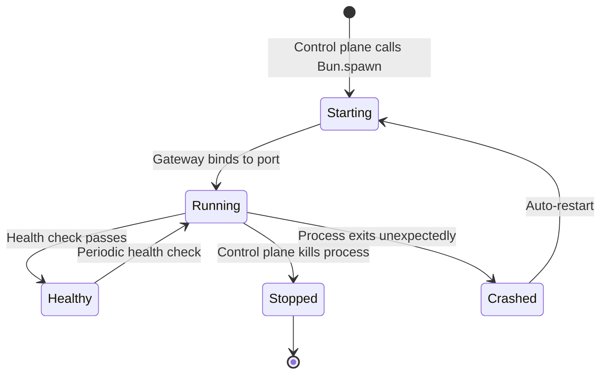
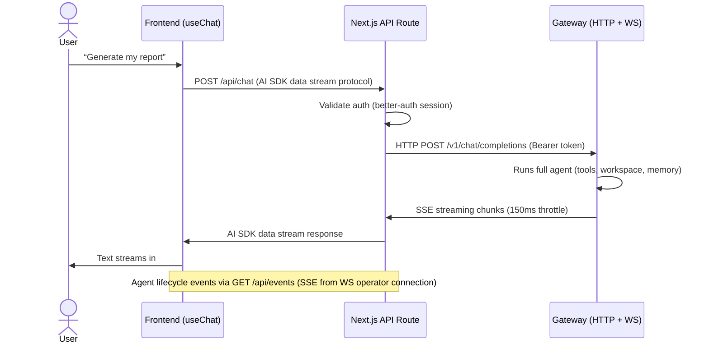
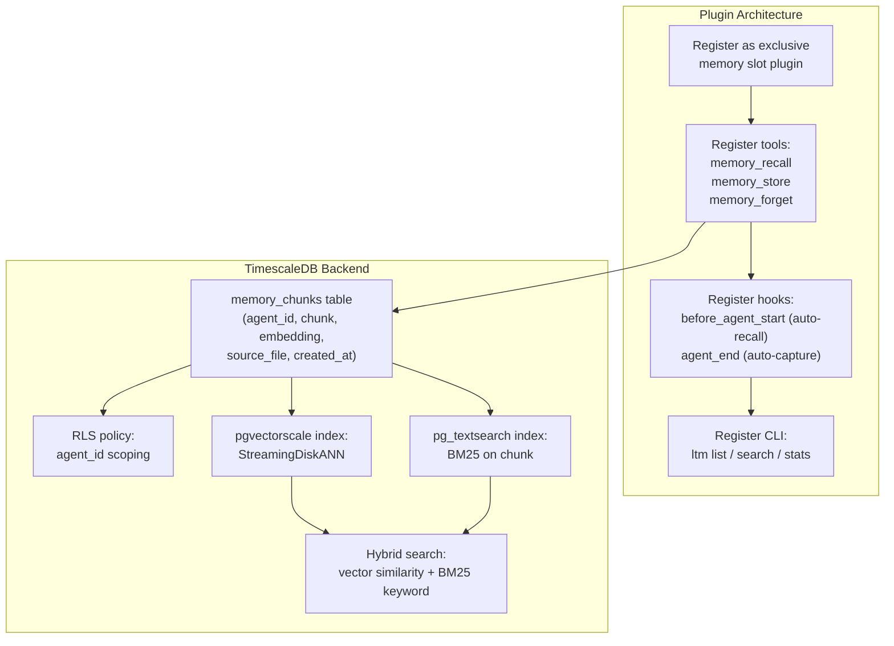
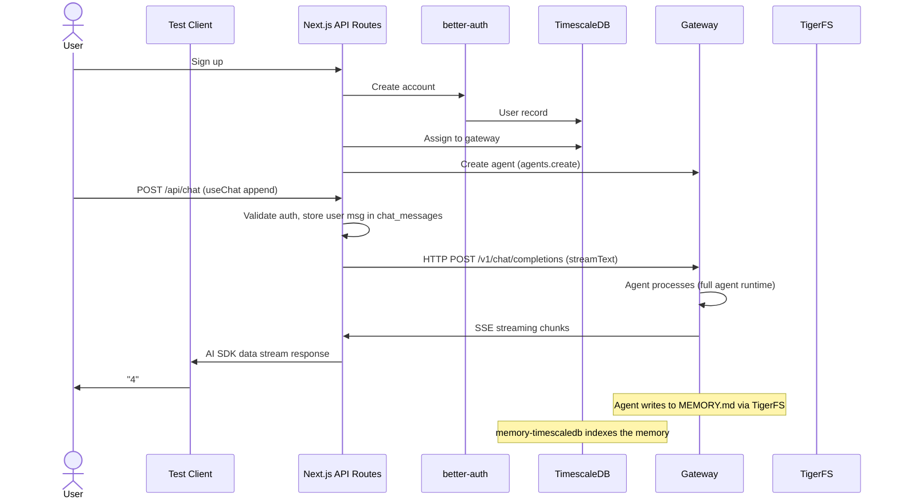

# Phase 2: Gateway Integration

## Goal

Connect the Next.js app to an OpenClaw gateway. Relay chat messages and stream agent events. Build the memory-timescaledb plugin.

**Architecture:**

- Chat: HTTP POST to gateway `/v1/chat/completions` (OpenAI-compatible, Bearer token auth) via AI SDK `@ai-sdk/openai` provider + `streamText`. See [decisions.md](../brainstorm/stack/decisions.md) for why HTTP over WS.
- Events: WebSocket operator connection for agent lifecycle events (tool calls, progress), streamed to frontend via SSE `/api/events`
- Session persistence: Drizzle-managed `chat_messages` table (both user + assistant messages). JSONL transcripts on TigerFS only store assistant responses.
- `/api/chat` route: AI SDK `streamText` → gateway → `toDataStreamResponse()`. Frontend uses `useChat` from `@ai-sdk/react`.
- `/api/events` route: SSE stream of agent lifecycle events from WS operator connection

## Overview

**Stage ordering:** 2.1 → 2.2 (chat+events) and 2.3 (memory plugin) can run in parallel. 2.5 (clarification) and 2.6 (key pool) are independent additions that don’t block 2.4 (e2e validation). 2.4 requires 2.1 + 2.2 + 2.3.

---

## Stage 2.1: Single Gateway Lifecycle

### Goal

Control plane can start, stop, and health-check a single OpenClaw gateway process.

### Dependencies

- Phase 1 complete
- OpenClaw installed
- TigerFS mounted (from Phase 0)

### Steps

1. **Create a per-gateway PostgreSQL role** for this gateway (even for the first single gateway in Phase 2). The role is scoped via RLS policies to only see its own agents’ data. Configure the gateway’s database connection and TigerFS mount to use this role. This ensures RLS is tested from Phase 2 onward, not deferred to Phase 5.
2. Control plane spawns OpenClaw gateway via `Bun.spawn()` with:
   - `OPENCLAW_STATE_DIR` pointing to TigerFS
   - `agents.defaults.workspace` pointing to TigerFS
   - Unique port assignment
   - Gateway auth token for control plane connection
   - Database connection string using the per-gateway PostgreSQL role (not superuser)
   - **Explicitly set `tools.exec.security: "allowlist"` with `safeBins: ["bunx"]` in the shared config** — this permits ONLY `bunx` (the CLI execution mechanism) while blocking all other shell commands. Setting `"deny"` would break the agent-native CLI paradigm entirely
   - **TigerFS mount permissions:** TigerFS mount should use restricted permissions (only accessible to the gateway process user group). Combined with exec deny default, this prevents FUSE-level bypass of RLS
3. Control plane waits for gateway to be ready (poll `/health` or wait for WebSocket handshake)
4. Control plane connects to gateway via WebSocket (operator+password auth, no device identity needed)
5. Implement health check loop — periodic ping, restart on failure
6. Implement graceful shutdown — wait for active tasks, then kill
7. **Secrets management:** For production, deployers should use environment variables or a secrets manager for API keys, not plaintext files on TigerFS. The framework supports both `auth-profiles.json` (for development) and environment variable injection (for production).
8. Write tests: start gateway, verify health, send message via gateway API, stop gateway, verify restart on crash

### External References

- [OpenClaw gateway CLI](https://docs.openclaw.ai/cli/gateway)
- [OpenClaw gateway protocol](https://docs.openclaw.ai/gateway/protocol)
- [OpenClaw gateway configuration](https://docs.openclaw.ai/gateway/configuration)
- [Bun.spawn docs](https://bun.sh/docs/api/spawn)

### Verification Checklist

- [ ] Control plane starts gateway process successfully
- [ ] Gateway binds to assigned port
- [ ] Control plane connects via WebSocket with auth
- [ ] Health check detects healthy gateway
- [ ] Health check detects crashed gateway and restarts it
- [ ] Graceful shutdown waits for active task then stops
- [ ] Gateway reads workspace from TigerFS (validates Phase 0 findings)
- [ ] `tools.exec.security` is set to `"allowlist"` with `safeBins: ["bunx"]` in shared config (verified via gateway config dump)
- [ ] All tests pass

---

## Stage 2.2: Chat + Events API Routes

### Goal

Relay chat messages from the frontend to the gateway via HTTP `/v1/chat/completions` (OpenAI-compatible, Bearer token auth). Stream agent lifecycle events via SSE from WS operator connection. See [decisions.md](../brainstorm/stack/decisions.md) for why HTTP over WS.

### Dependencies

- Stage 2.1 complete

### Steps

1. `/api/chat` route handler:
   - Authenticate via better-auth session
   - Use AI SDK `streamText` with `@ai-sdk/openai` provider pointed at gateway `/v1/chat/completions`
   - System prompt instructs model to always respond with text (reinforces SOUL.md)
   - Store user message in `chat_messages` table before sending
   - `onFinish` callback stores assistant response in `chat_messages` table
   - Return `toDataStreamResponse()` for AI SDK wire protocol
   - Gateway runs the full agent (same as WS `chat.send`) but with built-in empty response fallback
2. `/api/events` SSE route handler:
   - Connect to gateway via WS (operator+password auth, no device identity)
   - Stream `agent` lifecycle events (tool calls, progress, errors) as SSE to the frontend
3. **Session persistence:** Session list and messages read from Drizzle-managed `chat_messages` table (both user and assistant messages). JSONL transcripts on TigerFS only store assistant responses. Session switching via `/api/sessions` and `/api/sessions/[id]/messages`.
4. Write e2e tests: full message round-trip with real auth cookies, event streaming, session creation, session switching with message loading, multi-turn context preservation, auth rejection

### External References

- [OpenClaw HTTP API](https://docs.openclaw.ai/gateway/openai-http-api) (used for chat — see [decisions.md](../brainstorm/stack/decisions.md) for why)
- [OpenClaw WebSocket protocol](https://docs.openclaw.ai/gateway/protocol) (used for agent events via `/api/events`)
- [Next.js Route Handlers](https://nextjs.org/docs/app/building-your-application/routing/route-handlers)

### Verification Checklist

- [ ] POST `/api/chat` relays message to gateway via HTTP `/v1/chat/completions` and returns AI SDK data stream
- [ ] GET `/api/events` streams agent lifecycle events via SSE (from WS operator connection)
- [ ] Unauthenticated requests to `/api/chat` and `/api/events` are rejected
- [ ] Message from frontend reaches gateway (verify in gateway logs / terminal panel)
- [ ] Agent response streams back to frontend in real-time (AI SDK data stream protocol)
- [ ] Tool call events visible in SSE event stream (verbose JSON in terminal panel)
- [ ] `/api/events` WS connection uses operator+password auth (no device identity, no pairing)
- [ ] Multiple users can interact simultaneously
- [ ] Both user and assistant messages stored in `chat_messages` table (user messages not in JSONL)
- [ ] Session list API (`/api/sessions`) returns sessions with first user message as label
- [ ] Session messages API (`/api/sessions/[id]/messages`) returns full conversation (user + assistant)
- [ ] Clicking a session in sidebar loads its messages and updates URL
- [ ] New chat creates a fresh session, clears messages, updates URL
- [ ] Multi-turn context preserved within a session (full history sent in each request)
- [ ] Chat never returns empty response (gateway HTTP fallback guarantees non-empty)
- [ ] All e2e tests pass (with real auth cookies against dev server)

---

## Stage 2.5: Clarification Mechanism

### Goal

Allow the agent to request clarification from the user mid-task, using the exec approval pattern — no new event types needed.

### Dependencies

- Stage 2.2 complete (chat + events API routes)

### Steps

1. Create a custom OpenClaw plugin package (`extensions/clarification-tool/`) following the same pattern as `memory-timescaledb`. The plugin uses `api.registerTool()` to register the `request_clarification` tool with the gateway. The tool’s `execute()` function triggers an exec approval event via `callGatewayTool('exec.approval.request', ...)` and waits for resolution.
2. Implement `request_clarification` as a custom tool registered on the gateway:
   - Tool accepts `{ question: string, options?: string[] }` as input
   - When the agent calls this tool, the gateway emits an exec approval event (the same pattern used for tool execution approval)
   - The API route intercepts this event and forwards a clarification prompt to the frontend via SSE
3. Frontend displays the clarification prompt to the user (interactive prompt UI implemented in Phase 4)
4. User’s response is sent back through the API route to the gateway, which provides it as the tool result
5. **Important:** The `clarification.requested` event type does NOT exist in OpenClaw. This implementation reuses the existing exec approval flow — the gateway broadcasts a tool approval request, and the Next.js app recognizes `request_clarification` as a special case requiring user input rather than auto-approval. The control plane inspects the tool name in the exec approval event. If the tool name is `request_clarification`, it routes to the frontend as a clarification prompt. All other exec approvals are handled normally (auto-approved or denied based on tool policy)
6. **Clarification timeout reaper:** The control plane runs a periodic reaper (every 60s) that checks for timed-out clarification requests. If a clarification has been pending longer than the timeout (default 5 min), the Next.js app sends a timeout response to the gateway, freeing the agent to abort gracefully. This prevents stuck agents from consuming gateway capacity.
7. Write tests: agent requests clarification, user responds, agent continues with the answer

### External References

- [OpenClaw tool approval](https://docs.openclaw.ai/gateway/configuration#exec-approval)
- [OpenClaw custom tools](https://docs.openclaw.ai/tools/plugin)

### Verification Checklist

- [ ] `request_clarification` tool registered on gateway
- [ ] Agent calling the tool triggers exec approval event (not a custom event type)
- [ ] Control plane intercepts and forwards clarification to frontend
- [ ] User response flows back to agent as tool result
- [ ] Agent continues task with clarification answer
- [ ] Timeout: if user doesn’t respond within configurable window, agent proceeds with a default
- [ ] Timed-out clarification releases the agent slot (verify gateway agent count doesn’t grow with stuck clarifications)
- [ ] This stage must be complete before Phase 4 frontend can show interactive prompts
- [ ] All tests pass

---

## Stage 2.3: memory-timescaledb Plugin

### Goal

Build an OpenClaw memory plugin that stores vector embeddings and full-text search in TimescaleDB via pgvector + pg_textsearch (BM25), replacing the default file-based memory (`memory-core`) and LanceDB-based vector memory (`memory-lancedb`). Note: `memory-core` is file-based (not SQLite), and `memory-lancedb` uses LanceDB (not SQLite). `memory-timescaledb` replaces both by providing **hybrid search** (semantic vector + BM25 keyword) in a single database — matching OpenClaw’s built-in hybrid search capabilities but backed by TimescaleDB instead of SQLite/LanceDB.

### Dependencies

- Stage 2.1 complete
- Phase 0 benchmarks confirm pgvector works

### Steps

1. Study the existing `memory-lancedb` plugin structure:
   - `extensions/memory-lancedb/index.ts` (676 LOC reference)
   - `extensions/memory-lancedb/config.ts` (180 LOC reference)
2. Create `extensions/memory-timescaledb/` following the same pattern
3. Implement `TimescaleMemoryDB` class:
   - `init()` — create table if not exists, with RLS policy. Enable extensions: `CREATE EXTENSION IF NOT EXISTS vector`, `CREATE EXTENSION IF NOT EXISTS vectorscale`, `CREATE EXTENSION IF NOT EXISTS pg_textsearch`
   - `store(agentId, chunks[])` — insert with embeddings (BM25 index auto-updates on insert)
   - `search(agentId, query, limit)` — **hybrid search** combining pgvector similarity + pg_textsearch BM25:
     - Vector: top `limit * 4` candidates by cosine similarity (`embedding <=> $queryVector`)
     - BM25: top `limit * 4` candidates by keyword relevance (`chunk <@> $queryText`)
     - Merge: `finalScore = vectorWeight * vectorScore + textWeight * textScore` (default 0.7/0.3)
     - Union candidates by chunk id, sort by final score, return top `limit`
     - Fallback: if BM25 index unavailable, vector-only; if embeddings fail, BM25-only
   - `delete(agentId, filter)` — delete by agent_id + filter
   - `count(agentId)` — count chunks for agent
4. Implement embedding generation (reuse OpenAI embeddings provider or make configurable). The embedding provider is configurable via env var `EMBEDDING_MODEL` (default: `text-embedding-3-small` at 1536 dimensions). The `vector(1536)` column dimension must match the model. If switching models, re-index is required. Add `EMBEDDING_MODEL` and `EMBEDDING_API_KEY` to the env var inventory.
   > **Why hybrid search:** Vector search finds semantic matches ("deployment issues" ↔ “server problems”) but misses exact tokens (error codes, env var names, file paths). BM25 is the opposite. Combined, both signals cover natural language queries AND needle-in-a-haystack lookups. This matches OpenClaw’s built-in hybrid search (SQLite FTS5 + vector) but runs entirely in TimescaleDB.
5. Create indexes on `memory_chunks`:
   - `CREATE INDEX ON memory_chunks USING hnsw (embedding vector_cosine_ops)` — pgvectorscale StreamingDiskANN for vector search
   - `CREATE INDEX ON memory_chunks USING bm25 (chunk)` — pg_textsearch BM25 for keyword search
   - Standard btree on `agent_id` for RLS filtering
6. Register tools: `memory_recall`, `memory_store`, `memory_forget` (matching `memory-lancedb`’s tool names — NOT `memory_search`/`memory_get` from `memory-core`)
7. Register hooks: `before_agent_start` (auto-recall), `agent_end` (auto-capture)
8. Register CLI commands: `ltm list`, `ltm search`, `ltm stats`
9. Configure as exclusive memory slot: `plugins.slots.memory: "memory-timescaledb"`
10. **Critical: every query MUST scope by agent_id. RLS policy allows own rows + `__shared__` rows.** Policy: `USING (agent_id = current_setting(‘app.agent_id’) OR agent_id = ‘__shared__’)` — enforce in code AND via RLS
    > **Note:** The `memory-timescaledb` plugin generates embeddings in application code (not via pgai). If pgai is available locally, it can be used for auto-vectorizing the shared intelligence layer (crawled_pages) in a future phase, but the memory plugin does not depend on it.
11. **Implement a shared knowledge indexer:** On startup and on file change (via chokidar), read all files from the shared knowledge directory (`/mnt/tigerfs/knowledge/`), chunk them, generate embeddings, and insert/update rows in `memory_chunks` with `agent_id = ‘__shared__’`. The control plane runs this indexer (not individual gateways) to avoid duplicate indexing. BM25 index auto-updates — no separate keyword indexing step needed.
12. **Optional post-processing (match OpenClaw’s built-in features):**
    - **MMR re-ranking** — reduce redundant results by penalizing similarity to already-selected results (lambda 0.7 default)
    - **Temporal decay** — exponential recency boost on dated memory files (`score × e^(-λ × ageDays)`, half-life 30 days default). Evergreen files (MEMORY.md, non-dated) are never decayed.
    - Both are off by default, configurable per-agent
13. Write comprehensive tests: store/search/delete, agent isolation, concurrent access, hybrid search (verify BM25 finds exact tokens that vector search misses, and vice versa)

### External References

- [OpenClaw plugin docs](https://docs.openclaw.ai/tools/plugin)
- [OpenClaw memory concepts](https://docs.openclaw.ai/concepts/memory)
- [pgvector usage](https://github.com/pgvector/pgvector#usage)
- [pgvectorscale DiskANN](https://github.com/timescale/pgvectorscale)
- [pg_textsearch BM25](https://github.com/timescale/pg_textsearch) — pre-installed in timescaledb-ha:pg18, provides `USING bm25` index and `<@>` operator for BM25-ranked full-text search

### Verification Checklist

- [ ] Plugin registers as exclusive memory slot
- [ ] `memory_recall` returns relevant results from TimescaleDB
- [ ] `memory_store` persists chunks with embeddings to TimescaleDB
- [ ] `memory_forget` deletes specific memories
- [ ] Auto-recall injects relevant memories before agent starts
- [ ] Auto-capture stores conversation facts after agent ends
- [ ] **Agent A cannot search Agent B’s memories** (RLS enforced)
- [ ] **Every SQL query includes `WHERE agent_id`** (code review)
- [ ] CLI commands work: `ltm list`, `ltm search`, `ltm stats`
- [ ] Performance: hybrid search latency < 100ms for 10K chunks
- [ ] Gateway with memory-timescaledb has no SQLite files on disk
- [ ] Files dropped in knowledge/ directory are searchable by any agent via memory_recall
- [ ] **Hybrid search: BM25 finds exact token matches** (e.g., env var name `DATABASE_URL` found by keyword when vector search ranks it low)
- [ ] **Hybrid search: vector finds semantic matches** (e.g., “database connection” finds chunks about `DATABASE_URL` when BM25 misses due to different wording)
- [ ] **pg_textsearch extension enabled** (`CREATE EXTENSION pg_textsearch` succeeds — pre-installed in timescaledb-ha:pg18)
- [ ] BM25 index created on `memory_chunks.chunk` column
- [ ] All tests pass

---

## Stage 2.6: LLM Key Pool Configuration

### Goal

Configure multiple LLM API keys with fallback strategy to avoid rate limits and single-key failures.

### Dependencies

- Stage 2.1 complete (single gateway running)

### Steps

OpenClaw handles key rotation natively. This stage is about CONFIGURING the key pool, not building custom rotation code.

1. Configure multiple auth profiles in `auth-profiles.json`:
   - Multiple Anthropic API keys (for load distribution)
   - Multi-provider fallback: Anthropic → OpenAI → other providers
2. Test that OpenClaw rotates between them on rate limits
3. Verify fallback to secondary provider works
4. Store key pool configuration on TigerFS so all gateways share the same pool

### External References

- [OpenClaw auth profiles](https://docs.openclaw.ai/gateway/configuration#auth-profiles)
- [OpenClaw multi-provider](https://docs.openclaw.ai/concepts/models)

### Verification Checklist

- [ ] Multiple auth profiles configured in `auth-profiles.json`
- [ ] OpenClaw rotates between keys on rate limits
- [ ] Fallback to secondary provider works when primary is exhausted
- [ ] Key pool config shared across gateways via TigerFS
- [ ] All tests pass

---

## Stage 2.4: End-to-End Validation

### Goal

Complete round-trip: user authenticates → sends task → agent works → result delivered.

### Dependencies

- Stages 2.1, 2.2, 2.3 complete

### Steps

1. Run the full flow manually first, then automate as an integration test
2. Verify every piece of data lands in the right place:
   - User record in TimescaleDB (via better-auth)
   - User-gateway mapping in TimescaleDB
   - Agent workspace on TigerFS
   - Session JSONL on TigerFS
   - Memory embeddings in TimescaleDB (via memory-timescaledb plugin)
3. Verify event stream contains expected events:
   - `agent` events during processing
   - `chat` event with final result
4. Verify gateway usage tracking returns correct token counts

### Verification Checklist

- [ ] User signup → gateway assignment → agent creation works end-to-end
- [ ] User sends message → receives correct response
- [ ] Session transcript exists on TigerFS (verifiable via SQL)
- [ ] Memory embeddings exist in TimescaleDB
- [ ] Event stream contains `agent` progress events
- [ ] Event stream contains `chat` final result
- [ ] `/usage` returns non-zero token count
- [ ] Second message in same session retains context
- [ ] All data in TimescaleDB, nothing on local disk (except gateway process itself)
- [ ] Integration test passes end-to-end
