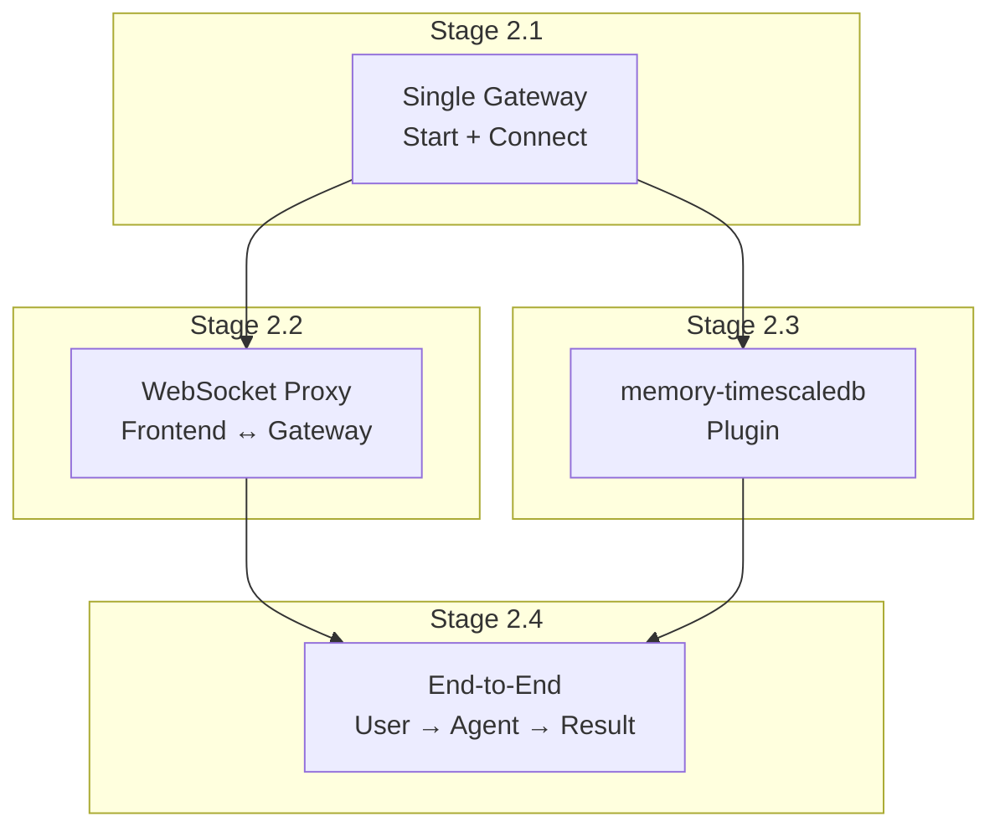
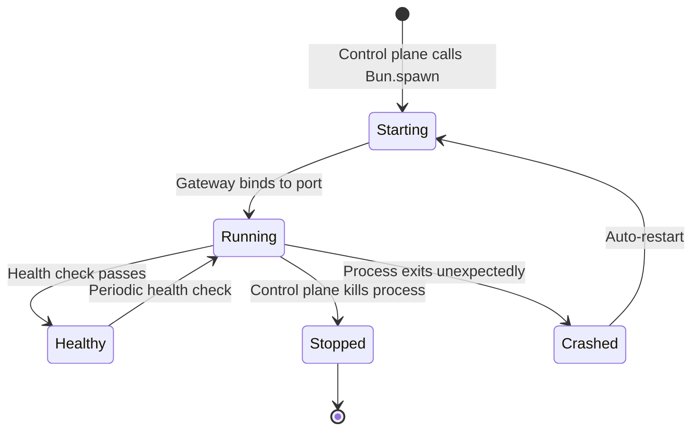
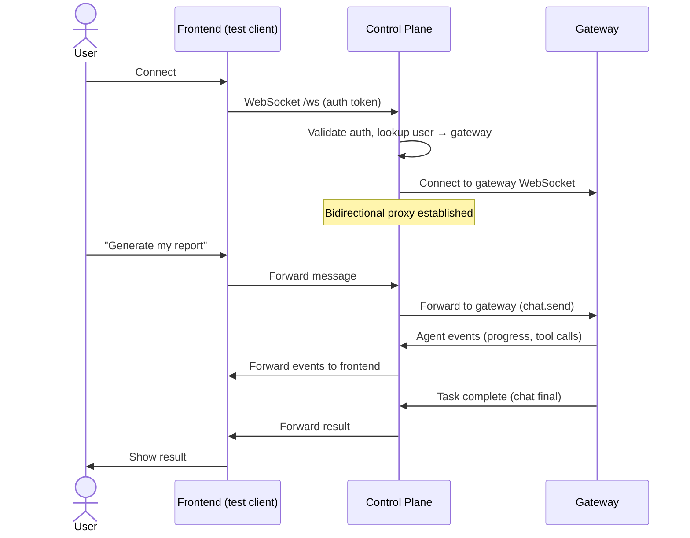
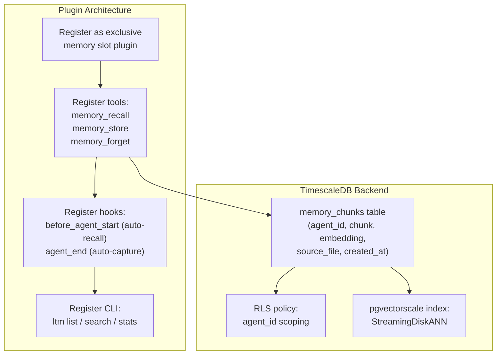
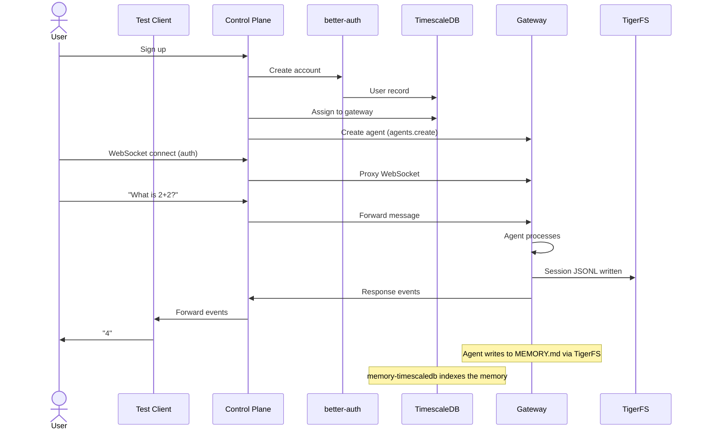

# Phase 2: Gateway Integration

## Goal

Connect the control plane to an OpenClaw gateway. Proxy WebSocket traffic between the frontend and the gateway. Build the memory-timescaledb plugin.

## Overview

---

## Stage 2.1: Single Gateway Lifecycle

### Goal
Control plane can start, stop, and health-check a single OpenClaw gateway process.

### Dependencies
- Phase 1 complete
- OpenClaw installed
- TigerFS mounted (from Phase 0)

### Steps

1. **Create a per-gateway PostgreSQL role** for this gateway (even for the first single gateway in Phase 2). The role is scoped via RLS policies to only see its own agents' data. Configure the gateway's database connection and TigerFS mount to use this role. This ensures RLS is tested from Phase 2 onward, not deferred to Phase 5.
2. Control plane spawns OpenClaw gateway via `Bun.spawn()` with:
   - `OPENCLAW_STATE_DIR` pointing to TigerFS
   - `agents.defaults.workspace` pointing to TigerFS
   - Unique port assignment
   - Gateway auth token for control plane connection
   - Database connection string using the per-gateway PostgreSQL role (not superuser)
   - **Explicitly set `tools.exec.security: "allowlist"` with `safeBins: ["bunx"]` in the shared config** — this permits ONLY `bunx` (the CLI execution mechanism) while blocking all other shell commands. Setting `"deny"` would break the agent-native CLI paradigm entirely
   - **TigerFS mount permissions:** TigerFS mount should use restricted permissions (only accessible to the gateway process user group). Combined with exec deny default, this prevents FUSE-level bypass of RLS
2. Control plane waits for gateway to be ready (poll `/health` or wait for WebSocket handshake)
3. Control plane connects to gateway via WebSocket (device identity + token auth)
4. Implement health check loop — periodic ping, restart on failure
5. Implement graceful shutdown — wait for active tasks, then kill
6. **Secrets management:** For production, deployers should use environment variables or a secrets manager for API keys, not plaintext files on TigerFS. The framework supports both `auth-profiles.json` (for development) and environment variable injection (for production).
7. Write tests: start gateway, verify health, send message via gateway API, stop gateway, verify restart on crash

### External References
- [OpenClaw gateway CLI](https://docs.openclaw.ai/cli/gateway)
- [OpenClaw gateway protocol](https://docs.openclaw.ai/gateway/protocol)
- [OpenClaw gateway configuration](https://docs.openclaw.ai/gateway/configuration)
- [Bun.spawn docs](https://bun.sh/docs/api/spawn)

### Verification Checklist
- [ ] Control plane starts gateway process successfully
- [ ] Gateway binds to assigned port
- [ ] Control plane connects via WebSocket with auth
- [ ] Health check detects healthy gateway
- [ ] Health check detects crashed gateway and restarts it
- [ ] Graceful shutdown waits for active task then stops
- [ ] Gateway reads workspace from TigerFS (validates Phase 0 findings)
- [ ] `tools.exec.security` is set to `"allowlist"` with `safeBins: ["bunx"]` in shared config (verified via gateway config dump)
- [ ] All tests pass

---

## Stage 2.2: WebSocket Proxy

### Goal
Proxy WebSocket traffic from the frontend through the control plane to the correct gateway.

### Dependencies
- Stage 2.1 complete

### Steps

1. When user connects to control plane WebSocket:
   - Authenticate via session token (better-auth)
   - Look up user's gateway assignment in TimescaleDB
   - Open a WebSocket connection to that gateway (using gateway auth token)
   - Establish bidirectional proxy: frontend ↔ control plane ↔ gateway
2. Forward all messages from frontend to gateway
3. Forward all events from gateway to frontend
4. Handle disconnections: if frontend disconnects, keep gateway connection alive (task continues). If gateway disconnects, notify frontend.
5. **Concurrent sessions per user:** When a user sends a second task while the first is running, the control plane configures OpenClaw's queue mode. Default: `collect` — new messages are batched and delivered after the current task completes. Deployer can configure to `followup` or `steer` via shared config.
6. Classify gateway events for the frontend:
   - `agent` events → live feed
   - `chat` events with `state: "delta"` → live feed
   - `chat` events with `state: "final"` → task complete notification
   - Clarification requests → interactive prompt (see Stage 2.5)
7. The control plane intercepts `chat` events with `state: 'final'` and extracts token counts, cost, model, and latency. It writes these as rows to the `usage_events` hypertable. This is a side effect of the proxy, not a separate service — the control plane writes to the DB while forwarding events.
8. Write tests: full message round-trip, event forwarding, disconnect handling

### External References
- [OpenClaw WebSocket protocol](https://docs.openclaw.ai/gateway/protocol)
- [Elysia WebSocket](https://elysiajs.com/patterns/websocket)

### Verification Checklist
- [ ] Frontend WebSocket connects to control plane with auth
- [ ] Control plane connects to correct gateway for the authenticated user
- [ ] Message from frontend reaches gateway (verify in gateway logs)
- [ ] Agent response events flow back to frontend
- [ ] Tool call events visible in event stream
- [ ] Frontend disconnect doesn't kill the gateway task
- [ ] Gateway disconnect notifies frontend
- [ ] Multiple users can connect simultaneously to different gateways
- [ ] Concurrent task queueing works (second task queued while first runs, default `collect` mode)
- [ ] `usage_events` table has rows after a task completes
- [ ] Verify `chat` final events contain token counts (input_tokens, output_tokens), cost, model, and latency fields. If these fields are missing from WebSocket events, the control plane must query the gateway's `usage.cost` API after each task instead. Document the actual event schema.
- [ ] All tests pass

---

## Stage 2.5: Clarification Mechanism

### Goal
Allow the agent to request clarification from the user mid-task, using the exec approval pattern — no new event types needed.

### Dependencies
- Stage 2.2 complete (WebSocket proxy)

### Steps

1. Create a custom OpenClaw plugin package (`extensions/clarification-tool/`) following the same pattern as `memory-timescaledb`. The plugin uses `api.registerTool()` to register the `request_clarification` tool with the gateway. The tool's `execute()` function triggers an exec approval event via `callGatewayTool('exec.approval.request', ...)` and waits for resolution.
2. Implement `request_clarification` as a custom tool registered on the gateway:
   - Tool accepts `{ question: string, options?: string[] }` as input
   - When the agent calls this tool, the gateway emits an exec approval event (the same pattern used for tool execution approval)
   - The control plane intercepts this event and forwards a clarification prompt to the frontend via WebSocket
2. Frontend displays the clarification prompt to the user (interactive prompt UI implemented in Phase 4)
3. User's response is sent back through the WebSocket proxy to the gateway, which provides it as the tool result
4. **Important:** The `clarification.requested` event type does NOT exist in OpenClaw. This implementation reuses the existing exec approval flow — the gateway broadcasts a tool approval request, and the control plane recognizes `request_clarification` as a special case requiring user input rather than auto-approval. The control plane inspects the tool name in the exec approval event. If the tool name is `request_clarification`, it routes to the frontend as a clarification prompt. All other exec approvals are handled normally (auto-approved or denied based on tool policy)
5. Write tests: agent requests clarification, user responds, agent continues with the answer

### External References
- [OpenClaw tool approval](https://docs.openclaw.ai/gateway/configuration#exec-approval)
- [OpenClaw custom tools](https://docs.openclaw.ai/tools/plugin)

### Verification Checklist
- [ ] `request_clarification` tool registered on gateway
- [ ] Agent calling the tool triggers exec approval event (not a custom event type)
- [ ] Control plane intercepts and forwards clarification to frontend
- [ ] User response flows back to agent as tool result
- [ ] Agent continues task with clarification answer
- [ ] Timeout: if user doesn't respond within configurable window, agent proceeds with a default
- [ ] This stage must be complete before Phase 4 frontend can show interactive prompts
- [ ] All tests pass

---

## Stage 2.3: memory-timescaledb Plugin

### Goal
Build an OpenClaw memory plugin that stores vector embeddings in TimescaleDB via pgvector, replacing the default file-based memory (`memory-core`) and LanceDB-based vector memory (`memory-lancedb`). Note: `memory-core` is file-based (not SQLite), and `memory-lancedb` uses LanceDB (not SQLite). `memory-timescaledb` replaces both by providing pgvector-backed vector search.

### Dependencies
- Stage 2.1 complete
- Phase 0 benchmarks confirm pgvector works

### Steps

1. Study the existing `memory-lancedb` plugin structure:
   - `extensions/memory-lancedb/index.ts` (676 LOC reference)
   - `extensions/memory-lancedb/config.ts` (180 LOC reference)
2. Create `extensions/memory-timescaledb/` following the same pattern
3. Implement `TimescaleMemoryDB` class:
   - `init()` — create table if not exists, with RLS policy
   - `store(agentId, chunks[])` — insert with embeddings
   - `search(agentId, query, limit)` — pgvector similarity search with `WHERE agent_id = $1`
   - `delete(agentId, filter)` — delete by agent_id + filter
   - `count(agentId)` — count chunks for agent
4. Implement embedding generation (reuse OpenAI embeddings provider or make configurable). The embedding provider is configurable via env var `EMBEDDING_MODEL` (default: `text-embedding-3-small` at 1536 dimensions). The `vector(1536)` column dimension must match the model. If switching models, re-index is required. Add `EMBEDDING_MODEL` and `EMBEDDING_API_KEY` to the env var inventory.
5. Register tools: `memory_recall`, `memory_store`, `memory_forget` (matching `memory-lancedb`'s tool names — NOT `memory_search`/`memory_get` from `memory-core`)
6. Register hooks: `before_agent_start` (auto-recall), `agent_end` (auto-capture)
7. Register CLI commands: `ltm list`, `ltm search`, `ltm stats`
8. Configure as exclusive memory slot: `plugins.slots.memory: "memory-timescaledb"`
9. **Critical: every query MUST scope by agent_id. RLS policy allows own rows + `__shared__` rows.** Policy: `USING (agent_id = current_setting('app.agent_id') OR agent_id = '__shared__')` — enforce in code AND via RLS
    > **Note:** The `memory-timescaledb` plugin generates embeddings in application code (not via pgai). If pgai is available locally, it can be used for auto-vectorizing the shared intelligence layer (crawled_pages) in a future phase, but the memory plugin does not depend on it.
10. **Implement a shared knowledge indexer:** On startup and on file change (via chokidar), read all files from the shared knowledge directory (`/mnt/tigerfs/knowledge/`), chunk them, generate embeddings, and insert/update rows in `memory_chunks` with `agent_id = '__shared__'`. The control plane runs this indexer (not individual gateways) to avoid duplicate indexing.
11. Write comprehensive tests: store/search/delete, agent isolation, concurrent access

### External References
- [OpenClaw plugin docs](https://docs.openclaw.ai/tools/plugin)
- [OpenClaw memory concepts](https://docs.openclaw.ai/concepts/memory)
- [pgvector usage](https://github.com/pgvector/pgvector#usage)
- [pgvectorscale DiskANN](https://github.com/timescale/pgvectorscale)

### Verification Checklist
- [ ] Plugin registers as exclusive memory slot
- [ ] `memory_recall` returns relevant results from TimescaleDB
- [ ] `memory_store` persists chunks with embeddings to TimescaleDB
- [ ] `memory_forget` deletes specific memories
- [ ] Auto-recall injects relevant memories before agent starts
- [ ] Auto-capture stores conversation facts after agent ends
- [ ] **Agent A cannot search Agent B's memories** (RLS enforced)
- [ ] **Every SQL query includes `WHERE agent_id`** (code review)
- [ ] CLI commands work: `ltm list`, `ltm search`, `ltm stats`
- [ ] Performance: search latency < 100ms for 10K chunks
- [ ] Gateway with memory-timescaledb has no SQLite files on disk
- [ ] Files dropped in knowledge/ directory are searchable by any agent via memory_recall
- [ ] All tests pass

---

## Stage 2.6: LLM Key Pool Configuration

### Goal
Configure multiple LLM API keys with fallback strategy to avoid rate limits and single-key failures.

### Dependencies
- Stage 2.1 complete (single gateway running)

### Steps

OpenClaw handles key rotation natively. This stage is about CONFIGURING the key pool, not building custom rotation code.

1. Configure multiple auth profiles in `auth-profiles.json`:
   - Multiple Anthropic API keys (for load distribution)
   - Multi-provider fallback: Anthropic → OpenAI → other providers
2. Test that OpenClaw rotates between them on rate limits
3. Verify fallback to secondary provider works
4. Store key pool configuration on TigerFS so all gateways share the same pool

### External References
- [OpenClaw auth profiles](https://docs.openclaw.ai/gateway/configuration#auth-profiles)
- [OpenClaw multi-provider](https://docs.openclaw.ai/concepts/models)

### Verification Checklist
- [ ] Multiple auth profiles configured in `auth-profiles.json`
- [ ] OpenClaw rotates between keys on rate limits
- [ ] Fallback to secondary provider works when primary is exhausted
- [ ] Key pool config shared across gateways via TigerFS
- [ ] All tests pass

---

## Stage 2.4: End-to-End Validation

### Goal
Complete round-trip: user authenticates → sends task → agent works → result delivered.

### Dependencies
- Stages 2.1, 2.2, 2.3 complete

### Steps

1. Run the full flow manually first, then automate as an integration test
2. Verify every piece of data lands in the right place:
   - User record in TimescaleDB (via better-auth)
   - User-gateway mapping in TimescaleDB
   - Agent workspace on TigerFS
   - Session JSONL on TigerFS
   - Memory embeddings in TimescaleDB (via memory-timescaledb plugin)
3. Verify event stream contains expected events:
   - `agent` events during processing
   - `chat` event with final result
4. Verify gateway usage tracking returns correct token counts

### Verification Checklist
- [ ] User signup → gateway assignment → agent creation works end-to-end
- [ ] User sends message → receives correct response
- [ ] Session transcript exists on TigerFS (verifiable via SQL)
- [ ] Memory embeddings exist in TimescaleDB
- [ ] Event stream contains `agent` progress events
- [ ] Event stream contains `chat` final result
- [ ] `/usage` returns non-zero token count
- [ ] Second message in same session retains context
- [ ] All data in TimescaleDB, nothing on local disk (except gateway process itself)
- [ ] Integration test passes end-to-end
