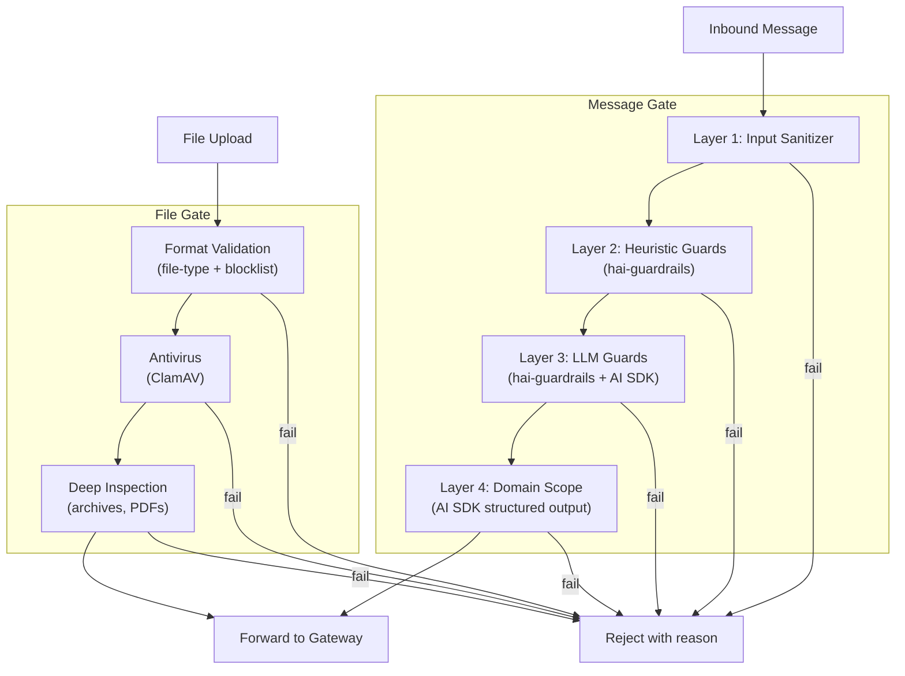
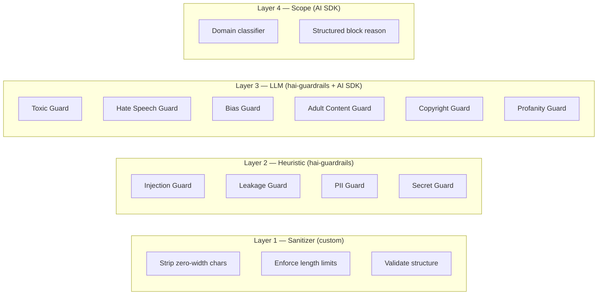
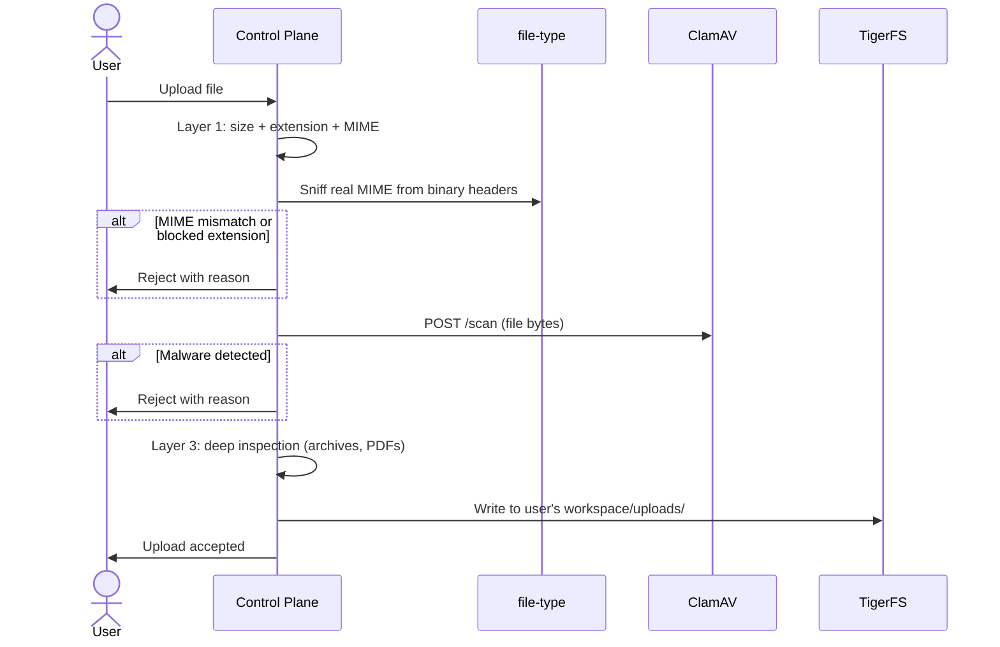

# Phase 3: Security Gate

## Goal

Build the 7-layer security gate that validates all input BEFORE it reaches OpenClaw. See [brainstorm security](../brainstorm/architecture/security.md) for the full design.

## Overview

**Parallelizable:** Stage 3.1 (message gate) and Stage 3.2 (file gate) can be built in parallel.

---

## Stage 3.1: Message Security Gate

### Goal
Validate every user message through 4 layers before forwarding to the gateway.

### Dependencies
- Phase 1 complete (control plane with auth)

### Steps

#### Layer 1: Input Sanitizer
1. Strip hidden unicode characters, zero-width spaces, invisible markup
2. Enforce max message length (configurable by deployer)
3. Reject malformed payloads
4. Test: known unicode trick payloads are stripped, oversized messages rejected

#### Layer 2: Heuristic Guards
1. Install `@presidio-dev/hai-guardrails`
2. Configure guards in heuristic mode (no LLM call):
   - Injection Guard — known prompt injection patterns
   - Leakage Guard — system prompt extraction attempts
   - PII Guard — personal data detection
   - Secret Guard — API keys, credentials
3. Each guard returns a score (0.0–1.0) + explanation
4. Configurable threshold per guard (deployer can tune)
5. Test: known injection patterns blocked, clean messages pass

#### Layer 3: LLM Content Guards
1. Install `ai` (Vercel AI SDK)
2. Configure hai-guardrails LLM-mode guards with AI SDK as the model provider
3. Guards: Toxic, Hate Speech, Bias, Adult Content, Copyright, Profanity
4. Use a fast/cheap model (e.g., Haiku-tier) for classification
5. Test: toxic content blocked, normal business messages pass

#### Layer 4: Domain Scope Classifier
1. Use AI SDK `generateText()` with `Output.object()` + Zod schema
2. Schema returns: `{ allowed: boolean, reason: string, category: string }`
3. Prompt is deployer-configurable (defines what's in-scope for their product)
4. Test: in-scope requests pass, out-of-scope requests blocked with reason

#### Integration
1. Wire all 4 layers as Elysia middleware on the WebSocket message handler
2. Messages pass through layers sequentially (fast layers first)
3. On block: return structured reason to frontend, do NOT forward to gateway
4. On pass: forward to gateway
5. Log all blocks (message hash, layer that blocked, reason) for operator dashboard

### External References
- [hai-guardrails](https://github.com/presidio-oss/hai-guardrails#readme)
- [AI SDK generating text](https://ai-sdk.dev/docs/ai-sdk-core/generating-text)
- [AI SDK getting started](https://ai-sdk.dev/docs/getting-started)

### Verification Checklist
- [ ] Layer 1: unicode tricks stripped, oversized messages rejected
- [ ] Layer 2: known prompt injection patterns blocked (test with OWASP examples)
- [ ] Layer 2: PII detected and flagged (test with SSN, email, phone patterns)
- [ ] Layer 2: API key/secret patterns detected
- [ ] Layer 3: toxic/harmful content blocked
- [ ] Layer 3: normal business messages pass without false positives
- [ ] Layer 4: out-of-scope requests blocked with structured reason
- [ ] Layer 4: in-scope requests pass
- [ ] Blocked messages return structured JSON reason to frontend
- [ ] Blocked messages logged with layer, reason, and message hash
- [ ] Clean messages forward to gateway without modification
- [ ] Gate adds < 200ms total latency (layers 1-2 < 5ms, layers 3-4 < 200ms)
- [ ] All tests pass (unit + integration)

---

## Stage 3.2: File Security Gate

### Goal
Validate all file uploads before they reach the agent's workspace.

### Dependencies
- Phase 1 complete (control plane)
- ClamAV running (from docker-compose)

### Steps

#### Layer 1: Format Validation
1. Install `file-type` package
2. Enforce file size limits (configurable per-type)
3. Extension blocklist: `.exe`, `.dll`, `.bat`, `.sh`, `.ps1`, `.com`, `.scr`, etc.
4. MIME sniff from binary headers, compare with declared content-type
5. Reject on mismatch or blocked type
6. Filename validation: reject path separators, null bytes, traversal

#### Layer 2: Antivirus
1. ClamAV running via docker-compose (from Phase 0 infra)
2. Install or configure `clamav-rest-api` container
3. On file upload, POST file to ClamAV REST API
4. If infected, reject with reason
5. If clean, proceed

#### Layer 3: Deep Inspection
1. For ZIP/TAR/RAR files: extract and scan contents before accepting
2. For PDF files: check for embedded JavaScript, suspicious objects
3. For Office files: flag macros

#### Integration
1. Wire as Elysia route: `POST /upload` with auth middleware
2. After all layers pass, write file to user's workspace on TigerFS: `/mnt/tigerfs/users/{email}/uploads/{filename}`
3. Return success response with file path (relative to workspace)

### External References
- [file-type npm](https://www.npmjs.com/package/file-type)
- [clamav-rest-api](https://github.com/benzino77/clamav-rest-api#readme)
- [ClamAV docs](https://docs.clamav.net/)

### Verification Checklist
- [ ] File size limits enforced (oversized files rejected)
- [ ] Blocked extensions rejected (`.exe`, `.dll`, etc.)
- [ ] MIME sniffing detects real file type (renamed `.jpg` that's actually `.exe`)
- [ ] ClamAV scans file and returns clean/infected status
- [ ] EICAR test file (antivirus test) is detected and rejected
- [ ] Clean files pass all layers and appear in TigerFS workspace
- [ ] ZIP with malicious contents detected (if implementing deep inspection)
- [ ] Filename validation blocks path traversal (`../../etc/passwd`)
- [ ] Upload endpoint requires authentication
- [ ] All tests pass

---

## Stage 3.3: Gate Integration Test

### Goal
Verify the complete security gate works end-to-end with the gateway proxy.

### Dependencies
- Stages 3.1 and 3.2 complete
- Phase 2 complete (gateway integration)

### Verification Checklist
- [ ] Clean message → passes gate → reaches gateway → agent responds
- [ ] Prompt injection → blocked at Layer 2 → user sees reason → gateway never receives it
- [ ] Toxic message → blocked at Layer 3 → user sees reason
- [ ] Out-of-scope request → blocked at Layer 4 → user sees reason
- [ ] Infected file → blocked at ClamAV → user sees reason
- [ ] Clean file → passes gate → appears in agent workspace → agent can read it
- [ ] Gate doesn't interfere with agent events flowing back to frontend
- [ ] Performance: gate adds < 200ms to message flow, < 2s to file upload
