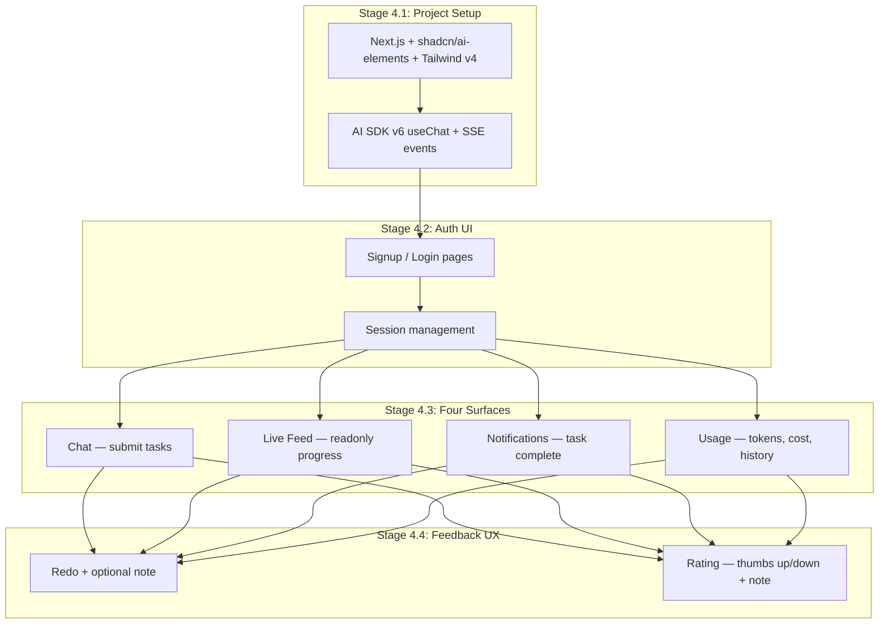
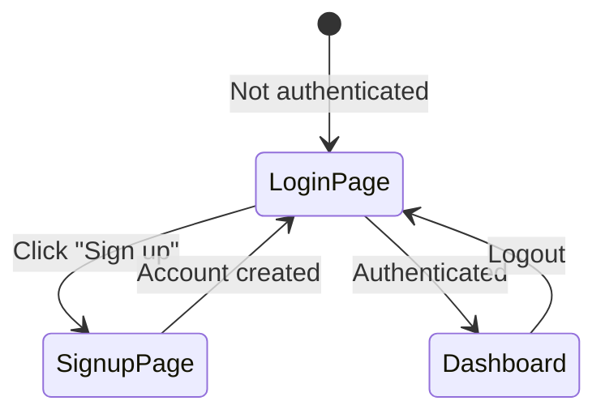
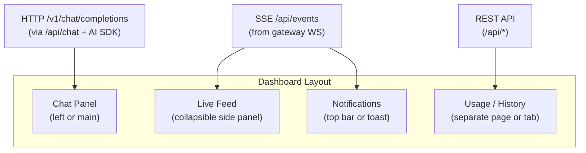
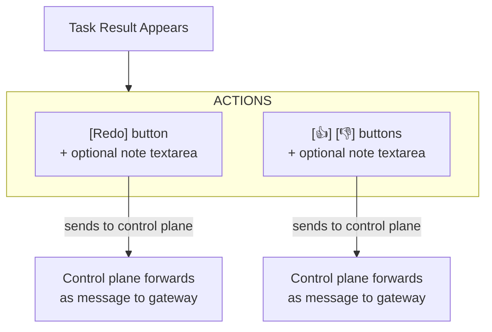

# Phase 4: Frontend

## Goal

Build the Next.js frontend with 4 surfaces: chat, live feed (Terminal), notifications, usage. Auth, chat, and events are all same-origin API routes — no separate control plane server.

## Overview

---

## Stage 4.1: Project Setup

### Goal

Set up the Next.js frontend with `lib/ui/` components and AI SDK v6 integration.

### Dependencies

- Phase 1 complete (Next.js app with auth API routes)

### Steps

1. The Next.js app already exists from Phase 1 — this stage adds the frontend UI
2. `lib/ui/` is a read-only copy of shadcn + ai-elements from noboil (uses `@a/ui` package name, ignored by lintmax)
3. `globals.css` imports `@a/ui/globals.css` directly — stock theme, no redefinition
4. Install AI SDK v6 (`ai`, `@ai-sdk/react`, `@ai-sdk/openai`) — `useChat` returns `append`, `messages`, `setMessages`, `status` (v6 parts-based messages)
5. Chat transport: `/api/chat` uses AI SDK `streamText` with `@ai-sdk/openai` provider pointed at the gateway’s `/v1/chat/completions` endpoint. Frontend uses `useChat` from `@ai-sdk/react` — standard AI SDK pattern, no custom transport. See [decisions.md](../brainstorm/stack/decisions.md) for why HTTP over WS.
6. Create basic layout: IDE panel (file tree + Monaco code viewer + terminal) | chat | session sidebar
7. IDE panel uses `@monaco-editor/react` with Monokai theme (dark) and light variant, synced via `next-themes`. File tree reads from TigerFS tables via `/api/files`. OpenVSCode Server kept as admin-only service on port 3333 (iframe approach dropped — see [limitations.md](../brainstorm/limitations.md)).

### External References

- [AI SDK v6 useChat](https://ai-sdk.dev)
- [Next.js App Router](https://nextjs.org/docs/app)

### Verification Checklist

- [ ] `bun dev` starts Next.js dev server with frontend
- [ ] Tailwind styles render correctly
- [ ] `lib/ui/` components import and render (Terminal, Conversation, Message, Card)
- [ ] Chat connects to `/api/chat` which proxies to gateway via HTTP `/v1/chat/completions` (AI SDK `streamText`)
- [ ] Layout renders with IDE panel (file tree + Monaco + terminal) and chat panels

---

## Stage 4.2: Auth UI

### Goal

Signup, login, and session-gated pages.

### Dependencies

- Stage 4.1 complete
- Phase 1 Stage 1.4 (auth) complete

### Steps

1. Create signup/login page using `lib/ui/` Card components
2. Use `createAuthClient` from `better-auth/react` with `useSession()` hook
3. Google OAuth via `socialProviders.google` (configured in better-auth server)
4. Implement session check — redirect unauthenticated users to login
5. Add logout button

### External References

- [better-auth client SDK](https://www.better-auth.com/docs/installation)

### Verification Checklist

- [ ] User can sign up with email/password
- [ ] User can sign up with Google OAuth
- [ ] User can log in
- [ ] Authenticated user sees dashboard
- [ ] Unauthenticated user redirected to login
- [ ] Logout works and redirects to login
- [ ] Session persists across page refreshes

---

## Stage 4.3: Four Surfaces

### Goal

Build the core UX: chat, live feed, notifications, usage.

### Dependencies

- Stage 4.2 complete
- Phase 2 complete (gateway + chat/events API routes)

### Steps

#### Surface 1: Chat

1. Text input for submitting tasks — `useChat` from `@ai-sdk/react` with `append()`, POST to `/api/chat` which uses AI SDK `streamText` → gateway `/v1/chat/completions`
2. Message list using `lib/ui/` Conversation + Message components
3. Agent responses stream back via AI SDK data stream protocol (SSE with 150ms throttle from gateway)
4. **Session sidebar:** List of past sessions from `chat_messages` table (via `/api/sessions`), each labeled with first user message. Click to switch — loads messages from `/api/sessions/[id]/messages`. New chat button creates fresh session. URL updates to `/?s={sessionKey}` on switch.
5. File upload button (triggers file gate from Phase 3)
6. Support for markdown rendering in agent responses

#### Surface 2: Live Feed

1. Uses `lib/ui/` Terminal component for agent lifecycle logs
2. Readonly stream of agent progress events via SSE `/api/events`
3. Renders: tool calls (name + status), agent thinking indicators, progress updates
4. Collapsible — user can peek or hide
5. Auto-scrolls to latest event
6. Real-time lifecycle events stream via SSE `/api/events`

#### Surface 3: Notifications

1. Toast/banner when a task completes
2. Shows when agent needs clarification (agent clarification requests arrive via exec approval events — see Stage 2.5)
3. Badge counter for unread results

#### Surface 4: Usage / History

1. Token usage summary (today, this week, this month)
2. Cost estimate
3. Past tasks list with status (completed, in-progress, failed)
4. Drill into a task to see its conversation
5. Data sourced from control plane API (which queries TimescaleDB continuous aggregates)

### Verification Checklist

- [ ] Chat: user sends message, agent response appears (via HTTP `/v1/chat/completions` through AI SDK)
- [ ] Chat: streaming response updates in real-time (150ms throttle from gateway)
- [ ] Chat: file upload works, agent can reference uploaded file
- [ ] Sessions: sidebar lists past sessions with first user message as label (from `chat_messages` table)
- [ ] Sessions: clicking a session loads its messages and updates URL to `/?s={sessionKey}`
- [ ] Sessions: new chat button creates fresh session, clears messages, resets URL
- [ ] Sessions: after sending a message, new session appears at top of sidebar
- [ ] Live Feed: verbose JSON agent logs appear during chat (tool calls, progress)
- [ ] Live Feed: can be collapsed/expanded
- [ ] Notifications: toast appears when task completes
- [ ] Usage: token count shows for current session
- [ ] Usage: past tasks listed with correct status
- [ ] All surfaces work simultaneously
- [ ] HTTP chat always returns a response (never empty — gateway fallback guarantees it)

---

## Stage 4.4: Feedback UX

### Goal

Redo button and rating (thumbs up/down) on task results.

### Dependencies

- Stage 4.3 complete

### Steps

1. When a task result appears, show action buttons below it:
   - **Redo** — button + collapsible textarea for optional note
   - **👍 / 👎** — buttons + collapsible textarea for optional note
2. Redo sends a message to the agent in the same session: “User rejected the output. {note if provided}. Try a different approach.”
3. Rating sends a message to the agent: “User rated {positive/negative}. {note if provided}.”
4. **Security: user-typed notes in redo/rating must pass through Layers 1-2 (sanitization + heuristic guards) of the security gate before forwarding to the agent.** The control plane constructs a trusted message template and only the user’s note text is validated. Layers 3-4 (LLM classification) are skipped for these short, low-risk notes.
5. After redo, show new result with the same action buttons
6. UI state: buttons disabled while agent is processing

### Verification Checklist

- [ ] Redo without note: agent retries with different approach
- [ ] Redo with note: agent uses the note to improve
- [ ] Rating (positive) without note: agent acknowledges
- [ ] Rating (negative) with note: agent updates memory
- [ ] Redo produces a new result (not the same one)
- [ ] Buttons disabled during agent processing
- [ ] Multiple redos work (2nd, 3rd attempt)
- [ ] 3rd redo triggers clarification from agent (if AGENTS.md instructs this)
- [ ] User-typed notes in redo/rating pass through security gate Layers 1-2
