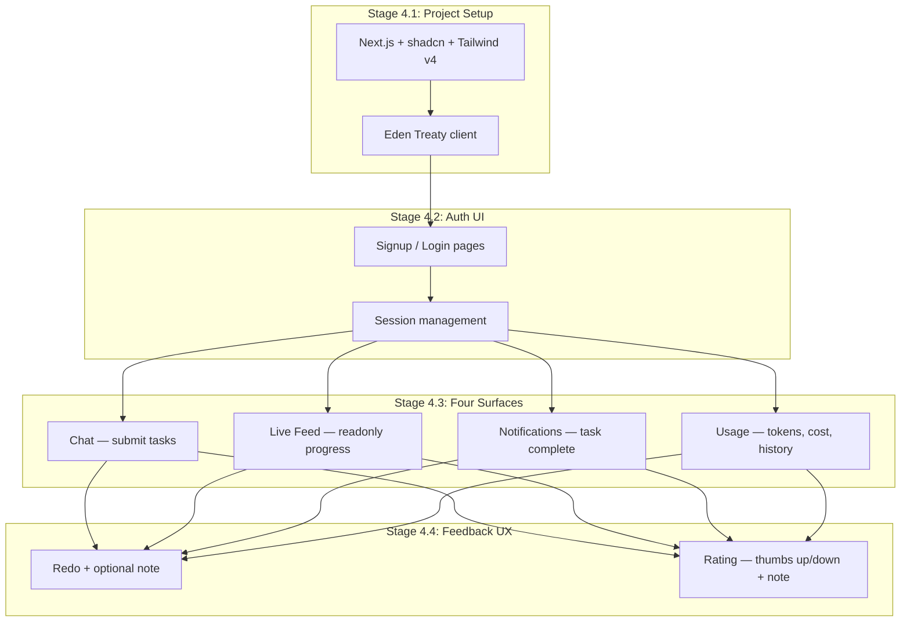
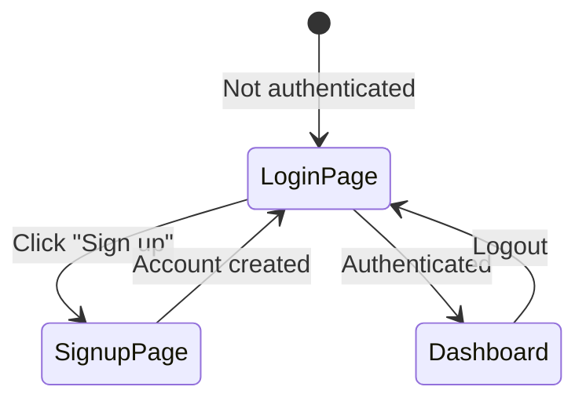
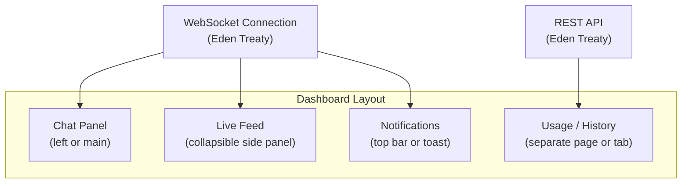
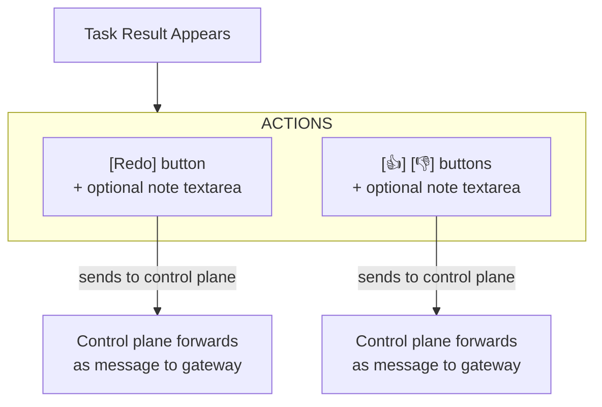

# Phase 4: Frontend

## Goal

Build the Next.js reference app with 4 surfaces: chat, live feed, notifications, usage. Connect to control plane via Eden Treaty for full type safety.

## Overview

---

## Stage 4.1: Project Setup

### Goal
Initialize Next.js app with shadcn, Tailwind v4, and Eden Treaty connected to the control plane.

### Dependencies
- Phase 1 complete (control plane with auth + Elysia type export)

### Steps
1. Create Next.js app in `apps/web/`
2. Install and configure Tailwind v4
3. Install and configure shadcn
4. Install Eden Treaty client, configure to point at control plane URL
5. Verify type inference: Eden Treaty client shows control plane routes with autocomplete
6. Create basic layout (sidebar/header, main content area)

### External References
- [Next.js getting started](https://nextjs.org/docs/getting-started)
- [shadcn + Next.js installation](https://ui.shadcn.com/docs/installation/next)
- [Tailwind CSS installation](https://tailwindcss.com/docs/installation/using-postcss)
- [Eden Treaty overview](https://elysiajs.com/eden/treaty/overview)

### Verification Checklist
- [ ] `bun run dev --filter web` starts Next.js dev server
- [ ] Tailwind styles render correctly
- [ ] shadcn components import and render
- [ ] Eden Treaty client has full type inference from control plane
- [ ] API call to `/health` via Eden Treaty returns typed response
- [ ] Layout renders with placeholder content

---

## Stage 4.2: Auth UI

### Goal
Signup, login, and session-gated pages.

### Dependencies
- Stage 4.1 complete
- Phase 1 Stage 1.4 (auth) complete

### Steps

1. Create signup page (email + password, OAuth buttons)
2. Create login page
3. Implement session check — redirect unauthenticated users to login
4. Create auth context/provider for the app
5. Add logout button

### External References
- [better-auth client SDK](https://www.better-auth.com/docs/installation)

### Verification Checklist
- [ ] User can sign up with email/password
- [ ] User can sign up with GitHub OAuth
- [ ] User can log in
- [ ] Authenticated user sees dashboard
- [ ] Unauthenticated user redirected to login
- [ ] Logout works and redirects to login
- [ ] Session persists across page refreshes

---

## Stage 4.3: Four Surfaces

### Goal
Build the core UX: chat, live feed, notifications, usage.

### Dependencies
- Stage 4.2 complete
- Phase 2 complete (gateway + WebSocket proxy)

### Steps

#### Surface 1: Chat
1. Text input for submitting tasks
2. Message list showing conversation history
3. Agent responses rendered as they arrive (streaming from WebSocket events)
4. File upload button (triggers file gate from Phase 3)
5. Support for markdown rendering in agent responses

#### Surface 2: Live Feed
1. Readonly stream of agent progress events
2. Renders: tool calls (name + status), agent thinking indicators, progress updates
3. Collapsible — user can peek or hide
4. Auto-scrolls to latest event
5. Events sourced from WebSocket `agent` events

#### Surface 3: Notifications
1. Toast/banner when a task completes
2. Shows when agent needs clarification (agent clarification requests arrive via exec approval events — see Stage 2.5)
3. Badge counter for unread results

#### Surface 4: Usage / History
1. Token usage summary (today, this week, this month)
2. Cost estimate
3. Past tasks list with status (completed, in-progress, failed)
4. Drill into a task to see its conversation
5. Data sourced from control plane API (which queries TimescaleDB continuous aggregates)

### Verification Checklist
- [ ] Chat: user sends message, agent response appears
- [ ] Chat: streaming response updates in real-time (not just final)
- [ ] Chat: file upload works, agent can reference uploaded file
- [ ] Live Feed: tool call events appear as they happen
- [ ] Live Feed: can be collapsed/expanded
- [ ] Notifications: toast appears when task completes
- [ ] Usage: token count shows for current session
- [ ] Usage: past tasks listed with correct status
- [ ] All four surfaces work simultaneously
- [ ] WebSocket reconnects automatically on disconnect

---

## Stage 4.4: Feedback UX

### Goal
Redo button and rating (thumbs up/down) on task results.

### Dependencies
- Stage 4.3 complete

### Steps

1. When a task result appears, show action buttons below it:
   - **Redo** — button + collapsible textarea for optional note
   - **👍 / 👎** — buttons + collapsible textarea for optional note
2. Redo sends a message to the agent in the same session: "User rejected the output. {note if provided}. Try a different approach."
3. Rating sends a message to the agent: "User rated {positive/negative}. {note if provided}."
4. After redo, show new result with the same action buttons
5. UI state: buttons disabled while agent is processing

### Verification Checklist
- [ ] Redo without note: agent retries with different approach
- [ ] Redo with note: agent uses the note to improve
- [ ] Rating (positive) without note: agent acknowledges
- [ ] Rating (negative) with note: agent updates memory
- [ ] Redo produces a new result (not the same one)
- [ ] Buttons disabled during agent processing
- [ ] Multiple redos work (2nd, 3rd attempt)
- [ ] 3rd redo triggers clarification from agent (if AGENTS.md instructs this)
