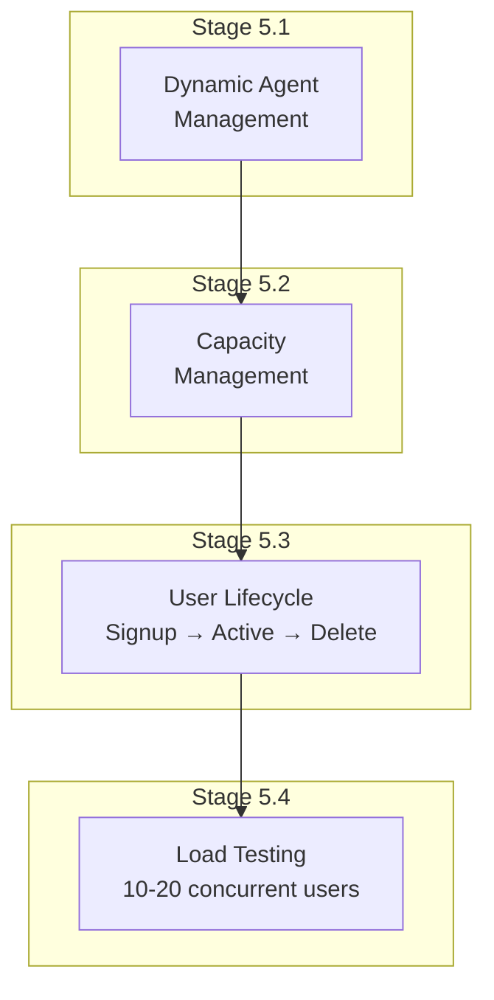
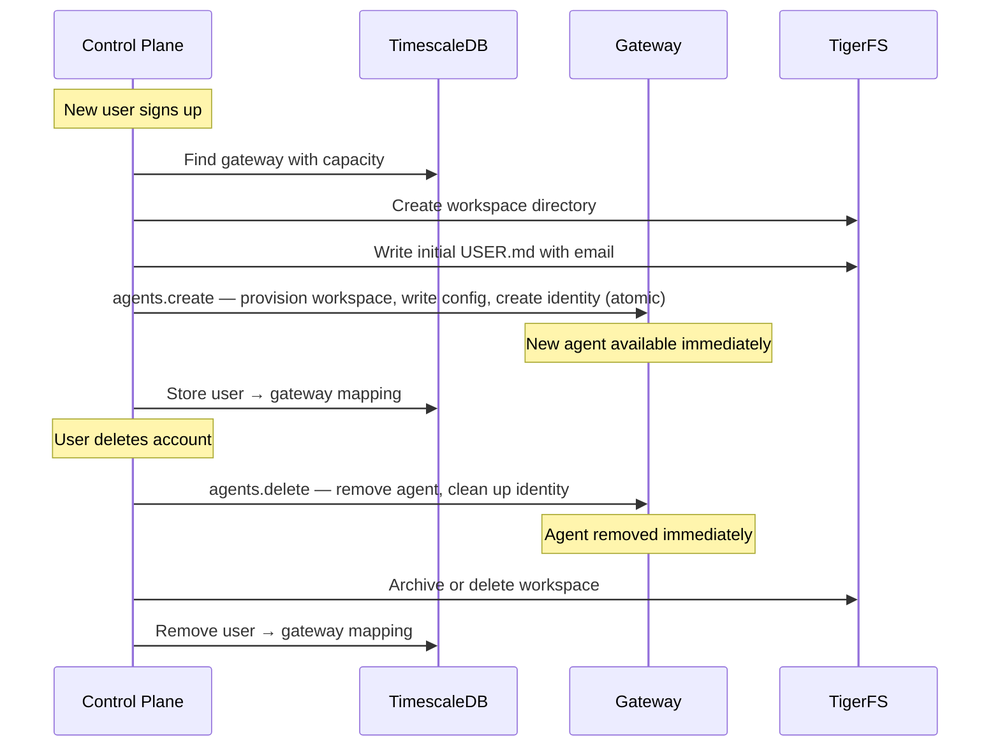
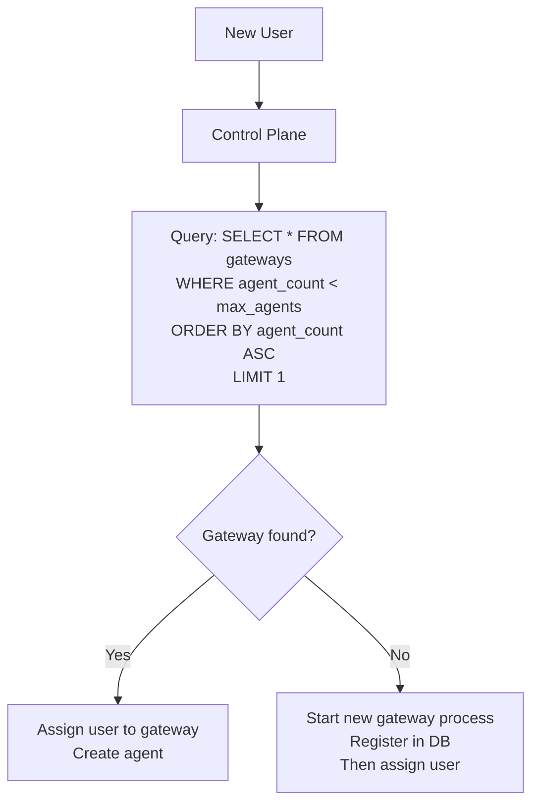
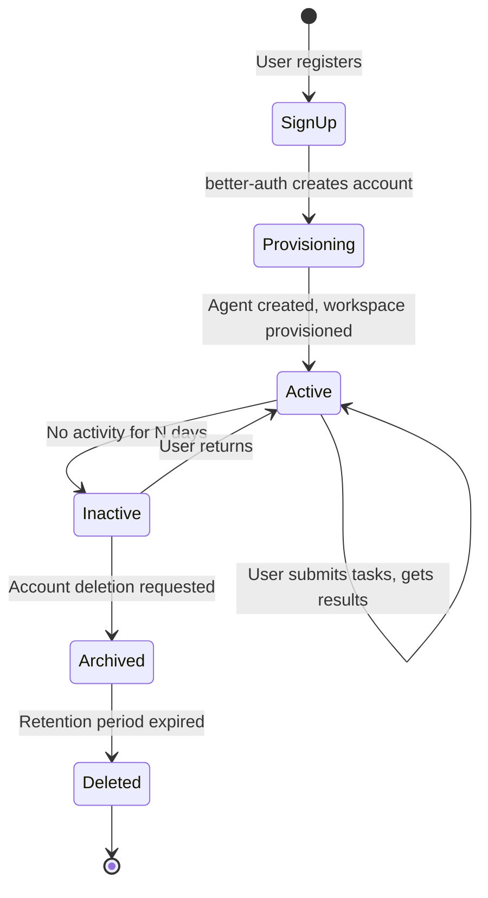
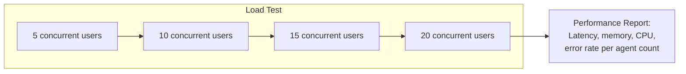

# Phase 5: Multi-Agent

## Goal

Support multiple users on a single gateway. Dynamic agent creation/deletion, capacity management, and user lifecycle.

## Overview

---

## Stage 5.1: Dynamic Agent Management

### Goal
Control plane can create and delete agents on a running gateway without restart.

### Prerequisites
- **Stateless gateway config:** For stateless gateways, the config file must reside on TigerFS. Set `OPENCLAW_CONFIG_PATH` to a TigerFS path so that `agents.create` writes are visible to any gateway instance.
- **Path distinction:** `OPENCLAW_STATE_DIR` and `agents.defaults.workspace` control DIFFERENT data:
  - `OPENCLAW_STATE_DIR` → config, credentials, sessions (gateway state)
  - `agents.defaults.workspace` → agent files (SOUL.md, USER.md, MEMORY.md, etc.)
  Both must point to TigerFS for multi-host setups.

### Dependencies
- Phase 2 complete (single gateway integration)

### Steps

1. Implement agent creation via gateway `agents.create` method:
   - `agents.create` handles workspace provisioning, config writing, and identity files atomically
   - All paths point to TigerFS
   - New agent is available immediately (no restart, no hot-reload needed)
2. Configure workspace defaults:
   - Directory structure on TigerFS: `users/{email}/workspace/`, `users/{email}/agent/`
   - Initial `USER.md` with user's email (written by `agents.create`)
   - Shared config (SOUL.md, AGENTS.md) read from shared TigerFS path
3. Implement agent deletion via `agents.delete`:
   - Removes agent from gateway, cleans up identity files
   - Archive workspace data (don't delete immediately — retention period)
4. Write tests: create agent, verify it responds, delete agent, verify it's gone

### External References
- [OpenClaw multi-agent](https://docs.openclaw.ai/concepts/multi-agent)
- [OpenClaw agents CLI](https://docs.openclaw.ai/cli/agents)
- [OpenClaw gateway configuration](https://docs.openclaw.ai/gateway/configuration)

### Verification Checklist
- [ ] Agent created via `agents.create` appears in gateway agent list
- [ ] New agent responds to messages immediately after creation (no restart)
- [ ] New agent's workspace is on TigerFS (verify via SQL)
- [ ] Agent deletion removes it from gateway (no restart)
- [ ] Deleted agent's messages are rejected
- [ ] Deleted agent's workspace data is archived (not immediately deleted)
- [ ] Creating 10 agents on one gateway works
- [ ] All tests pass

---

## Stage 5.2: Capacity Management

### Goal
Control plane tracks gateway capacity and assigns users to gateways with room.

### Dependencies
- Stage 5.1 complete

### Steps

1. Control plane maintains `gateways` table with current agent count
2. On user signup: find gateway with lowest agent count below max (default 20)
3. If no gateway has capacity: start a new gateway process (Bun.spawn), register it, then assign
4. On user deletion: decrement agent count, if gateway is empty for a threshold period, stop it
5. Periodic sync: control plane verifies gateway agent counts match actual (in case of drift)

### Verification Checklist
- [ ] New user assigned to gateway with most capacity
- [ ] Gateway agent count incremented on assignment
- [ ] When all gateways full, new gateway spawned automatically
- [ ] User deletion decrements gateway agent count
- [ ] Empty gateway stopped after idle timeout
- [ ] Agent count sync catches drift between DB and actual
- [ ] All tests pass

---

## Stage 5.3: User Lifecycle

### Goal
End-to-end user lifecycle from signup to deletion.

### Dependencies
- Stages 5.1 and 5.2 complete
- Phase 4 (frontend) complete for manual testing

### Steps

1. **Signup flow:**
   - better-auth creates account
   - Control plane assigns to gateway
   - Agent created on gateway
   - Workspace provisioned on TigerFS
   - User redirected to dashboard
2. **First task:**
   - Agent starts onboarding conversation (if AGENTS.md instructs it)
   - USER.md populated through conversation
3. **Ongoing use:**
   - Normal task flow
   - Memory accumulates
   - Agent improves with feedback
4. **Account deletion:**
   - User requests deletion
   - Agent removed from gateway
   - Workspace archived (TigerFS `.history/` preserves data for retention period)
   - After retention: workspace directory deleted
   - User record removed from better-auth

### Verification Checklist
- [ ] New user goes from signup to first agent response in one flow
- [ ] USER.md is created with correct email
- [ ] Returning user after inactivity: agent still has memory and context
- [ ] Account deletion: agent stops responding immediately
- [ ] Account deletion: workspace archived, not immediately destroyed
- [ ] After retention period: workspace data fully deleted
- [ ] GDPR: no user data remains after deletion (verify via SQL)
- [ ] All tests pass

---

## Stage 5.4: Load Testing

### Goal
Verify multi-agent performance at 10-20 concurrent users per gateway.

### Dependencies
- Stage 5.3 complete

### Steps

1. Script that creates N test users, each assigned to the same gateway
2. Each user sends a task simultaneously
3. Measure: response latency per user, gateway memory usage, CPU usage, error rate
4. Run at 5, 10, 15, 20 concurrent users
5. Identify the break point where performance degrades unacceptably
6. Document results and set max_agents accordingly

### Verification Checklist
- [ ] 5 concurrent users: all respond within baseline + 50%
- [ ] 10 concurrent users: all respond within baseline + 100%
- [ ] 15 concurrent users: all respond within baseline + 200%
- [ ] 20 concurrent users: all respond (may be slower)
- [ ] No data leakage between users at any agent count
- [ ] No session corruption under concurrent load
- [ ] Gateway memory stays under 2GB at 20 agents
- [ ] Error rate < 1% at recommended agent count
- [ ] Performance report documented with exact numbers
- [ ] max_agents default set based on results
