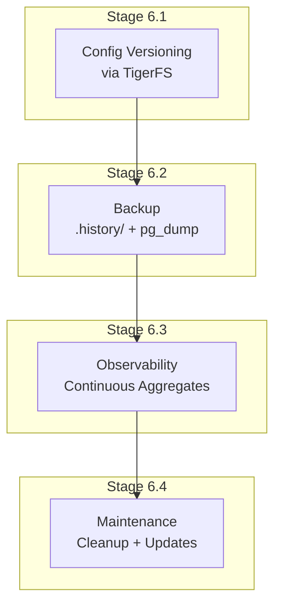
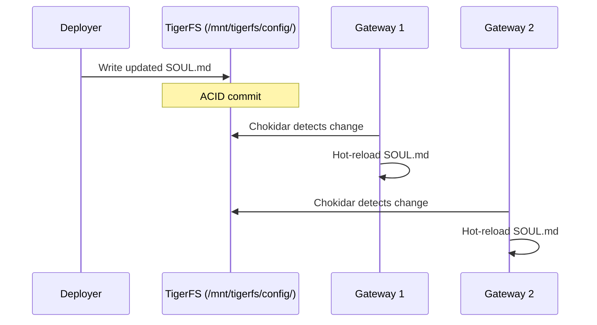
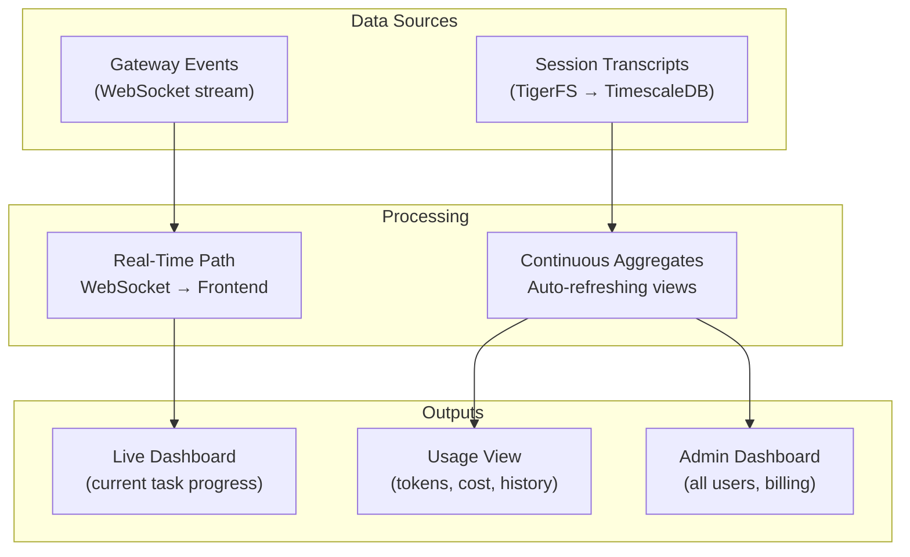
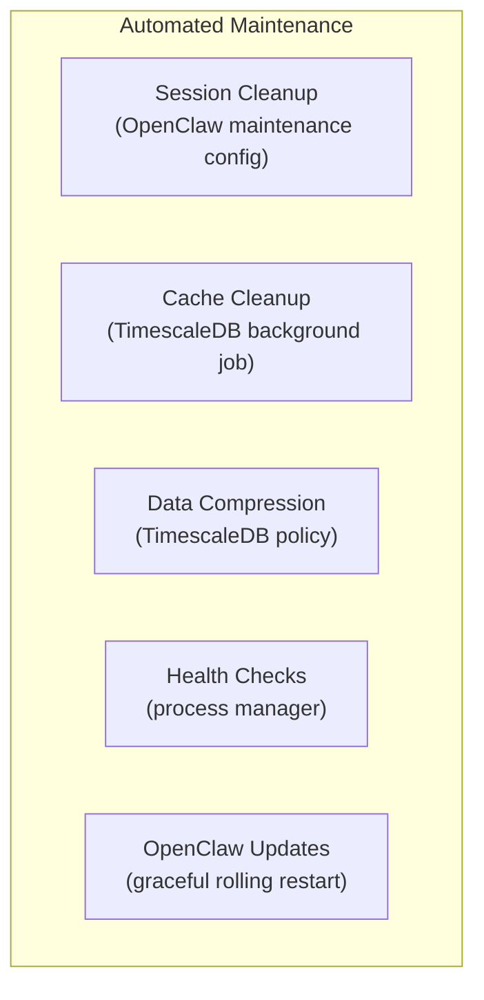

# Phase 6: Operations

## Goal

Versioning, backup, maintenance, and observability — everything needed to run uniclaw in production.

## Overview

---

## Stage 6.1: Config Versioning

### Goal

Deployer updates SOUL.md or AGENTS.md, all gateways pick it up instantly.

### Dependencies

- Phase 2 complete (gateway integration)
- TigerFS validated (Phase 0)

### Steps

1. Shared config files live in TigerFS at `/mnt/tigerfs/config/`
2. All gateways’ `agents.defaults.workspace` includes this path for bootstrap files
3. Test: update SOUL.md in TigerFS, verify all gateways hot-reload
4. Test: rollback via `.history/` — restore previous version, verify gateways pick it up
5. Build a simple admin endpoint in control plane: `PUT /admin/config/{filename}` that writes to TigerFS
6. **Admin endpoint authorization:** All `/admin/*` endpoints require better-auth admin role (via admin plugin). Implement role check middleware for admin routes. No admin endpoint is accessible without explicit admin role.

### Verification Checklist

- [ ] SOUL.md update in TigerFS detected by gateway within 1s
- [ ] Gateway hot-reloads — next task uses new instructions
- [ ] `.history/` shows previous versions of config files
- [ ] Rollback via `.history/` works — gateways pick up restored version
- [ ] Admin endpoint writes config file to TigerFS
- [ ] Multiple gateways all pick up the same change
- [ ] All `/admin/*` endpoints return 403 for non-admin users
- [ ] Regular user cannot access /admin/\* endpoints (verified with non-admin session)

---

## Stage 6.2: Backup Strategy

### Goal

Automated backup with TigerFS `.history/` for file versioning and `pg_dump` for disaster recovery.

### Dependencies

- Stage 6.1 complete

### Steps

1. Verify TigerFS `.history/` is enabled for all workspace “apps” (created with `markdown,history` flag)
2. Set up scheduled `pg_dump` via TimescaleDB background job or system cron
3. Store `pg_dump` output to a secure location (separate disk, S3, or remote host)
4. Test full disaster recovery: drop database, restore from `pg_dump`, remount TigerFS, verify all data intact
5. Document Recovery Point Objective (RPO) and Recovery Time Objective (RTO)

### Verification Checklist

- [ ] TigerFS `.history/` tracks all workspace file changes
- [ ] `pg_dump` runs on schedule and completes successfully
- [ ] Full restore from `pg_dump` works — all user data intact
- [ ] After restore: gateways start and users can continue working
- [ ] RPO and RTO documented with actual measured times
- [ ] Backup file size is reasonable (compression enabled)

---

## Stage 6.3: Observability

### Goal

Usage tracking via TimescaleDB continuous aggregates. Real-time monitoring via WebSocket.

### Dependencies

- Phase 2 complete (gateway integration)
- Phase 4 complete (frontend)

### Steps

1. **Create continuous aggregates over the existing `usage_events` hypertable (created in Phase 1, populated since Phase 2)** — the control plane extracts token counts, cost, model, and latency from gateway WebSocket events and writes them as rows. Continuous aggregates query this hypertable, NOT the raw JSONL session files on TigerFS.
2. **Real-time path:** Already built in Phase 2 (SSE events). Verify live feed shows progress.
3. **Continuous aggregates:** Create TimescaleDB materialized views over `usage_events`:
   - Per-user daily usage: tokens, cost, task count
   - Per-model usage: which models used, cost breakdown
   - Global usage: total tokens, active users, tasks/day
4. **Usage API:** Control plane endpoints to query aggregates:
   - `GET /usage/me` — current user’s usage (filtered by auth)
   - `GET /admin/usage` — all users (admin only)
   - `GET /admin/usage/:email` — specific user (admin only)
5. **Frontend integration:** Usage surface (Phase 4) connects to these endpoints
6. **Billing readiness:** Per-user cost available for Stripe integration

### External References

- [TimescaleDB continuous aggregates](https://www.tigerdata.com/docs/use-timescale/latest/continuous-aggregates)
- [better-auth Stripe plugin](https://www.better-auth.com/docs/plugins/stripe)

### Verification Checklist

- [ ] Continuous aggregates created and auto-refreshing
- [ ] Per-user usage query returns correct token counts
- [ ] Per-model breakdown is accurate
- [ ] Global usage aggregation works across all users
- [ ] Usage API returns correct data for authenticated user
- [ ] Admin API returns all users’ usage
- [ ] Frontend usage surface shows data from API
- [ ] Aggregates refresh within 60s of new data
- [ ] Per-user cost in USD queryable (deployer uses this for their own billing)

---

## Stage 6.4: Maintenance Automation

### Goal

Automated cleanup, update process, and health monitoring.

### Dependencies

- Stages 6.1–6.3 complete

### Steps

1. **Session cleanup:** Configure OpenClaw session maintenance in shared config:
   - `session.maintenance.mode: "enforce"`
   - `session.maintenance.pruneAfter: "30d"`
   - `session.maintenance.maxEntries: 500`
2. **Cache cleanup:** Create TimescaleDB background job that deletes expired cache rows
3. **Data compression:** Configure TimescaleDB compression on the `usage_events` hypertable (older usage data). Session transcripts are JSONL files managed by TigerFS — their storage is handled by TimescaleDB’s table storage, not a custom hypertable.
4. **Health checks:** Process manager (systemd or PM2) pings gateway health endpoints
5. **OpenClaw updates:** Script for graceful rolling restart:
   - Check for new version
   - For each gateway: wait for active tasks to finish → restart
   - Verify health after restart

### Verification Checklist

- [ ] Sessions older than 30 days are pruned automatically
- [ ] Expired cache rows deleted by background job
- [ ] Compression policy reduces storage for old usage event data
- [ ] Health check detects crashed gateway and restarts it
- [ ] Rolling restart updates all gateways without dropping active tasks
- [ ] All maintenance tasks are automated (no manual intervention)

---

## Stage 6.5: Audit Logging

### Goal

Structured audit trail for security-sensitive operations.

### Steps

1. Implement structured audit logging for: agent creation/deletion, config overwrites (admin), account deletion, admin data access
2. Store audit logs in a TimescaleDB hypertable with retention policies
3. Each audit log entry includes: timestamp, actor (user ID or system), action, target resource, and metadata (IP, user agent)
4. Configure retention policy (default: 90 days, configurable by deployer)

### Verification Checklist

- [ ] Agent creation/deletion logged with actor and target
- [ ] Admin config writes logged with before/after hash
- [ ] Account deletion logged
- [ ] Admin data access (viewing other users’ data) logged
- [ ] Audit log hypertable has compression and retention policies
- [ ] Audit logs queryable via admin API

---

## Stage 6.6: OpenClaw Version Pinning

### Goal

Ensure production stability by pinning OpenClaw versions.

### Steps

1. Pin OpenClaw to a specific version in production. Test compatibility before upgrading
2. Add `OPENCLAW_VERSION` to env vars (add to Phase 0 env var inventory)
3. The maintenance rolling restart (Stage 6.4) should verify the new version passes health checks before proceeding
4. Pin OpenClaw to a post-patch version (after CVE-2026-25253 fix). Disable ClawHub skill installation in production gateways unless explicitly needed. Subscribe to OpenClaw security advisories.

### Verification Checklist

- [ ] `OPENCLAW_VERSION` env var controls which version is installed/used
- [ ] Rolling restart verifies health checks pass with new version before proceeding to next gateway
- [ ] ClawHub skill installation disabled in production gateway config
- [ ] OpenClaw security advisory subscription documented
