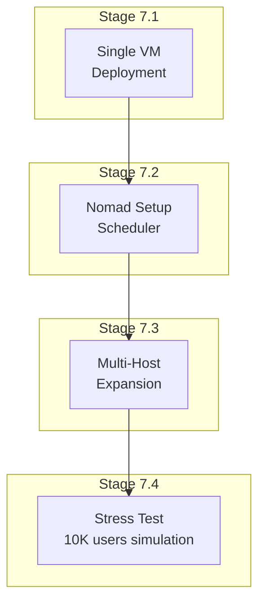
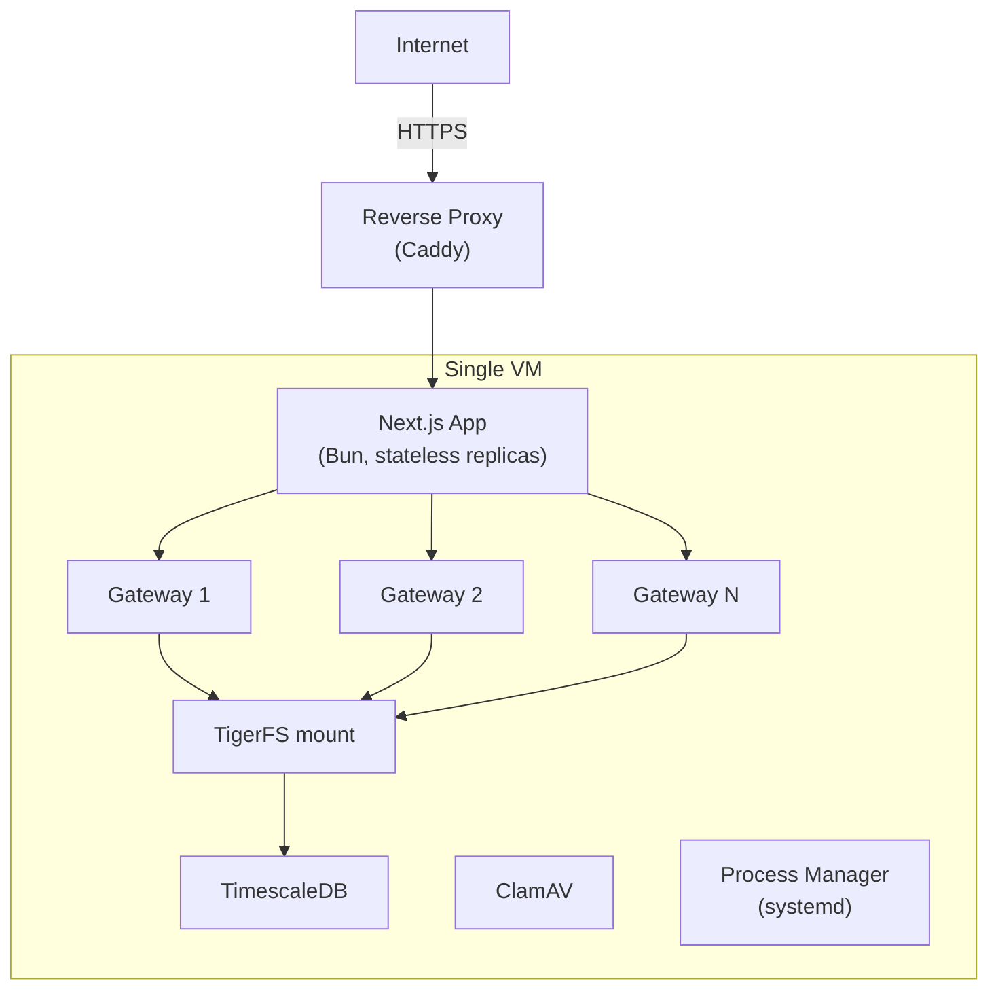
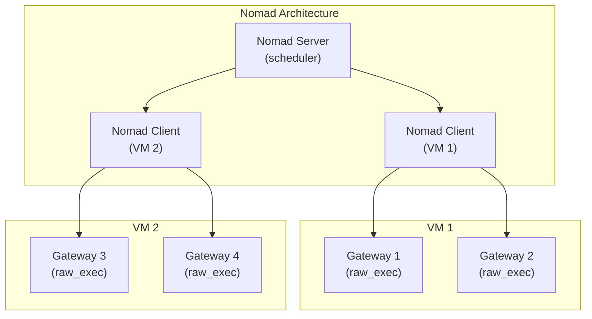
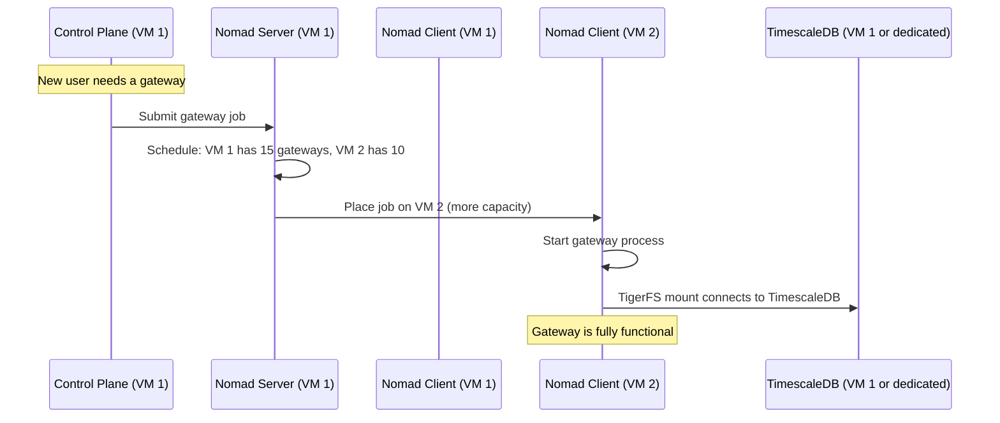
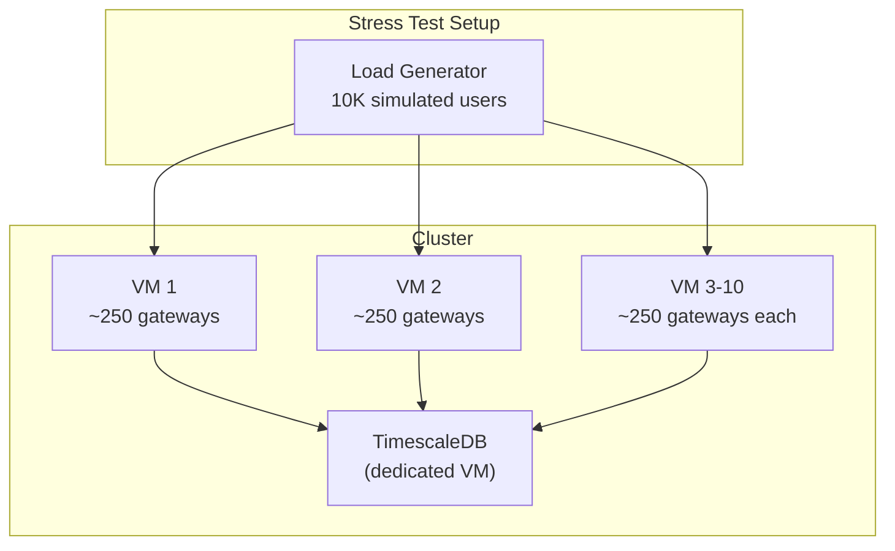

# Phase 7: Scale

## Goal

Deploy to cloud VMs, set up Nomad for multi-host orchestration, target 10K users.

## Overview

---

## Stage 7.1: Single VM Deployment

### Goal

Deploy the complete stack to a single cloud VM. Validate everything works outside local dev.

### Dependencies

- Phase 6 complete (operations)

### Steps

1. Provision a VM (Ubuntu, 16-32GB RAM, 4-8 vCPU)
2. Install TimescaleDB, TigerFS, ClamAV, Bun, OpenClaw, **PgBouncer**
   - **Connection pooling is critical:** PostgreSQL default `max_connections` is 100. At 500+ gateways (each with its own DB connection for TigerFS + memory-timescaledb), connections will be exhausted without a pooler
   - Configure PgBouncer in transaction pooling mode between gateways and TimescaleDB
   - All gateway `DATABASE_URL` values should point to PgBouncer, not directly to TimescaleDB
   - Configure PgBouncer with pool_size matching expected gateway count per host. Control plane connects directly to TimescaleDB (needs full SQL). TigerFS may need direct connection — verify whether TigerFS works through PgBouncer or requires a direct connection.
   - **Warning: PgBouncer + RLS interaction.** PgBouncer in transaction pooling mode resets `SET ROLE` when connections return to pool. The application MUST set the role at the start of every transaction. Test this explicitly: verify that consecutive transactions from different gateways through PgBouncer never see each other’s data.
3. Set up TigerFS mount pointing to local TimescaleDB
4. Deploy control plane as systemd service
5. Set up Caddy as reverse proxy (automatic HTTPS)
6. Deploy frontend (Next.js) — static export or behind Caddy
7. Start 2-3 gateway processes via control plane
8. Create test users, run full end-to-end flow
9. Monitor resource usage (CPU, RAM, disk)

### Verification Checklist

- [ ] VM provisioned and accessible via SSH
- [ ] TimescaleDB running with extensions (pgvector, pgvectorscale)
- [ ] TigerFS mount works on the VM
- [ ] ClamAV running and scanning
- [ ] Control plane accessible via HTTPS
- [ ] Frontend loads in browser via HTTPS
- [ ] User signup → task → result works end-to-end on the VM
- [ ] Multiple gateways running, each hosting test users
- [ ] PgBouncer running and proxying connections to TimescaleDB
- [ ] Gateways connect via PgBouncer (not directly to TimescaleDB)
- [ ] Consecutive transactions from different gateways through PgBouncer never see each other’s data (RLS + SET ROLE verified)
- [ ] Resource usage acceptable (< 80% RAM, < 50% CPU at idle)
- [ ] System survives a reboot (all services start automatically)

---

## Stage 7.2: Nomad Setup

### Goal

Install and configure Nomad to schedule gateway processes.

### Dependencies

- Stage 7.1 complete

### Steps

1. Install Nomad on the VM (single node: server + client mode)
2. Write Nomad job spec for gateway processes:
   - Driver: `raw_exec` (no Docker)
   - Task: run OpenClaw gateway with specific config
   - Resource stanza: memory + CPU limits per gateway
   - Service stanza with health check (HTTP health endpoint)
   - Restart policy: on failure, max 3 attempts
   - Meta stanza with `gateway_id` for control plane discovery. The control plane discovers gateway addresses via Nomad API (list allocations for the gateway job).
3. Migrate existing gateway processes from manual systemd to Nomad jobs
4. Control plane integration: submit/stop jobs via Nomad HTTP API instead of Bun.spawn
5. Test: Nomad starts gateways, health checks work, restart on crash

### External References

- [Nomad getting started](https://developer.hashicorp.com/nomad/tutorials/get-started)
- [Nomad raw_exec driver](https://developer.hashicorp.com/nomad/docs/drivers/raw-exec)
- [Nomad HTTP API](https://developer.hashicorp.com/nomad/api-docs)

### Verification Checklist

- [ ] Nomad installed and running (server + client)
- [ ] Gateway job spec deploys successfully
- [ ] Nomad starts gateway processes via raw_exec
- [ ] Health checks pass in Nomad
- [ ] Nomad restarts crashed gateway automatically
- [ ] Control plane creates/stops gateways via Nomad API
- [ ] `nomad status` shows all running gateways
- [ ] Resource limits enforced (gateway can’t exceed memory limit)
- [ ] All tests pass

---

## Stage 7.3: Multi-Host Expansion

### Goal

Add a second VM, verify Nomad schedules gateways across both hosts.

### Dependencies

- Stage 7.2 complete

### Steps

1. Provision second VM
2. Install Nomad client, TigerFS, Bun, OpenClaw
3. Join Nomad cluster (point to server on VM 1)
4. TigerFS on VM 2 mounts the same TimescaleDB as VM 1
5. Submit a gateway job — verify Nomad places it on the less-loaded host
6. Test: user on VM 2’s gateway can read/write same TigerFS data
7. Test: move a user between hosts (remove agent from gateway on VM 1, add to gateway on VM 2)
8. Test: VM 2 goes down — Nomad reschedules gateways to VM 1

### Verification Checklist

- [ ] Second VM joins Nomad cluster
- [ ] TigerFS on VM 2 accesses same database
- [ ] Nomad schedules gateways across both VMs
- [ ] User data accessible from either VM (TigerFS stateless verified)
- [ ] Agent migration between hosts works with zero data loss
- [ ] VM 2 failure: Nomad reschedules gateways to VM 1
- [ ] No data corruption during failover
- [ ] Latency from VM 2 to TimescaleDB acceptable (< 10ms for queries)

---

## Stage 7.4: Stress Test

### Goal

Simulate 10K users and verify the system handles the load.

### Dependencies

- Stage 7.3 complete

### Steps

1. Provision enough VMs for 10K users (estimate from Phase 5 load test results)
2. Script: create 10K test user accounts and assign to gateways
3. Simulate realistic traffic patterns:
   - 5-10% active at any time (500-1000 concurrent tasks)
   - Tasks last 10-60 seconds
   - Mix of simple and complex tasks
4. Measure:
   - Task completion latency (p50, p95, p99)
   - Gateway memory and CPU per host
   - TimescaleDB query latency and connections
   - TigerFS performance under load
   - Control plane latency (API route overhead)
   - Error rate
5. Identify bottlenecks and optimize
6. Document capacity planning numbers

### Verification Checklist

- [ ] 10K user accounts created successfully
- [ ] 500 concurrent tasks complete within acceptable latency
- [ ] 1000 concurrent tasks complete (may be degraded)
- [ ] No data leakage between users under load
- [ ] No session corruption under load
- [ ] TimescaleDB handles the connection count
- [ ] TigerFS performs within benchmarked limits (Phase 0)
- [ ] Nomad distributes load evenly across hosts
- [ ] Failover works under load (kill a host, gateways reschedule)
- [ ] Capacity planning doc: users per gateway, gateways per host, hosts needed
