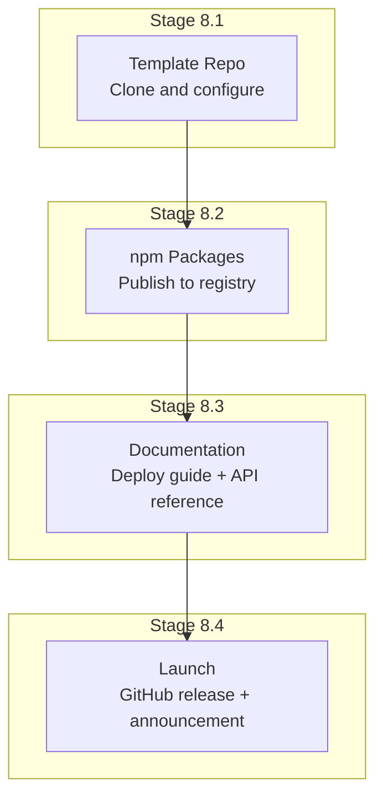
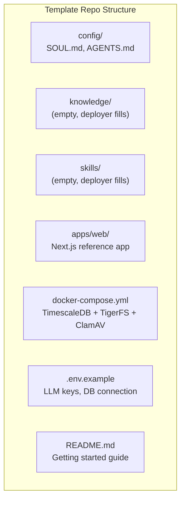
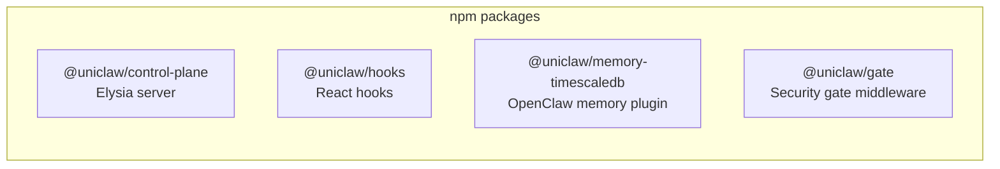

# Phase 8: Release

## Goal

Package uniclaw as a template repo that deployers can clone, configure, and ship. Publish npm packages. Write documentation.

## Overview

---

## Stage 8.1: Template Repo

### Goal
Create the repo that deployers clone to build their SaaS.

### Dependencies
- All previous phases complete

### Steps

1. Create `uniclaw/template` repo from the working codebase
2. Remove all test users, test data, development configs
3. Replace specific values with placeholders:
   - LLM API keys → `.env.example` with `YOUR_ANTHROPIC_KEY`
   - Domain → configurable
   - Product name → configurable
4. Write `config/SOUL.md` with a generic, customizable agent personality
5. Write `config/AGENTS.md` with deployer-facing comments explaining each section
6. Create `.env.example` with all required environment variables documented
7. Create `docker-compose.yml` for local dev (TimescaleDB + TigerFS + ClamAV)
8. Verify: clone fresh, follow README, get a working instance

### Verification Checklist
- [ ] Fresh clone + `bun install` succeeds
- [ ] `docker-compose up` starts all dependencies
- [ ] Copy `.env.example` to `.env`, fill in one LLM key → system works
- [ ] Edit `SOUL.md` → agent personality changes on next task
- [ ] Drop a file in `knowledge/` → agent can reference it
- [ ] Publish a CLI → agent can use it via `bunx`
- [ ] README instructions are followable by a developer unfamiliar with uniclaw
- [ ] No test data, no personal configs, no hardcoded values

---

## Stage 8.2: npm Packages

### Goal
Publish reusable packages to npm under the `uniclaw` scope.

### Dependencies
- Stage 8.1 complete

### Steps

Packages to publish:

1. **@uniclaw/control-plane** — the Elysia server with auth, WebSocket proxy, gateway management
2. **@uniclaw/hooks** — React hooks extracted from the reference app (useChat, useTaskFeed, useNotifications, useUsage)
3. **@uniclaw/memory-timescaledb** — the OpenClaw memory plugin
4. **@uniclaw/gate** — security gate middleware (hai-guardrails + AI SDK integration)
5. For each package: set up `package.json`, build config, type exports
6. Publish to npm under `uniclaw` scope
7. Verify: install from npm into a fresh project, verify it works

### Verification Checklist
- [ ] All packages published to npm
- [ ] `bun add @uniclaw/control-plane` installs successfully
- [ ] `bun add @uniclaw/hooks` installs successfully
- [ ] `bun add @uniclaw/memory-timescaledb` installs successfully
- [ ] `bun add @uniclaw/gate` installs successfully
- [ ] TypeScript types exported correctly (autocomplete works)
- [ ] Each package works when installed from npm (not just from monorepo)

---

## Stage 8.3: Documentation

### Goal
Deployer-facing documentation: getting started, configuration, architecture, and API reference.

### Dependencies
- Stage 8.2 complete

### Steps
1. **Getting Started** — step-by-step from clone to running instance
2. **Configuration Guide** — what each file does, how to customize
3. **Architecture Overview** — how the system works (reference brainstorm docs)
4. **CLI Guide** — how to build and publish deployer CLIs
5. **Frontend Customization** — how to use hooks, customize the reference app
6. **Deployment Guide** — local → single VM → multi-host with Nomad
7. **Security** — what the gate does, how to configure guard thresholds
8. **API Reference** — auto-generated from Elysia types (OpenAPI)

### Verification Checklist
- [ ] Getting Started: a developer can follow it end-to-end
- [ ] Configuration: every configurable value is documented
- [ ] Architecture: diagrams explain the system clearly
- [ ] CLI Guide: deployer can build and publish their first CLI
- [ ] Frontend: deployer can customize the UI
- [ ] Deployment: deployer can deploy to a cloud VM
- [ ] Security: guard configuration is clear
- [ ] API Reference: all endpoints documented

---

## Stage 8.4: Launch

### Goal
Public release on GitHub + npm.

### Dependencies
- Stages 8.1–8.3 complete

### Steps
1. Create GitHub release with changelog
2. Ensure all npm packages are published at matching versions
3. Template repo is public and clean
4. Documentation site is live
5. README has badges (CI, npm version, license)
6. Write announcement post explaining uniclaw

### Verification Checklist
- [ ] GitHub repo is public (MIT license)
- [ ] npm packages are public
- [ ] Documentation site accessible
- [ ] Template repo cloneable and working
- [ ] CI passing on main branch
- [ ] No secrets, no personal data, no test credentials in any published artifact
