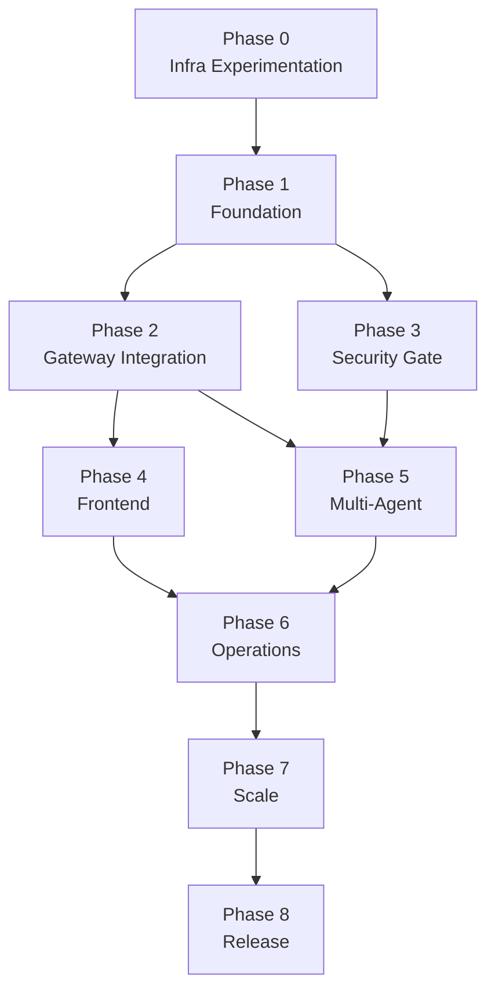
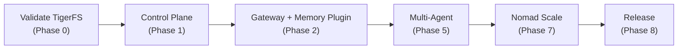

# Uniclaw Implementation Plan

## How to Read This Plan

Each phase is a separate file. Phases must be completed in order — later phases depend on earlier ones. Within each phase, stages can sometimes be parallelized (noted where applicable).

Every stage has:
- **Goal** — what we're building
- **Dependencies** — what must be complete first
- **Steps** — what to do (logic and constraints, not code snippets)
- **Verification checklist** — binary pass/fail gates (every item must pass)
- **External references** — verified documentation links

Refer to [brainstorm/](../brainstorm/) for architectural decisions and rationale. This plan does not repeat those — it references them.

## Dependency Graph

```mermaid
gantt
    title Implementation Phases
    dateFormat X
    axisFormat Phase %s

    section Foundation
    Phase 0 — Infra Experiment     :p0, 0, 1
    Phase 1 — Foundation           :p1, after p0, 1

    section Core
    Phase 2 — Gateway Integration  :p2, after p1, 1
    Phase 3 — Security Gate        :p3, after p1, 1

    section Product
    Phase 4 — Frontend             :p4, after p3, 1
    Phase 5 — Multi-Agent          :p5, after p3, 1

    section Ship
    Phase 6 — Operations           :p6, after p4, 1
    Phase 7 — Scale                :p7, after p6, 1
    Phase 8 — Release              :p8, after p7, 1
```

**Parallelizable:** Phase 2 + Phase 3 can run in parallel. Phase 4 and Phase 5 both require Phase 2 AND Phase 3 complete (security gate must be active before users connect to live gateways).

## Phases

| Phase | Name | Goal | Key Risk |
|---|---|---|---|
| [0](00-infra-experiment.md) | Infra Experimentation | Validate TigerFS + OpenClaw compatibility, benchmark performance | First integration of TigerFS with OpenClaw |
| [1](01-foundation.md) | Foundation | Monorepo, control plane skeleton, auth, database schema | None — proven tools |
| [2](02-gateway.md) | Gateway Integration | Connect control plane to OpenClaw, WebSocket proxy, memory plugin | memory-timescaledb plugin is custom code |
| [3](03-security.md) | Security Gate | 7-layer input validation before OpenClaw | Integration between hai-guardrails + AI SDK |
| [4](04-frontend.md) | Frontend | Next.js app with 4 surfaces, Eden Treaty | Real-time WebSocket UX |
| [5](05-multi-agent.md) | Multi-Agent | Dynamic agent management, capacity, user lifecycle | OpenClaw multi-agent at 10-20 users untested |
| [6](06-operations.md) | Operations | Versioning, backup, maintenance, observability | Continuous aggregates design |
| [7](07-scale.md) | Scale | Nomad, multi-host, 10K users | Nomad + raw_exec configuration |
| [8](08-release.md) | Release | Template repo, docs, npm packages | Packaging for deployers |

## Critical Path

The critical path runs through TigerFS validation → gateway integration → multi-agent → scaling.
